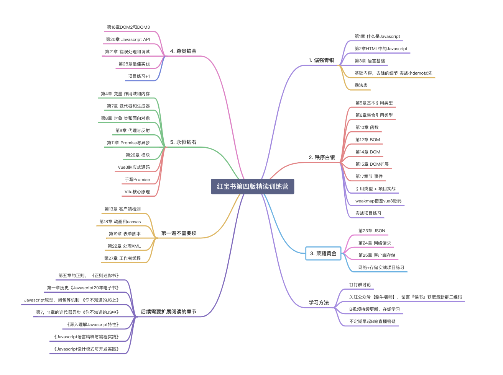

## 读书导图

## 目录大纲

- [红宝书笔记系列之《第 1 章-什么是 JavaScript》](./第1章-什么是JavaScript.md)
- [红宝书笔记系列之《第 2 章-HTML 中的 JavaScript》](./第2章-HTML中的JavaScript.md)
- [红宝书笔记系列之《第 3 章-语言基础》](./第3章-语言基础.md)
- [红宝书笔记系列之《第 5 章-基本引用类型》](./第5章-基本引用类型.md)
- [红宝书笔记系列之《第 6 章-集合引用类型》](./第6章-集合引用类型.md)
- [红宝书笔记系列之《第 10 章-函数》](./第10章-函数.md)
- [红宝书笔记系列之《第 12 章-BOM》](./第12章-BOM.md)
- [红宝书笔记系列之《第 14 章-DOM》](./第14章-DOM.md)
- [红宝书笔记系列之《第 15 章-DOM 扩展》](./第15章-DOM扩展.md)
- [红宝书笔记系列之《第 17 章-事件》](./第17章-事件.md)
- [红宝书笔记系列之《第 23 章-JSON》](./第23章-JSON.md)
- [红宝书笔记系列之《第 24 章-网络请求与远程资源》](./第24章-网络请求与远程资源.md)
- [红宝书笔记系列之《第 25 章-客户端存储》](./第25章-客户端存储.md)
- [红宝书笔记系列之《第 16 章-DOM2 和 DOM3》](./第16章-DOM2和DOM3.md)
- [红宝书笔记系列之《第 20 章-JavaScript API》](./第20章-JavaScriptAPI.md)
- [红宝书笔记系列之《第 21 章-错误处理与调试》](./第21章-错误处理与调试.md)
- [红宝书笔记系列之《第 28 章-最佳实践》](./第28章-最佳实践.md)
- [红宝书笔记系列之《第 4 章-变量、作用域与内存》](./第4章-变量、作用域与内存.md)
- [红宝书笔记系列之《第 7 章-迭代器与生成器》](./第7章-迭代器与生成器.md)
- [红宝书笔记系列之《第 8 章-对象、类与面向对象编程》](./第8章-对象、类与面向对象编程.md)
- [红宝书笔记系列之《第 9 章-代理与反射》](./第9章-代理与反射.md)
- [红宝书笔记系列之《第 11 章-期约与异步函数》](./第11章-期约与异步函数.md)
- [红宝书笔记系列之《第 26 章-模块》](./第26章-模块.md)
