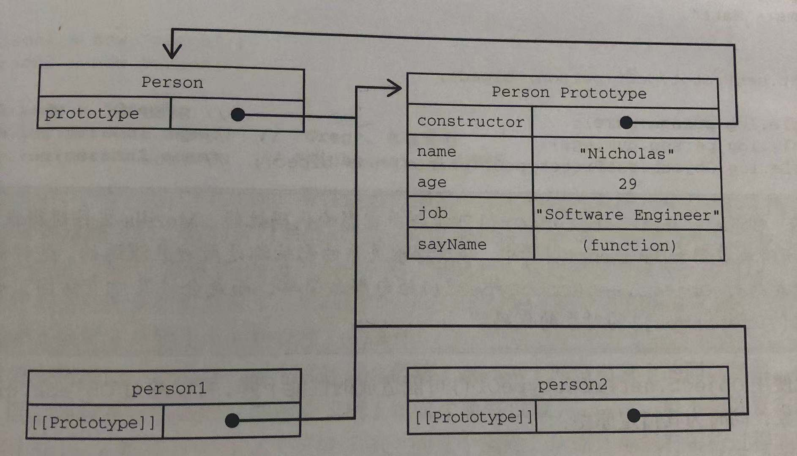
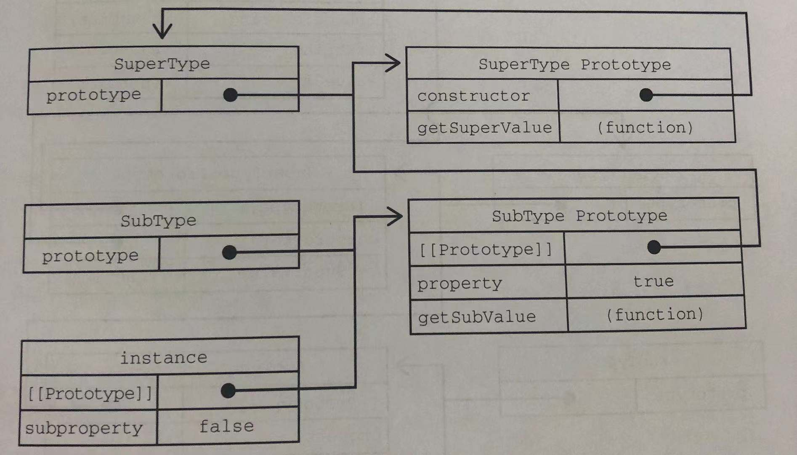

## 语法简写

在给对象添加变量的时候，如果属性名和变量名一样。可以只写属性名。

```js
let name = "lian";
let person = {
  name: name,
};

// 等同于
let name = "lian";
let person = {
  name,
};
```

可计算属性，可计算属性就是对象的属性值可以是一个表达式。

```js
let key = "name";
let person = {};
person[key] = key;

// 等同于
let key = "name";
let person = {
  [key]: key,
};
```

简写方法名。

```js
let person = {
  sayName: function (name) {
    console.log(name);
  },
};

// 等同于
let person = {
  sayName(name) {
    console.log(name);
  },
};
```

## 构造函数

#### 构造函数

构造函数与普通函数定义无区别。区别在于构造函数执行时使用 `new` 操作符。

```js
function Person() {}

Person();
let person = new Person(); // 构造函数通常以大写开头
```

要创建 `Person` 的实例，应使用 `new` 操作符。以这种方式调用构造函数会执行如下操作：

- 1、在内存中创建一个新对象。
- 2、这个新对象内部的 [[Prototype]] 特性*被赋值*为构造函数的 prototype 属性。
- 3、构造函数内部的 this *被赋值*为这个新对象。
- 4、执行构造函数的内部的代码。
- 5、如果构造函数返回非空对象，则返回改对象；否则：返回刚创建的对象。

#### 原型模式

无论何时，只要创建一个函数，都会按照特定的规则为这个函数创建一个 `prototype` 属性(指向原型对象)。默认情况下，所有原型对象自动获得一个名为 `constructor` 的属性，指回与之关联的构造函数。

每创建一个实例，都会在实例对象上暴露 `__proto__` (对隐藏[[Prototype]]的引用) 属性指回构造函数的原型。理解一点：实例与*构造函数原型*之间有直接的联系，但实例与*构造函数*之间没有。

```js
// 声明之后，函数就有了一个与之关联的原型对象。
function Person() {
  this.name = "lian";
}
console.log(Person.prototype);
```

```js
// 如前所述：构造函数有一个 prototype 属性；
// 引用其原型对象，而这个原型对象也有一个 constructor 属性，引用这个构造函数，
// 换句话说，两者项目引用
console.log(Person.prototype.constructor === Person); // true
```

```js
// 实例通过 __proto__ 链接到原型对象(对隐藏[[Prototype]]的引用)
// 实例与构造函数没有直接联系，与原型对象有直接联系
let person = new Person();
console.log(person.__proto__ === Person.prototype); // true
console.log(person.__proto__.constructor === Person.prototype.constructor); // true
```

构造函数、prototype 、constructor、\_\_proto\_\_ 之间的关系如图。



#### 原型继承

原型链被定义为主要的继承方式。回顾一下构造函数、原型、和实例的关系：每个构造函数都有一个原型对象，原型有一个属性指回构造函数，而实例有一个内部指针指向原型。

如果原型是另一个类型的实例呢？那就意味着这个原型本身有一个内部指针指向另一个原型，相应地另一个原型也有也有一个指针指向另一个构造函数，这样就在实例和原型之间构造了一条原型链。

```js
function SuperType() {
  this.superProperty = true;
}
SuperType.prototype.getSuperValue = function () {
  return this.superProperty;
};

function SubType() {
  this.subProperty = false;
}

// SubType 的原型被赋值为 SuperType 的实例。
SubType.prototype = new SuperType();
SubType.prototype.getSubValue = function () {
  return this.subProperty;
};

let instance = new SubType();

// __proto__ 指向 instance 的原型，而原型被赋值为 ”SuperType 实例“。
console.log(instance.__proto__);
// 继续往下 __proto__ 指向 ”SuperType 实例“ 的原型。
console.log(instance.__proto__.__proto__);
// 继续往下 原型的 "constructor" 指向构造函数
console.log(instance.__proto__.__proto__.constructor === SuperType); // true

// 在这条链上可以找到 getSubValue 和 getSuperValue 方法。
console.log(instance.getSubValue()); // false
console.log(instance.getSuperValue()); // true
```

原型链扩展了原型搜索机制，在读取实例上的属性时，首先会在实例上搜索，这个属性。如果没找到，则会继续搜索实例的原型，在通过原型链实现继承之后，搜索就可以继续向上，搜索原型的原型。



## 类

#### 把类当成特殊函数

类在底层上只不过是构造函数的语法糖，不过只能用 `new` 调用。

```js
class Person {}

let person = new Person();

console.log(typeof Person); // function
console.log(Person.prototype.constructor === Person); // true
console.log(person.__proto__ === Person.prototype); // true
console.log(person.__proto__.constructor === Person.prototype.constructor); // true
```

#### 类的继承

ES6 类支持单类继承，使用 `extends` 关键字。在派生类可以通过 `super` 关键字引用它们的原型。

```js
class Vehicle {
  constructor() {
    this.hasEngine = true;
  }
  run() {
    console.log("...run");
  }
  static identify() {
    console.log("Vehicle");
  }
}
// static 声明静态方法，可以在类上直接调用。
Vehicle.identify(); // "Vehicle"

// Bus 继承 Vehicle 类。
class Bus extends Vehicle {
  constructor() {
    // 在构造函数中使用 super 可以调用父类构造函数，将返回的实例赋值给 this。
    super();
    console.log(this);
  }
  // 在静态方法可以通过 super 调用继承的类上定义的静态方法。
  static identify() {
    super.identify();
  }
}

Bus.identify(); // "Vehicle"

let bus = new Bus();
bus.run(); // ...run

// 除语法层面更符合语义外，继承方式与构造函数的一致
console.log(bus.__proto__.constructor === Bus); // true
console.log(bus.__proto__.__proto__.constructor === Vehicle); //true
console.log(bus.__proto__.__proto__ === Vehicle.prototype); //true
console.log(bus instanceof Vehicle); // true
console.log(bus instanceof Bus); // true
```
