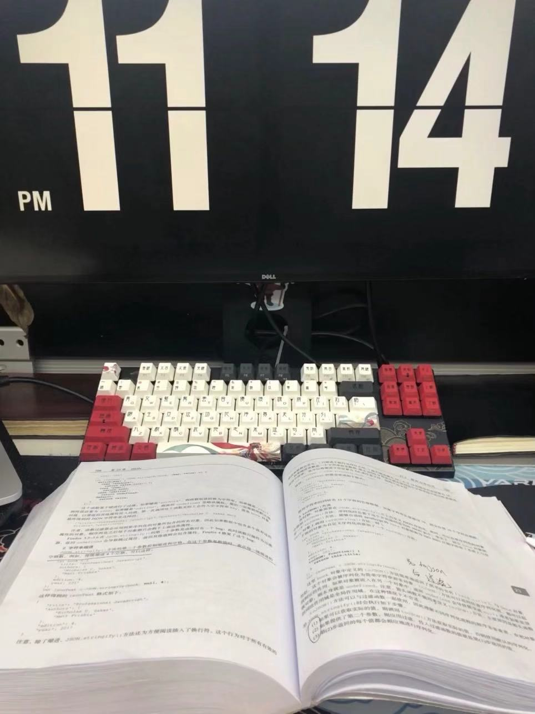
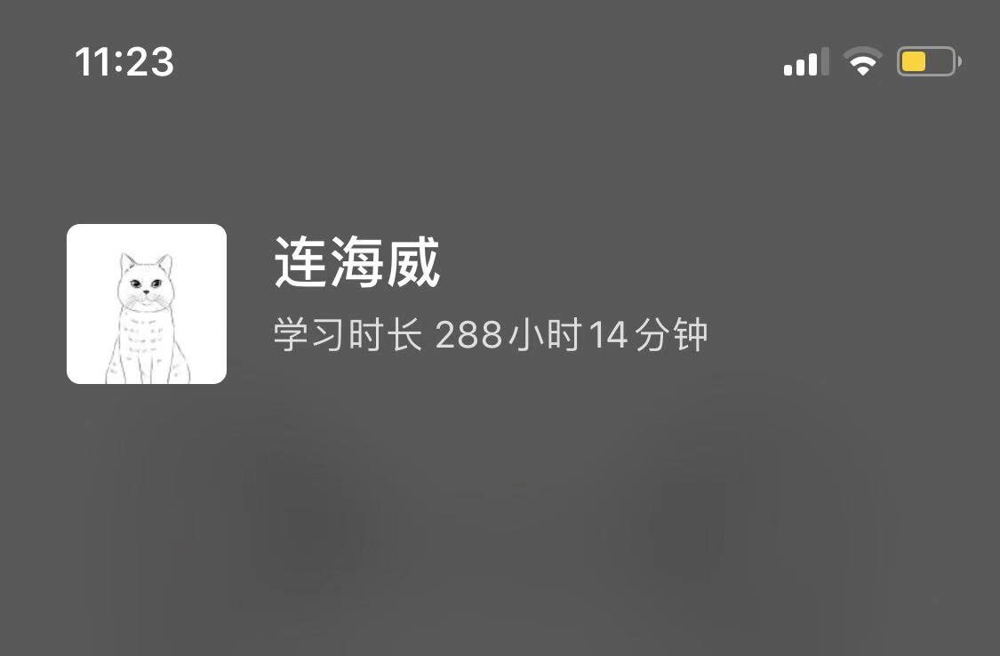

匆匆忙忙今年已到年尾，可能因为疫情原因和业务压力好像今年过的异常的快没怎么潇洒就过去了（最近北京的朋友注意安全）。赶上周末把自己今年做了哪些事总结一下。

## 追番

自己还是比较喜欢看动漫的，今年没看什么电视剧、电影。在 b 站逛了一年，基本新番都看了也看老的了，贴出来几个感觉特别好看的。

## 读书

今年就读了一本书，最后两个月算是把红宝书看了一遍，早上起不来都是晚上看的。[这是整理的笔记](https://juejin.cn/post/6909455840361742343)

## 学习

今年是学习最多的一年，当然进步也是最大的。差不多把大前端的东西都搞了一下广度很多但有深度的还是用得到的那些。学的最多的是： vue2 技术栈的源码、研究了 webpack 、学习并使用了 nodejs 和 egg、Js 的设计模式、数据结构与算法。

## 开源

今年在 github 上自嗨了很久，做了几个开源项目，也写了很多文章和实战练习。星星还是少的可怜，不过能有星星就能很高兴了。

## 工作

也不说什么原因了，身边的同事一如既往的更新的很快。今年重心都在业务，也没有给公司推进一些技术性的提升，比去年主导开发组件库、标准库差了好多。

## FLAG

- 读书：小黄书、红宝书第二遍深入、nodejs 深入浅出、软技能。
- 学习：数据结构与算法、vue3 技术栈源码、typeScript、计算机基础。
- 开源：参与有质量的项目、星星突破二百。
- 工作：开心工作、工资翻倍。

## END

😃 哈哈，不是妖精的尾巴中的最强恶魔 😈。留着放掘金年度征文链接的。

[掘金年度征文 | 2020 与我的技术之路 征文活动正在进行中......](https://juejin.cn/post/6901125532729999374)
