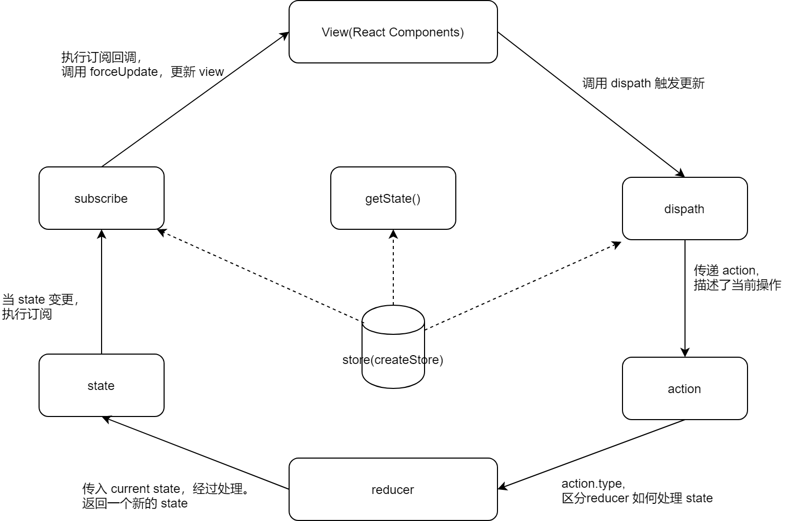

先来看下 redux 数据流。



## 查看示例

[查看示例](https://github.com/haiweilian/laboratory/tree/master/React/redux-simple-imp)

## 初始化项目

实现一个简单的记数器功能。

```js
import logger from "redux-logger";
import { createStore, combineReducers, applyMiddleware } from "redux";

// import logger1 from "../middleware/redux-logger-1";
// import logger2 from "../middleware/redux-logger-2";
// import { createStore, combineReducers, applyMiddleware } from "../redux/index";

// reducer 接受一个 state，更具 action 返回新的 state 。
const countReducer = (state = 0, { type, payload = 1 }) => {
  // console.log("2、reducer---处理state");
  switch (type) {
    case "ADD":
      return state + payload;
    case "MINUS":
      return state - payload;
    default:
      return state;
  }
};

const store = createStore(countReducer));

export default store;
```

```jsx
//src/pages/ReduxPage.js
import React, { Component } from "react";
import store from "../store/index";

export default class ReduxPage extends Component {
  componentDidMount() {
    // 添加订阅，当 state 更新的时候执行回调更新
    this.unsubscribe = store.subscribe(() => {
      // console.log("3、subscribe-更新");
      this.forceUpdate();
    });
  }

  componentWillUnmount() {
    // 组件卸载时删除订阅
    this.unsubscribe && this.unsubscribe();
  }

  add = () => {
    // 触发更新执行，传递 action
    // console.log("1、action---加");
    store.dispatch({
      type: "ADD",
    });
  };

  minus = () => {
    // 触发更新执行, 传递 action
    // console.log("1、action---减");
    store.dispatch({
      type: "MINUS",
    });
  };

  render() {
    return (
      <div>
        <h3>ReduxPage</h3>
        <p>{store.getState()}</p>
        <button onClick={this.add}>add</button>
        <button onClick={this.minus}>minus</button>
      </div>
    );
  }
}
```

## 基础实现

#### 需求分析

- createStore

`createStore` 创建一个 `state`，并返回 `getState` `dispatch` `subscribe` 方法。

- combineReducers

`combineReducers` 合并多个 `reducer`。

- applyMiddleware

`applyMiddleware` 添加中间件扩展功能。

#### 实现 createStore

在执行 `createStore` 函数的时候，需要实现几个功能。

- 定义 `currentState` 变量存储当前的值。
- 实现 `getState` 获取当前的 `currentState`。
- 实现 `dispatch` 提交 `action` 并执行对应的 `reducer`，获取最新的值赋值给 `currentState` 并执行订阅。
- 实现 `subscribe` 添加订阅并返回取消订阅的函数。

```js
// 创建一个函数，存储值、收集订阅、更新订阅。-- 观察者模式
export default function createStore(reducer) {
  let currentState;
  let currentListeners = [];

  // 获取当前的 state
  function getState() {
    return currentState;
  }

  // 提交 action 执行 reducer
  function dispatch(action) {
    // 执行自定义的 reducer，根据  action 获取新的值，通知所有的监听。
    currentState = reducer(currentState, action);
    currentListeners.forEach((listener) => listener());
    // 记住 dispatch 执行后返回的 action。
    return action;
  }

  // 添加订阅
  function subscribe(listener) {
    currentListeners.push(listener);
    // 返回用于取消订阅的方法
    return () => {
      const index = currentListeners.indexOf(listener);
      currentListeners.splice(index, 1);
    };
  }

  // 默认执行一次，触发下默认值
  dispatch({ type: "REUDX/DEFAULT" });

  return {
    getState,
    dispatch,
    subscribe,
  };
}
```

#### 实现 combineReducers

它的实现方式就是，把多个 `reducer` 一块执行，然后把结果存储到一个对象里，整体返回。那么我们的取值方式就变成了 `store.getState().xxx` 了。

```js
// 合成 reducer 把 多个 reducer 的执行结果，合并成一个对象整体返回。
export default function combineReducers(reducers) {
  return function combination(state = {}, action) {
    let nextState = {};

    // 当执行 大 reducer 时候，把所有 小 reducer 一起执行。
    for (let key in reducers) {
      const reducer = reducers[key];
      nextState[key] = reducer(state[key], action);
    }

    return nextState;
  };
}
```

然后改下使用方式，把多个 `reducer` 组合在一起 和 取值方式。

```js
createStore(combineReducers({ count: countReducer }));
```

```jsx
render() {
  return (
    <div>
      <h3>ReduxPage</h3>
      // store.getState().count
      <p>{store.getState().count}</p>
      <button onClick={this.add}>add</button>
      <button onClick={this.minus}>minus</button>
    </div>
  );
}
```

## 中间件实现

#### 函数合成

它的中间件机制是 “函数的合成” `compose`。

如果一个值要经过多个函数，才能变成另外一个值，就可以把所有中间步骤合并成一个函数，这叫做"函数的合成"（compose）。

```js
function compose(...funcs) {
  return funcs.reduce(
    (a, b) =>
      (...args) =>
        a(b(...args))
  );
}
compose(f4, f3, f2, f1)("omg"); //f4(f3(f2(f1("omg"))));
```

当调用 `compose(f4, f3, f2, f1)("omg")` 函数，相等于 `f4(f3(f2(f1("omg"))))`。

它是一种高阶聚合函数，相当于把 `f1` 先执行，然后把结果传给 `f2` 再执行，然后把结果传给 `f3` 再执行，再把结果交给 `f4` 去执行。

#### 实现机制

因为 `redux` 里只有 `dispatch` 是触发更新的，所以可以用一句话来解释。

**把 dispatch 这个方法不断用高阶函数包装，最后返回一个强化过后的 dispatch**

```js
// 把 dispatch 这个方法不断用高阶函数包装，最后返回一个强不断化过后的 dispatch，就是一层套一层。
export default function applyMiddleware(...middlewares) {
  // 在创建 createStore 的时候，发现有 middleware，走加强的逻辑。
  return (createStore) => (reducer) => {
    const store = createStore(reducer);

    // 待加强的 dispatch。
    let dispatch = store.dispatch;

    // 把获取值和原始 dispatch 存储起来。
    const middlewareAPI = {
      getState: store.getState,
      dispatch: (...args) => dispatch(...args),
    };

    // 生成一个中间件的链，给每个节点添加 middlewareAPI。
    // 第一阶函数将会获得 middlewareAPI。next => action => {}
    const middlewaresChain = middlewares.map((middleware) => middleware(middlewareAPI));

    // 包装层一个函数 从右到左执行 加强版的 dispatch，并将最初的 dispatch 传递给 compose。
    dispatch = compose(...middlewaresChain)(dispatch);

    // 最后返回加强过 dispatch 的对象。
    return {
      ...store,
      dispatch,
    };
  };
}

function compose(...funcs) {
  // 没有传入函数参数，就返回一个默认函数（直接返回参数）
  if (funcs.length === 0) {
    return (arg) => arg;
  }
  // 单元素数组时调用 reduce，会直接返回该元素，不会执行callback; 所以这里手动执行
  if (funcs.length === 1) {
    return funcs[0];
  }
  // 依次拼凑执行函数
  // compose(f4, f3, f2, f1)("omg")
  // reduce回调函数第一次执行时，返回值为 函数 (...args) => f4(f3(...args))，作为下一次执行的a参数
  // 回调函数第二次执行时，返回值为 函数(...args) => f4(f3(f2(...args))),作为下一次执行的a参数
  // 回调函数第三次执行时，返回值为 函数(...args) => f4(f3(f2(f1(...args))))
  return funcs.reduce(
    (a, b) =>
      (...args) =>
        a(b(...args))
  );
}
```

实现两个中间件，`logger1` 更新前输出值日志，`logger2` 更新后输出日志。

```js
// 更新前输出值日志
export default function logger1({ getState }) {
  return function next1(next) {
    debugger;
    return function action1(action) {
      debugger;
      console.log(action.type + "执行了！--1");

      const prevState = getState();
      console.log("prev state", prevState);

      // 执行真正的 dispatch
      const returnValue = next(action);

      return returnValue;
    };
  };
}

// 更新后输出日志
export default function logger2({ getState }) {
  return function next2(next) {
    debugger;
    return function action2(action) {
      debugger;
      console.log(action.type + "执行了！--2");

      // 调用下一个中间件 logger1
      const returnValue = next(action);

      const nextState = getState();
      console.log("next state", nextState, returnValue);

      return returnValue;
    };
  };
}
```

然后改下使用方式。

```js
createStore(combineReducers({ count: countReducer }), applyMiddleware(logger2, logger1));
```

#### 执行过程

**调用 chain 做了什么**

- 中间件的初始结构

logger2 = store2 => next2 => action2 => {}
logger1 = store1 => next1 => action1 => {}

- 调用完 `chain` 之后，`store` 已经在闭包中。

logger2 = next2 => action2 => {}
logger1 = next1 => action1 => {}

- 从*左*往*右*依次传入 `store`。

**调用 compose 做了什么**

compose(logger2, logger1)(dispatch) => logger2(logger1(dispatch))

- 先执行 `logger1(dispatch)` 返回 `logger1 = action1 => { dispatch(action1) }`

- 再执行 `logger2(logger1)`，把 `logger1` 作为了 `logger2` 的参数。返回 => `logger2 = action2 => { logger1(action2) }`

- 完成最后返回 `logger2 = action2 => { logger1(action2) }`。

- 从*右*往*左*依次组合函数，层层往外增强 `dispatch`。

**调用 dispatch 做了什么**

- 先执行 `action2`，在调用 `action1`，最后调用 `dispatch`。

- 从*外*往*内*依次调用函数。
