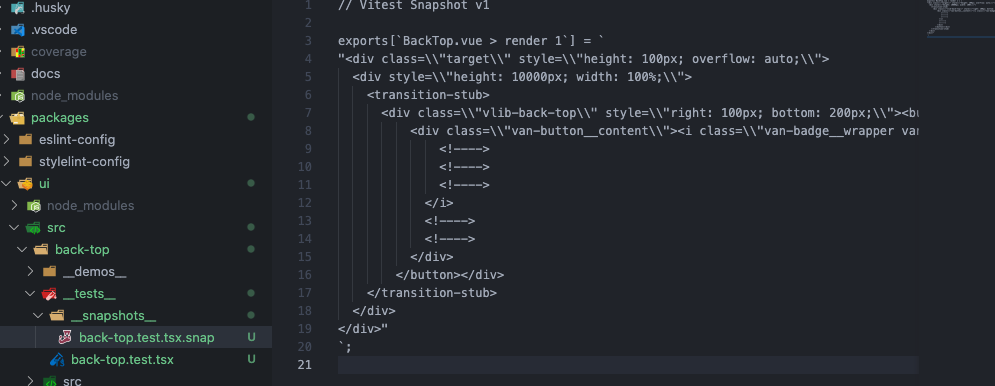
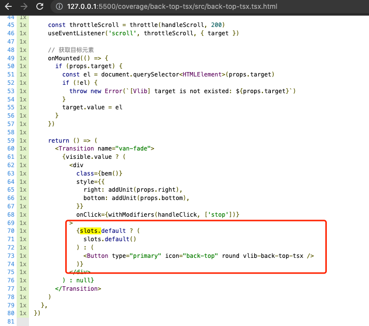

简单解释一下单元测试：就是对函数的输入输出进行测试，判断我们输入的用例的结果和我们实际输入的结果是否相同。平常工作中就会写一些测试可能不是系统性的，比如测试一个函数的返回值是否正确。

```ts
// 实现
function sum(a, b) {
  return a + b;
}
// 测试
function test() {
  if (sum(1, 1) !== 2) {
    throw new Error("sum(1, 1) did not return 2");
  }
}
test();
```

下面我们搭建一个系统性的单元测试，本篇新增的完整代码可查看单独的分支 [ui-test](https://github.com/bfehub/vlib-starter/tree/4-ui-test)。

> 如果你还不了解这个系列要做什么，那你可以先阅读 [【实践 Vue3 组件库-介绍一下这个系列】](./2022-08-10.md) 的介绍，以便你对整个系列有清晰的认识。

## 前置文章

你需要先阅读以下文章。

- [实践 Vue3 组件库-基于开源组件库扩展业务组件(组件篇一)](./2022-08-15.md)

## 环境配置

我们基于 [vitest](https://cn.vitest.dev/) 和 [vtu](https://test-utils.vuejs.org/) 做测试我们先把相关的依赖和环境配置好。

```sh
# 前置依赖
pnpm add vite vitest -D --filter @bfehub/vlib-ui

# Vue 语法插件
pnpm add @vitejs/plugin-vue @vitejs/plugin-vue-jsx unplugin-vue-define-options -D --filter @bfehub/vlib-ui

# Vue 测试环境
pnpm add @vue/test-utils happy-dom -D --filter @bfehub/vlib-ui

# Vitest 网页界面
pnpm add @vitest/ui -D --filter @bfehub/vlib-ui

# 测试覆盖率
pnpm add @vitest/coverage-c8 -D --filter @bfehub/vlib-ui
```

在 `package.json` 加入以下的脚本命令。

```json
// packages/vlib-ui/package.json
{
  "scripts": {
    "test": "vitest",
    "test:ui": "vitest --ui",
    "test:coverage": "vitest run --coverage"
  }
}
```

在 `vitest.config.ts` 中配置环境和插件。

```ts
// packages/vlib-ui/vitest.config.ts
import { defineConfig } from "vitest/config";
import vue from "@vitejs/plugin-vue";
import vueJsx from "@vitejs/plugin-vue-jsx";
import vueDefineOptions from "unplugin-vue-define-options/vite";

// https://cn.vitest.dev/config/
export default defineConfig({
  plugins: [vueDefineOptions(), vue(), vueJsx()],
  optimizeDeps: {
    disabled: true,
  },
  test: {
    clearMocks: true,
    environment: "happy-dom",
    transformMode: {
      web: [/\.[jt]sx$/],
    },
  },
});
```

## 基本使用

使用 `vitest` 只需优先记住三类方法的用法即可。

- `describe`：将相关的测试组合在一起(可以任意的嵌套和分组，一般一个文件定义一个主标题)。

- `test`：包含一组断言方法(也可以认为分组，一般是一个分支或一个功能的测试)。

- `expect`：一个断言(可以理解为判断，是对一个值或状态的具体判断)。

我们开头说的 `sum` 方法用这些方法就可以改写为。

```tsx
import { describe, test, expect } from "vitest";
describe("Sum", () => {
  test("测试数字相加", () => {
    expect(sum(1, 1)).toBe(2);

    expect(sum(0.1, 0.2)).toBeCloseTo(0.3);
  });

  test("测试字符串相加", () => {
    expect(sum("1", "1")).toBe("11");
  });
});
```

使用 `vtu` 建议跟着官网的案例走一遍，了解常用的 `mount`、`find`、`emitted`、`trigger` 等测试方法。刚开始写测试会有一种无法下手的感觉，不知道怎么写或者不会写。这时我们可以去参考开源组件库类似的组件慢慢就熟悉了。

```tsx
import { mount } from "@vue/test-utils";

// The component to test
const MessageComponent = {
  template: "<p>{{ msg }}</p>",
  props: ["msg"],
};

test("displays message", () => {
  const wrapper = mount(MessageComponent, {
    props: {
      msg: "Hello world",
    },
  });

  // Assert the rendered text of the component
  expect(wrapper.text()).toContain("Hello world");
});
```

## 测试组件

我们是新手肯定是先写组件后写测试，还可以看着组件渲染的效果写。


在组件的目录下，我们新建一个 `__tests__/back-top.test.tsx`，使用 `tsx` 的原因是挂载组件比较方便。

```tsx
// packages/vlib-ui/src/back-top/__tests__/back-top.test.tsx
import { nextTick } from "vue";
import { mount } from "@vue/test-utils";
import { describe, test, expect } from "vitest";
import { BackTop } from "../index";
```

我们要为 `BackTop` 组件写测试，使用 `describe` 定义个分组。

```tsx
describe("BackTop.vue", () => {});
```

我们要测试 `BackTop` 的渲染是否正确，使用 `test` 定义个测试。

```tsx
describe("BackTop.vue", () => {
  test("render", async () => {});
});
```

第一步先把要测试的组件 `BackTop` 挂载上。

```tsx
describe("BackTop.vue", () => {
  test("render", async () => {
    // 挂载组件
    const wrapper = mount(
      () => (
        <div class="target" style="height: 100px; overflow: auto">
          <div style="height: 10000px; width: 100%">
            <BackTop target=".target" visibilityHeight={2000} right={100} bottom={200} />
          </div>
        </div>
      ),
      { attachTo: document.body }
    );
    await nextTick();
  });
});
```

接下来我们写很多的断言，判断当前的状态和事件是否正确。

```tsx
describe("BackTop.vue", () => {
  test("render", async () => {
    // ...

    // 初始化时元素隐藏
    expect(wrapper.find(".vlib-back-top").exists()).toBe(false);

    // 滚动到 2000 之后元素显示
    wrapper.element.scrollTop = 2000;
    await wrapper.trigger("scroll");
    expect(wrapper.find(".vlib-back-top").exists()).toBe(true);

    // 验证 props 是否渲染正确
    expect(wrapper.find(".vlib-back-top").attributes("style")).toBe("right: 100px; bottom: 200px;");

    // 点击返回触发 click 事件
    await wrapper.trigger("click");
    expect(wrapper.emitted("click")).toBeDefined();
  });
});
```

最后输出快照查看整体的 DOM 结构渲染结果。

```tsx
describe("BackTop.vue", () => {
  test("render", async () => {
    // ...

    // 输出快照到单独的文件
    expect(wrapper.html()).toMatchSnapshot();
  });
});
```



运行 `pnpm run test:coverage` 测试并输出测试报告，打开 `coverage/index.html` 可以看到测试情况。由于 `sfc` 的组件测试不到 `v-if` 分支，之前还写了 `tsx` 版本的，可以看到当传入 `slot` 时这个分支没有测试到，那么接下来就可以继续添加一个测试提升覆盖率。

```tsx
describe("BackTop.vue", () => {
  test("render slot", async () => {
    // 你可以自己实现...
  });
});
```




## 你可以...

- 你可以根据本章内容自己实现一遍完善我们的组件库。

- 你可以补充未完成的测试完善覆盖率。

- 如果对你有帮助可以点个 **赞** 和 **关注** 以示鼓励。
