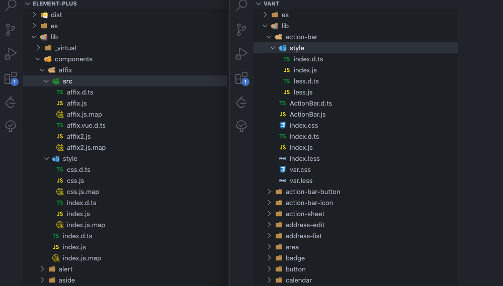
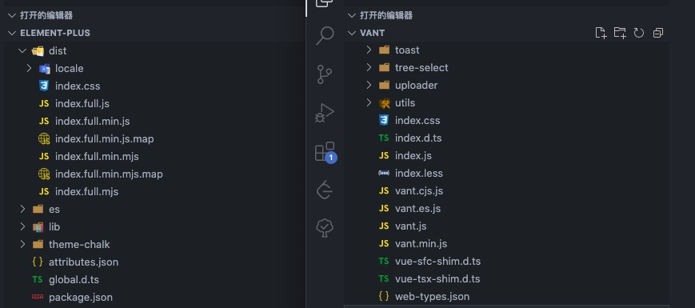
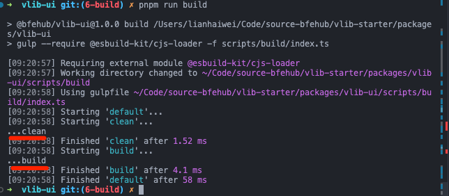
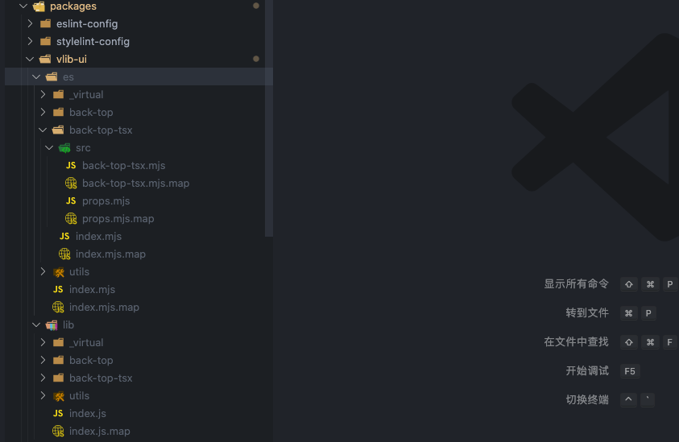
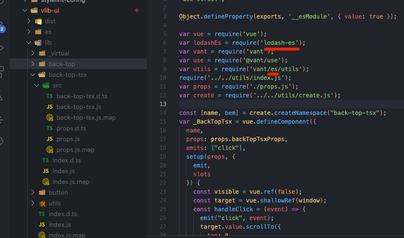
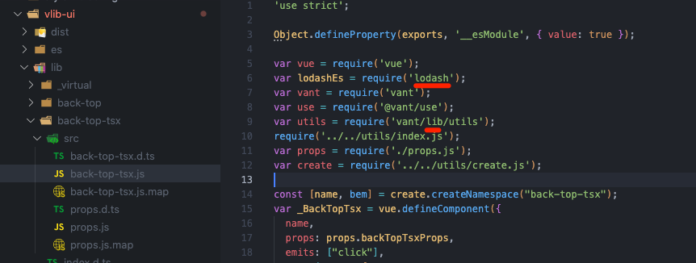
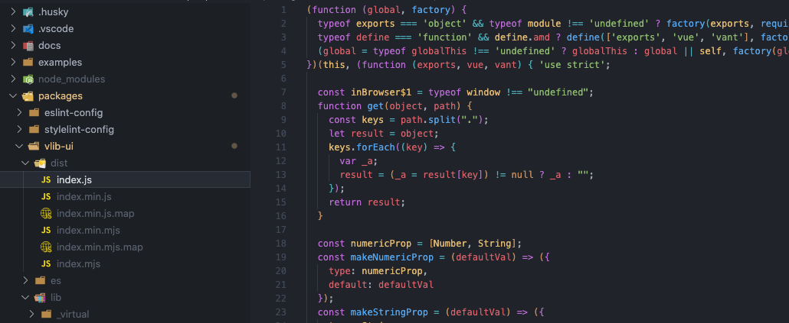
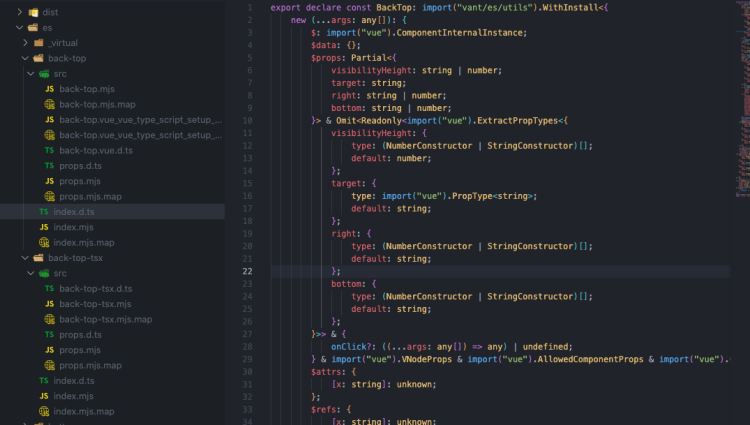

本篇我们正式进入打包篇。可以不打包吗？可以，如果是内部组件库并且项目工具链一致，那么就可以直接在内部直接发布源代码。打包复杂吗? 说也简单如果使用 `vite` 只需指定 `lib` 即可完成，说也麻烦一个开源的组件库需要处理诸多细节：多种格式、按需加载、开发体验等等。接下来我们就来看看打包一个开源组件库至少都需要做什么。

本篇新增的完整代码可查看单独的分支 [6-build](https://github.com/bfehub/vlib-starter/tree/6-build)。

## 产物格式

下图是 [vant](https://unpkg.com/vant/) 和 [element-plus](https://unpkg.com/element-plus/) 两个组件库的包文件，图截不全可以点击链接在线查看。虽然具体的文件结构是不相同的，但提供的内容基本上一致的。

- `es` 文件下都是 `esm` 模块的文件。

- `lib` 文件下都是 `cjs` 模块的文件。

- `es` 和 `lib` 下的文件结构都和源文件的文件结构一致，这样做是为了结构清晰和按需加载等。现在的 Node 和打包工具两种都支持，使用哪种是看配置环境。

- `dist` 文件下是全量的包，有 `umd` 模块的可以直接在浏览器使用，有 `esm` 模块的现在也可以在浏览器中使用(打包全量是为了减少模块请求)。

- 还有列如 `*.json`、`*.d.ts` 是代码提示，组件类型等提升开发体验的。





## 产物拆分

我们经过分析和整理可以大概明确我们都需要做什么。提供那几种格式，分别提供哪些文件。

### es

- 组件的导入/导出采用 `ES Modules` 标准，支持单独导出每个组件。

- 编译每个组件的 `Vue & TS` 代码生成对应的 `JS` 文件。

- 每个组件生成 `*.d.ts` 类型声明文件。

- 编译组件下的 `scss` 代码生成对应的 `css` 文件，包含 `style/index.js` 链接编译后的 `css` 样式文件。

- 复制组件下的 `scss` 代码到对应的目录，包含 `style/scss.js` 链接未编译的 `scss` 样式文件。

### lib

- 组件的导入/导出采用 `CommonJs Modules` 标准，支持单独导出每个组件。

- 编译每个组件的 `Vue & TS` 代码生成对应的 `JS` 文件。

- 每个组件生成 `*.d.ts` 类型声明文件。

- 编译组件下的 `scss` 代码生成对应的 `css` 文件，包含 `style/index.js` 链接编译后的 `css` 样式文件。

- 复制组件下的 `scss` 代码到对应的目录，包含 `style/scss.js` 链接未编译的 `scss` 样式文件。

### dist

- 打包所有组件代码生成一个 `JS` 文件，采用 `UMD` 和 `ES Modules` 两个模块标准。

- 生成对应 `JS` 文件 `.min.js` 后缀的压缩版本的文件和 `.map` 文件。

- 打包所有样式代码生成一个压缩后的 `css` 文件。

- 提供所有的组件的 `VSCode` 和 `WebStorm` 编辑器全局组件提示。

## 任务管理(gulp)

上面我们列举的一条条的产物要求就像是我们待完成的任务，我们需要一个工具来管理。有请这方面的主角 [gulp](https://gulpjs.com/)，虽然 `gulp` 提供的功能很少，单凭借着那 _优雅_ 的设计和各个工具的对接仍然有一战之力(现在我有时仍然会用来做文件流相关的内容)。如果你不熟悉可以阅读那极少的文档。

那么我们编写一个建议的 `gulp` 任务来熟悉熟悉，我们需要一个单独的包 `@esbuild-kit/cjs-loader` 来支持 `ts` 文件。

```sh
pnpm add gulp @types/gulp @esbuild-kit/cjs-loader -D --filter @bfehub/vlib-ui
```

添加一个执行命令，并制定一个任务配置文件。

```json
{
  "scripts": {
    "build": "gulp --require @esbuild-kit/cjs-loader -f scripts/build/index.ts"
  }
}
```

接着我们使用 `series` 编写一个串行的任务。

```ts
// packages/ui/scripts/build/index.ts
import { series } from "gulp";

export async function clean() {
  console.log("...clean");
}

export async function build() {
  console.log("...build");
}

export default series(clean, build);
```

执行 `pnpm run build` 就会按顺序依次输出。



## 组件打包(rollup+esbuild)

关于 [rollup](https://rollupjs.org/guide/en/) 的基础配置和用法你可以在掘金上找篇文章初步了解，基础的配置也是很简单。

```sh
# rollup
pnpm add rollup @rollup/plugin-node-resolve -D --filter @bfehub/vlib-ui

# vue 语法插件(在测试篇安装过就不用装了)
pnpm add @vitejs/plugin-vue @vitejs/plugin-vue-jsx unplugin-vue-define-options -D --filter @bfehub/vlib-ui

# esbuild
pnpm add esbuild rollup-plugin-esbuild -D --filter @bfehub/vlib-ui
```

### 打包模块组件

定义一些通用常量和路径。

```ts
// packages/vlib-ui/scripts/build/utils/constants.ts
export const PKG_NAME = "vlib";
export const PKG_CAMELCASE_NAME = "Vlib";
```

```ts
// packages/vlib-ui/scripts/build/utils/paths.ts
import { resolve } from "path";

// root
export const root = resolve(__dirname, "..", "..", "..");
export const compRoot = resolve(root, "src");

// output
export const output = resolve(root, "dist");
export const outputEsm = resolve(root, "es");
export const outputCjs = resolve(root, "lib");

// package
export const compPackage = resolve(root, "package.json");
```

```ts
// packages/vlib-ui/scripts/build/task/build-modules.ts
import path from "path";
import { rollup } from "rollup";
import { nodeResolve } from "@rollup/plugin-node-resolve";
import vue from "@vitejs/plugin-vue";
import vueJsx from "@vitejs/plugin-vue-jsx";
import vueDefineOptions from "unplugin-vue-define-options/rollup";
import esbuild from "rollup-plugin-esbuild";
import { compRoot, outputEsm, outputCjs } from "../utils/paths";
import { target, generateExternal, generatePaths } from "../utils/rollup";

export const buildModules = async () => {
  const input = [
    // root
    path.resolve(compRoot, "index.ts"),
  ];

  const bundle = await rollup({
    input,
    plugins: [
      // @ts-ignore
      vueDefineOptions(),
      // @ts-ignore
      vue(),
      // @ts-ignore
      vueJsx(),
      nodeResolve(),
      esbuild({
        target,
        sourceMap: true,
      }),
    ],
    treeshake: false,
    external: generateExternal({ full: true }),
  });

  await Promise.all([
    bundle.write({
      format: "esm",
      dir: outputEsm,
      exports: undefined,
      preserveModules: true,
      preserveModulesRoot: "src",
      sourcemap: true,
      entryFileNames: `[name].mjs`,
    }),
    bundle.write({
      format: "cjs",
      dir: outputCjs,
      exports: "named",
      preserveModules: true,
      preserveModulesRoot: "src",
      sourcemap: true,
      entryFileNames: `[name].js`,
    }),
  ]);
};
```

提取外部依赖，根据 `package.json` 判断是否是外部依赖。

```ts
// packages/vlib-ui/scripts/build/utils/rollup.ts
export const getCompPackage = () => {
  // eslint-disable-next-line @typescript-eslint/no-var-requires
  const { version, dependencies, peerDependencies } = require(compPackage);
  return {
    version,
    dependencies: Object.keys(dependencies),
    peerDependencies: Object.keys(peerDependencies),
  };
};

export const generateExternal = (options: { full: boolean }) => {
  const { dependencies, peerDependencies } = getCompPackage();

  const packages: string[] = peerDependencies;

  if (options.full) {
    packages.push(...dependencies);
  }

  return (id: string) => {
    return packages.some((pkg) => id === pkg || (options.full && id.startsWith(`${pkg}/`)));
  };
};
```

修改下我们的任务代码，引入打包是可以并行的。

```ts
import { parallel } from "gulp";
import { buildModules } from "./task";

export default parallel(buildModules);
```

执行 `pnpm run build` 打包，已经生成了。



但是这时候有个问题，外部模块是不解析的，但是我们的 lodash-es 和 vant/es 都是 ems 的模块的，怎么改成 cjs 呢。



还好 rollup 的有一个配置，[https://rollupjs.org/guide/en/#outputpaths] 就是用来处理外部模块的路径的。



```ts
export const generatePaths = () => {
  const paths = [
    ["lodash-es", "lodash"],
    ["vant/es", "vant/lib"],
  ];

  return (id: string) => {
    for (const [oldPath, newPath] of paths) {
      if (id.startsWith(oldPath)) {
        return id.replace(oldPath, newPath);
      }
    }

    return "";
  };
};
```

### 打包全量组件

打包全量组件我们只提取前置依赖，第一像 `lodash-es` 这种包我们只需要了几个方法，没必要也让用户在全局引入。

根据传入的配置是否是压缩版本。

```ts
// packages/vlib-ui/scripts/build/task/build-full.ts
import path from "path";
import { rollup } from "rollup";
import { nodeResolve } from "@rollup/plugin-node-resolve";
import vue from "@vitejs/plugin-vue";
import vueJsx from "@vitejs/plugin-vue-jsx";
import vueDefineOptions from "unplugin-vue-define-options/rollup";
import esbuild, { minify as minifyPlugin } from "rollup-plugin-esbuild";
import { compRoot, output } from "../utils/paths";
import { target, generateExternal } from "../utils/rollup";
import { PKG_CAMELCASE_NAME } from "../utils/constants";

const build = async (minify: boolean) => {
  const input = [
    // root
    path.resolve(compRoot, "index.ts"),
  ];

  const bundle = await rollup({
    input,
    plugins: [
      // @ts-ignore
      vueDefineOptions(),
      // @ts-ignore
      vue(),
      // @ts-ignore
      vueJsx(),
      nodeResolve(),
      esbuild({
        target,
        sourceMap: minify,
        treeShaking: true,
      }),
      minify
        ? minifyPlugin({
            target,
            sourceMap: minify,
          })
        : null,
    ],
    treeshake: true,
    external: generateExternal({ full: false }),
  });

  await Promise.all([
    bundle.write({
      format: "esm",
      file: path.resolve(output, `index${minify ? ".min" : ""}.mjs`),
      exports: undefined,
      sourcemap: minify,
    }),
    bundle.write({
      format: "umd",
      file: path.resolve(output, `index${minify ? ".min" : ""}.js`),
      exports: "named",
      sourcemap: minify,
      name: PKG_CAMELCASE_NAME,
      globals: {
        vue: "Vue",
        vant: "vant",
      },
    }),
  ]);
};

export const buildFull = async () => {
  await Promise.all([build(false), build(true)]);
};
```

修改任务的入口

```ts
import { parallel } from "gulp";
import { buildModules, buildFull } from "./task";

export default parallel(buildModules, buildFull);
```

## 清理产物

再次打包之前，我们先清理旧的产物，避免无用的文件。把三个文件删除掉就可以

```ts
// packages/ui/scripts/build/task/clean.ts
import fs from "fs-extra";
import { output, outputEsm, outputCjs } from "../utils";

export const clean = async () => {
  await Promise.all([fs.remove(output), fs.remove(outputEsm), fs.remove(outputCjs)]);
};
```

我们的执行顺序是前清理，清理完成后再打包。

```ts
import { series, parallel } from "gulp";
import { clean, buildModules, buildFull } from "./task";

export default series(clean, parallel(buildModules, buildFull));
```



## 生成声明文件

其实只需 vue-tsc --declaration --emitDeclarationOnly 即可生成，单生成时需要时间的，所以编写一个任务，只生成 es 下的，lib 下我们通过任务复制过去。

```sh
pnpm add typescript vue-tsc -D --filter @bfehub/vlib-ui
```

我们新建一个配置文件来声明，只生成声明文件不生成代码。

```ts
{
  "extends": "../../tsconfig.json",
  "compilerOptions": {
    "outDir": "es",
    "declaration": true,
    "emitDeclarationOnly": true
  },
  "include": ["src"],
  "exclude": ["node_modules", "**/__tests__/**", "**/__demos__/**", "**/*.md"]
}
```

我们只需在脚本中执行 `vue-tsc` 即可，执行命令我们使用 `execa` 执行。

```sh
pnpm add execa -D --filter @bfehub/vlib-ui
```

```ts
import { execa } from "execa";
import { src, dest } from "gulp";
import { root, outputEsm, outputCjs } from "../utils/paths";

export const generateTypes = async () => {
  await execa("vue-tsc", ["-p", "tsconfig.declaration.json"], {
    cwd: root,
  });

  return src(`${outputEsm}/**/*.d.ts`).pipe(dest(`${outputCjs}`));
};
```

最后加入我们的任务。

```ts
import { series, parallel } from "gulp";
import { clean, buildModules, buildFull, generateTypes } from "./task";

export default series(clean, parallel(buildModules, buildFull, generateTypes));
```

执行 `pnpm run build` 执行。



## 产物测试

1.  create vite 创建项目
2.  umd 引入 cdn 链接。
3.  esm 引入 cdn 链接，指定 importmap

可以查看 `examples` 文件夹
