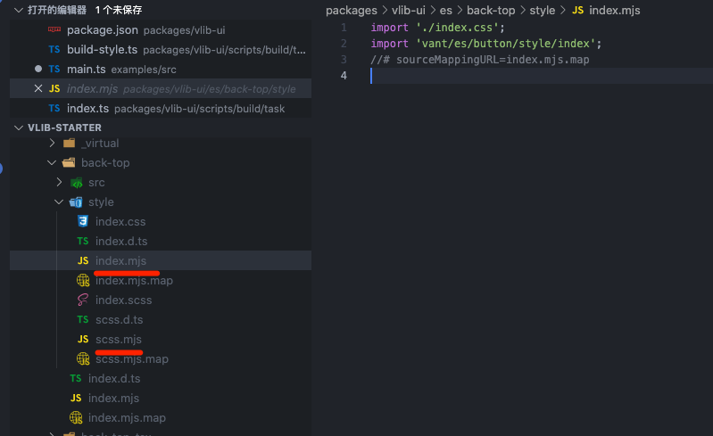

我们使用 gulp 来打包 css。

```sh
pnpm add sass gulp-sass gulp-autoprefixer gulp-clean-css  -D --filter @bfehub/vlib-ui

# 类型声明包
pnpm add @types/gulp-autoprefixer @types/gulp-clean-css   @types/gulp-sass -D --filter @bfehub/vlib-ui
```

## 拷贝 scss

我们需要对外提供原始的 `sass` 文件.

```js
// packages/vlib-ui/scripts/build/task/build-style.ts
/**
 * [src/*.scss] to [es/*.scss, lib/*.scss]
 */
const buildScssCopy = async () => {
  await new Promise((resolve) => {
    src(`${compRoot}/**/*.scss`).pipe(dest(outputEsm)).pipe(dest(outputCjs)).on("end", resolve);
  });
};
```


包这些小任务组合以下。

```js
export const buildStyle = async () => {
  await Promise.all([buildScssCopy()]);
};
```

加入到我们的打包任务中.

```ts
import { series, parallel } from "gulp";
import { clean, buildModules, buildFull, buildStyle, generateTypes } from "./task";

export default series(clean, parallel(buildModules, buildFull, buildStyle, generateTypes));
```

## 打包模块 css

把 style/xxx.scss 文件都编译一遍。

```js
/**
 * [src/**\/style/*.scss] to [es/**\/style/*.css, lib/**\/style/*.css]
 */
const buildScssModules = async () => {
  const sass = gulpSass(dartSass);
  await new Promise((resolve) => {
    src(`${compRoot}/**/style/*.scss`)
      .pipe(sass.sync())
      .pipe(autoprefixer({ cascade: false }))
      .pipe(cleanCSS())
      .pipe(dest(outputEsm))
      .pipe(dest(outputCjs))
      .on("end", resolve);
  });
};
```

## 打包全量的 css

打包 index.scss 到 dist/index.css

```ts
/**
 * [src/*.scss] to [dist/*.css]
 */
const buildScssFull = async () => {
  const sass = gulpSass(dartSass);
  await new Promise((resolve) => {
    src(`${compRoot}/*.scss`)
      .pipe(sass.sync())
      .pipe(autoprefixer({ cascade: false }))
      .pipe(cleanCSS())
      .pipe(dest(output))
      .on("end", resolve);
  });
};
```

## 打包 style 按需引入

需要找到 style/\*.ts 我们用一个匹配库查询。

```sh
pnpm add fast-glob -D --filter @bfehub/vlib-ui
```

我再 src/style 新建。index.ts 和 scss.ts，处理组件的样式外，我们还依赖 button 组件，所以也引入 vant 提供的 链接 button 样式的 js 文件。

```ts
// packages/vlib-ui/src/back-top/style/index.ts
import "./index.css";
import "vant/es/button/style/index";
```

```ts
// packages/vlib-ui/src/back-top/style/scss.ts
import "./index.scss";
import "vant/es/button/style/index";
```

还是使用 `rolluo` 打包，我们处理任何的人工。

```ts
/**
 * [src/**\/style/*.ts] to [es/**\/style/*.js, lib/**\/style/*.js]
 */
const buildStyleModules = async () => {
  const input = [
    // style
    ...(await glob(`${compRoot}/**/style/*.ts`)),
    // resolver
    // path.resolve(compRoot, "resolver.ts"),
  ];

  const bundle = await rollup({
    input,
    plugins: [
      esbuild({
        sourceMap: true,
      }),
    ],
    external: [/./],
    treeshake: false,
  });

  await Promise.all([
    bundle.write({
      format: "esm",
      dir: outputEsm,
      exports: undefined,
      preserveModules: true,
      preserveModulesRoot: "src",
      sourcemap: true,
      entryFileNames: `[name].mjs`,
    }),
    bundle.write({
      format: "cjs",
      dir: outputCjs,
      exports: "named",
      preserveModules: true,
      preserveModulesRoot: "src",
      sourcemap: true,
      entryFileNames: `[name].js`,
      paths: generatePaths(),
    }),
  ]);
};
```

## 自动导入解析器

我们可用 `unplugin-vue-components` 来完成我们的组件和样式的自动导入。要做到自动导入和样式引用，需要一个解析器，解析器规则。一些大的组件库会把自己的解析器加入到这个项目中。但我们这个小项目可以把解析器放到自己的项目中。

```sh
pnpm add unplugin-vue-components -D --filter @bfehub/examples
pnpm add unplugin-vue-components -D --filter @bfehub/vlib-ui
```

我们再 `src` 下新建一个 `resolver.ts` 编写我们的解析器。和 css 一起打包。

```ts
const input = [
  // style
  ...(await glob(`${compRoot}/**/style/*.ts`)),
  // resolver
  path.resolve(compRoot, "resolver.ts"),
];
```

```ts
import type { ComponentResolver, SideEffectsInfo } from "unplugin-vue-components/types";
import { kebabCase } from "unplugin-vue-components";

const isSSR = Boolean(
  process.env.SSR || process.env.SSG || process.env.VITE_SSR || process.env.VITE_SSG
);

const moduleType = isSSR ? "lib" : "es";

export interface VlibResolverOptions {
  /**
   * import style css or scss along with components
   *
   * @default true
   */
  importStyle?: boolean | "css" | "scss";
}

function getSideEffects(
  dirName: string,
  options: VlibResolverOptions
): SideEffectsInfo | undefined {
  const { importStyle = true } = options;

  if (!importStyle || isSSR) return;

  if (importStyle === "scss") {
    return `@bfehub/vlib-ui/${moduleType}/${dirName}/style/scss`;
  } else {
    return `@bfehub/vlib-ui/${moduleType}/${dirName}/style/index`;
  }
}

/**
 * Resolver for Vlib
 *
 * @link https://github.com/bfehub/vlib-starter
 */
export function VlibResolver(options: VlibResolverOptions = {}): ComponentResolver {
  return {
    type: "component",
    resolve: (name: string) => {
      if (name.startsWith("Vlib")) {
        const partialName = name.slice(4);
        return {
          name: partialName,
          from: `@bfehub/vlib-ui/${moduleType}`,
          sideEffects: getSideEffects(kebabCase(partialName), options),
        };
      }
    },
  };
}
```

我们回到示例项目中，配置解析器。

```ts
import { fileURLToPath, URL } from "node:url";
import { defineConfig } from "vite";
import vue from "@vitejs/plugin-vue";
import Components from "unplugin-vue-components/vite";
import { VantResolver } from "unplugin-vue-components/resolvers";
import { VlibResolver } from "@bfehub/vlib-ui/lib/resolver";

// https://vitejs.dev/config/
export default defineConfig({
  plugins: [
    vue(),
    Components({
      resolvers: [VantResolver(), VlibResolver()],
    }),
  ],
  resolve: {
    alias: {
      "@": fileURLToPath(new URL("./src", import.meta.url)),
    },
  },
});
```

按需引入之前




可以看到 `vant` 不再包含 `uploader` 之类的相关样式，我们的 `vlib` 也不在包含 `back-top-tsx` 相关的样式。
