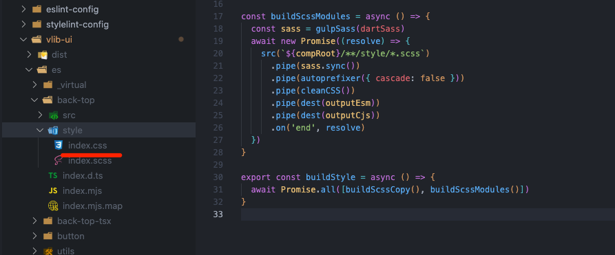
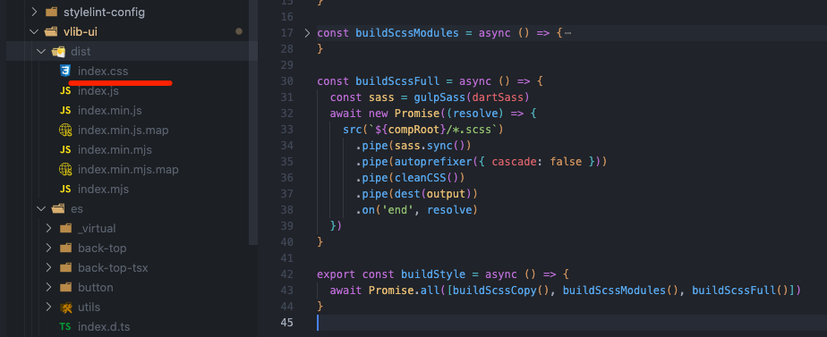
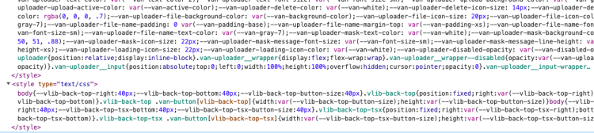

在上篇 [实践 Vue3 组件库-如何实现组件打包与组件声明文件(打包篇一)](./2022-08-25.md) 中完成了多种模块标准的产物和组件声明文件并对模块做了测试。在我们列举的产物列表中还剩下样式相关的任务未处理，这篇我们来打包样式代码并实现样式的按需引入。

本篇新增的完整代码可查看单独的分支 [7-build-style](https://github.com/bfehub/vlib-starter/tree/7-build-style)。

> 如果你还不了解这个系列要做什么，那你可以先阅读 [【实践 Vue3 组件库-介绍一下这个系列】](./2022-08-10.md) 的介绍，以便你对整个系列有清晰的认识。

## 前置文章

你可能需要先阅读以下文章编写我们需要打包的组件。

- [实践 Vue3 组件库-基于开源组件库扩展业务组件(组件篇一)](./2022-08-15.md)

- [实践 Vue3 组件库-如何实现组件打包与组件声明文件(打包篇一)](./2022-08-25.md)

## 打包样式

我们使用 gulp 生态内的插件编译 scss 文件，如果你对以下插件不熟悉可以在官网搜索查看文档。

```sh
# 相关依赖
pnpm add sass gulp-sass gulp-autoprefixer gulp-clean-css fast-glob -D --filter @bfehub/vlib-ui

# 类型声明包
pnpm add @types/gulp-autoprefixer @types/gulp-clean-css @types/gulp-sass -D --filter @bfehub/vlib-ui
```

和之前同样的思路新建一个 `buildStyle` 任务处理打包任务。

```ts
// packages/vlib-ui/scripts/build/task/build-style.ts
import { dest, src } from "gulp";
import path from "path";
import dartSass from "sass";
import gulpSass from "gulp-sass";
import autoprefixer from "gulp-autoprefixer";
import cleanCSS from "gulp-clean-css";
import { rollup } from "rollup";
import esbuild from "rollup-plugin-esbuild";
import glob from "fast-glob";
import { compRoot, output, outputEsm, outputCjs } from "../utils/paths";
import { generatePaths } from "../utils/rollup";

export const buildStyle = async () => {
  await Promise.all([]);
};
```

加入到之前的主任务中。现在还没有具体的实现，接下来就一步一步的实现。

```ts
// packages/vlib-ui/scripts/build/index.ts
import { series, parallel } from "gulp";
import { clean, buildModules, buildFull, buildStyle, generateTypes } from "./task";

export default series(clean, parallel(buildModules, buildFull, buildStyle, generateTypes));
```

### 拷贝 scss

我们对外提供原始的 scss 文件，有需求的用户可以直接引用使用。使用 `src` 匹配文件直接输出到 `es&lib` 下就完成了复制。

```ts
// packages/vlib-ui/scripts/build/task/build-style.ts
/**
 * [src/*.scss] to [es/*.scss, lib/*.scss]
 */
const buildScssCopy = async () => {
  await new Promise((resolve) => {
    src(`${compRoot}/**/*.scss`)
      .pipe(dest(outputEsm)) // es
      .pipe(dest(outputCjs)) // lib
      .on("end", resolve); // 监听流完成
  });
};
```

把这个小任务加入到样式主任务中。

```ts
// packages/vlib-ui/scripts/build/task/build-style.ts
export const buildStyle = async () => {
  await Promise.all([buildScssCopy()]);
};
```

执行 `pnpm run build` 打包可以看到已经生成了。


### 编译模块 scss

我们把组件下 scss 文件分别单独的编译成对应的文件，这样做是为了样式文件也可以单独引入。

```ts
// packages/vlib-ui/scripts/build/task/build-style.ts
/**
 * [src/**\/style/*.scss] to [es/**\/style/*.css, lib/**\/style/*.css]
 */
const buildScssModules = async () => {
  const sass = gulpSass(dartSass);
  await new Promise((resolve) => {
    src(`${compRoot}/**/style/*.scss`)
      .pipe(sass.sync()) // 编译
      .pipe(autoprefixer({ cascade: false })) // 兼容
      .pipe(cleanCSS()) // 压缩
      .pipe(dest(outputEsm)) // es
      .pipe(dest(outputCjs)) // lib
      .on("end", resolve); // 监听流完成
  });
};
```

把这个小任务加入到样式主任务中。

```js
// packages/vlib-ui/scripts/build/task/build-style.ts
export const buildStyle = async () => {
  await Promise.all([buildScssCopy(), buildScssModules()]);
};
```

执行 `pnpm run build` 打包可以看到已经生成了。



### 编译全量 scss

打包一份全量的样式文件，这样做为了提供给不需要按需引入和浏览器端直接引入使用。

```ts
// packages/vlib-ui/scripts/build/task/build-style.ts
/**
 * [src/*.scss] to [dist/*.css]
 */
const buildScssFull = async () => {
  const sass = gulpSass(dartSass);
  await new Promise((resolve) => {
    src(`${compRoot}/*.scss`)
      .pipe(sass.sync()) // 编译
      .pipe(autoprefixer({ cascade: false })) // 兼容
      .pipe(cleanCSS()) // 压缩
      .pipe(dest(output)) // dist
      .on("end", resolve); // 监听流完成
  });
};
```

把这个小任务加入到样式主任务中。

```js
// packages/vlib-ui/scripts/build/task/build-style.ts
export const buildStyle = async () => {
  await Promise.all([buildScssCopy(), buildScssModules(), buildScssFull()]);
};
```

执行 `pnpm run build` 打包可以看到已经生成了。



## 按需引入

### 代理样式文件

上面我们已经把组件的样式都打包成了一个单独的文件，使用 `@bfehub/vlib-ui/es/back-top/style/index.css` 这种方式手动引入也可以实现按需加载。

但这样也有很大的问题。如当前组件依赖了 `van-button` 组件或者自己编写的组件我们也需要手动单独的引入。对于用户是不知道依赖哪些组件的，这显然是无法接受的。

所以我们的解决方案是：创建一个 `style/index.js` 文件引入 `css` 文件。第一我们可以在这个文件中引入所有依赖的组件的样式文件，第二也可以直接使用由打包工具提供的路径解析功能，第三可以生成声明文件有代码提示 ，第四可以配合其他工具使用等等。把 `css` 和 `scss` 都支持下分别创建以下文件。

```ts
// packages/vlib-ui/src/back-top/style/index.ts
import "./index.css";
import "vant/es/button/style/index";
```

```ts
// packages/vlib-ui/src/back-top/style/scss.ts
import "./index.scss";
import "vant/es/button/style/index";
```

由于还是 `ts` 文件，我们还是使用 `rollup` 分别打包 `esm` 和 `cjs` 模块。但我们不需要处理任何的语法所有模块也全部排除到外部模块。

```ts
// packages/vlib-ui/scripts/build/task/build-style.ts
/**
 * [src/**\/style/*.ts] to [es/**\/style/*.js, lib/**\/style/*.js]
 */
const buildStyleModules = async () => {
  const input = [
    // style
    ...(await glob(`${compRoot}/**/style/*.ts`)),
  ];

  const bundle = await rollup({
    input,
    plugins: [
      esbuild({
        sourceMap: true,
      }),
    ],
    external: [/./],
    treeshake: false,
  });

  await Promise.all([
    bundle.write({
      format: "esm",
      dir: outputEsm,
      exports: undefined,
      preserveModules: true,
      preserveModulesRoot: "src",
      sourcemap: true,
      entryFileNames: `[name].mjs`,
    }),
    bundle.write({
      format: "cjs",
      dir: outputCjs,
      exports: "named",
      preserveModules: true,
      preserveModulesRoot: "src",
      sourcemap: true,
      entryFileNames: `[name].js`,
      paths: generatePaths(),
    }),
  ]);
};
```

把这个小任务加入到样式主任务中。

```js
// packages/vlib-ui/scripts/build/task/build-style.ts
export const buildStyle = async () => {
  await Promise.all([buildScssCopy(), buildScssModules(), buildScssFull(), buildStyleModules()]);
};
```

执行 `pnpm run build` 打包可以看到已经生成了，现在可以使用 `@bfehub/vlib-ui/es/back-top/style/index` 引入相关的样式文件。


### 自动导入解析器

现在虽然解决了依赖问题，但还是需要手动引入。社区中有这么一个工具 [unplugin-vue-components](https://github.com/antfu/unplugin-vue-components) 它可以自动按需导入项目中使用的组件。它内部提供了很多组件库的预设的解析器。

我们要做的就是编写自己组件库的解析器，但我们自己内部小项目就不必发上去，在本地写一个就好跟随组件库发布。你还可以参考对应组件库 [resolvers](https://github.com/antfu/unplugin-vue-components/tree/main/src/core/resolvers) 的解析器。

```sh
pnpm add unplugin-vue-components -D --filter @bfehub/vlib-ui
```

单独新建一个 `resolver.ts` 编写解析器，它会把解析到的组件名称通过 `resolve` 传过来，根据组件名称可以指定组件导入的路径和样式导入路径。

```ts
import type { ComponentResolver, SideEffectsInfo } from "unplugin-vue-components/types";
import { kebabCase } from "unplugin-vue-components";

// 判断是不是服务端渲染
const isSSR = Boolean(
  process.env.SSR || process.env.SSG || process.env.VITE_SSR || process.env.VITE_SSG
);

// 服务端渲染使用 cjs 模块，反之使用 esm 模块
const moduleType = isSSR ? "lib" : "es";

// 解析器的参数配置
export interface VlibResolverOptions {
  // 执行加载 css 还是 scss，默认加载 css
  importStyle?: boolean | "css" | "scss";
}

// 获取到副作用
function getSideEffects(
  dirName: string,
  options: VlibResolverOptions
): SideEffectsInfo | undefined {
  // 是否加载
  const { importStyle = true } = options;
  if (!importStyle || isSSR) return;

  // 获取到副作用的路径
  if (importStyle === "scss") {
    return `@bfehub/vlib-ui/${moduleType}/${dirName}/style/scss`;
  } else {
    return `@bfehub/vlib-ui/${moduleType}/${dirName}/style/index`;
  }
}

export function VlibResolver(options: VlibResolverOptions = {}): ComponentResolver {
  return {
    type: "component", // 组件类型
    resolve: (name: string) => {
      // 判断解析的组件名称是不是当前组件库的
      if (name.startsWith("Vlib")) {
        // 获取到组件名称
        const partialName = name.slice(4);
        return {
          // 组件名称
          name: partialName,
          // 从哪个路径导入，es/lib
          from: `@bfehub/vlib-ui/${moduleType}`,
          // 根据组件名称获取到对应的 css 导入路径。BackTop => es/back-top/style/index
          sideEffects: getSideEffects(kebabCase(partialName), options),
        };
      }
    },
  };
}
```

把这个解析器与样式一起打包。

```ts
// packages/vlib-ui/scripts/build/task/build-style.ts
const buildStyleModules = async () => {
  const input = [
    // style
    ...(await glob(`${compRoot}/**/style/*.ts`)),
    // resolver
    path.resolve(compRoot, "resolver.ts"),
  ];
};
```

### 测试按需导入

现在回到示例项目(@bfehub/examples)中配置解析器。

```sh
pnpm add unplugin-vue-components -D --filter @bfehub/examples
```

```ts
// examples/vite.config.ts
import { fileURLToPath, URL } from "node:url";
import { defineConfig } from "vite";
import vue from "@vitejs/plugin-vue";
import Components from "unplugin-vue-components/vite";
import { VantResolver } from "unplugin-vue-components/resolvers";
import { VlibResolver } from "@bfehub/vlib-ui/lib/resolver";

export default defineConfig({
  plugins: [
    vue(),
    Components({
      resolvers: [
        // vant
        VantResolver(),
        // vlib
        VlibResolver(),
      ],
    }),
  ],
  resolve: {
    alias: {
      "@": fileURLToPath(new URL("./src", import.meta.url)),
    },
  },
});
```

修改入口文件，现在即不注册组件也不引入样式。

```ts
// examples/src/main.ts
import { createApp } from "vue";

// 全部引入测试
// import VantUI from 'vant'
// import VlibUI from '@bfehub/vlib-ui'
// import App from './App.vue'
// import 'vant/lib/index.css'
// import '@bfehub/vlib-ui/dist/index.css'
// const app = createApp(App)
// app.use(VantUI)
// app.use(VlibUI)
// app.mount('#app')

// 自动按需引入测试
import App from "./App.vue";
const app = createApp(App);
app.mount("#app");
```

```html
<!-- examples/src/App.vue -->
<template>
  <van-cell-group>
    <van-cell v-for="i in 100" :key="i">Cell {{ i }}</van-cell>
  </van-cell-group>
  <vlib-back-top></vlib-back-top>
</template>
```

改成按需引入后，可以看到 `vant` 不再包含 `uploader` 之类的相关样式，我们的 `vlib` 也不再包含 `back-top-tsx` 相关的样式。




## 你可以...

- 你可以根据本章内容自己实现一遍完善我们的组件库。

- 如果对你有帮助可以点个 **赞** 和 **关注** 以示鼓励。
