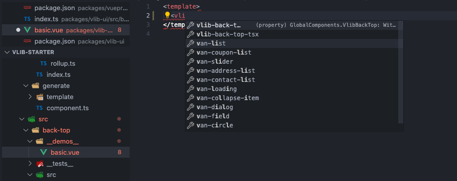
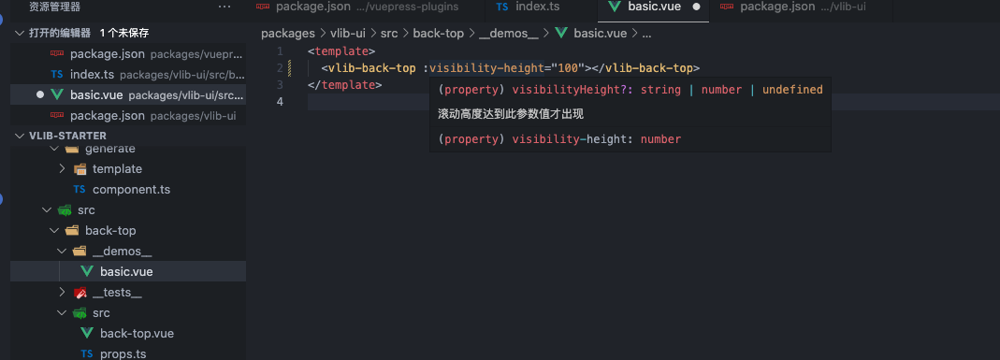
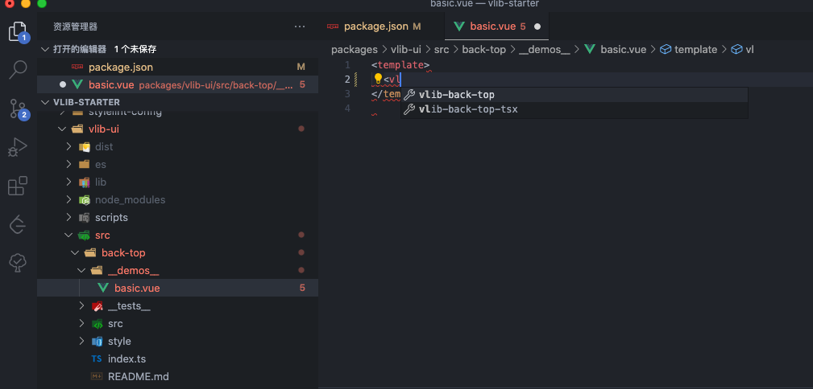
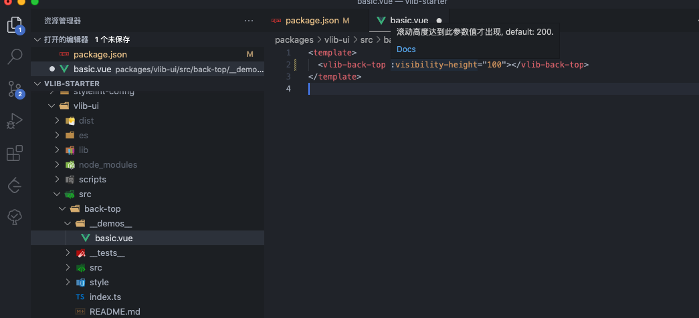
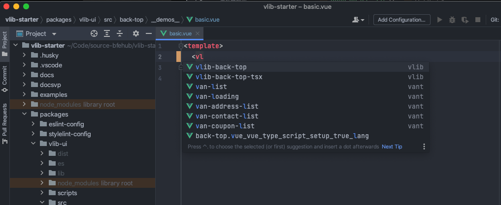
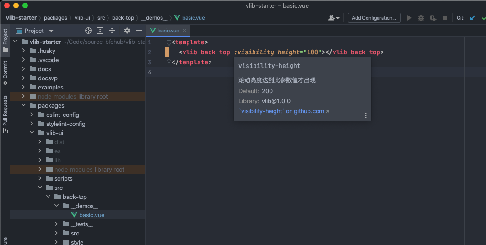
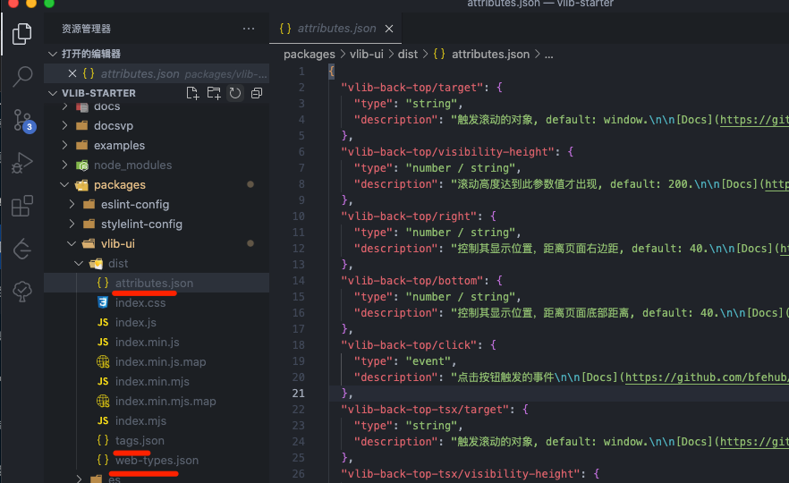

我们写代码的时候，需要一些组件提示，这些都是由编辑器支持或插件支持的。

## 手动编写

### vscode.volar

https://github.com/vuejs/core/pull/3399
https://github.com/johnsoncodehk/volar/tree/master/extensions/vscode-vue-language-features#usage
https://stackoverflow.com/questions/69010567/how-to-make-vscode-recognize-global-component-in-vue

volar 根据类型支持组件提示，我们可以直接写在代码里，这样在未打包之前也能获得提示

```ts
// packages/vlib-ui/src/back-top/index.ts
import { withInstall } from "vant/es/utils";
import _BackTop from "./src/back-top.vue";

export const BackTop = withInstall(_BackTop);
export default BackTop;

export type { BackTopProps } from "./src/props";

declare module "vue" {
  export interface GlobalComponents {
    VlibBackTop: typeof BackTop;
  }
}
```

你可以向 `element-plus` 单独写一个维护。

```ts
// GlobalComponents for Volar
declare module "@vue/runtime-core" {
  export interface GlobalComponents {
    VlibBackTop: typeof import("@bfehub/vlib")["VlibBackTop"];
  }
}
```




### vscode.vetur

现在写 vue3 组件都是使用 `volar`，`vetur` 插件本身支持配置。

https://vuejs.github.io/vetur/guide/component-data.html#component-data

```json
// tags.json
{
  "vlib-back-top": {
    "attributes": ["target", "visibility-height", "right", "bottom", "click"],
    "description": "返回页面顶部的操作按钮。\n\n[Docs](https://github.com/bfehub/vlib-starter/components/Users/#backtop)"
  }
}
```

```json
// attributes.json
{
  "vlib-back-top/target": {
    "type": "string",
    "description": "触发滚动的对象, default: window.\n\n[Docs](https://github.com/bfehub/vlib-starter/components/Users/#backtop-props)"
  },
  "vlib-back-top/visibility-height": {
    "type": "number / string",
    "description": "滚动高度达到此参数值才出现, default: 200.\n\n[Docs](https://github.com/bfehub/vlib-starter/components/Users/#backtop-props)"
  },
  "vlib-back-top/right": {
    "type": "number / string",
    "description": "控制其显示位置，距离页面右边距, default: 40.\n\n[Docs](https://github.com/bfehub/vlib-starter/components/Users/#backtop-props)"
  },
  "vlib-back-top/bottom": {
    "type": "number / string",
    "description": "控制其显示位置，距离页面底部距离, default: 40.\n\n[Docs](https://github.com/bfehub/vlib-starter/components/Users/#backtop-props)"
  }
}
```

在 `package.json` 中加入

```ts
// packages/vlib-ui/package.json
{
  "vetur": {
    "tags": "dist/tags.json",
    "attributes": "dist/attributes.json"
  },
}
```

我们关闭 volar 插件，打开 volar 插件，把 ui 包安装根项目，或者然后单独打开 `package/vlib-ui` 这个项目，因为只有根目下的包的声明和配置才会生效。(可能需要重启编辑器)

```sh
pnpm add @bfehub/vlib-ui -w
```




### webstorm

webstorm 有自己内置的支持，是一种标准的格式。

https://github.com/JetBrains/web-types

```json
// web-types.json
{
  "$schema": "https://raw.githubusercontent.com/JetBrains/web-types/master/schema/web-types.json",
  "framework": "vue",
  "name": "vlib",
  "version": "1.0.0",
  "contributions": {
    "html": {
      "types-syntax": "typescript",
      "description-markup": "markdown",
      "tags": [
        {
          "name": "vlib-back-top",
          "source": {
            "symbol": "VlibBackTop"
          },
          "description": "返回页面顶部的操作按钮。",
          "doc-url": "https://github.com/bfehub/vlib-starter/components/Users/#backtop",
          "attributes": [
            {
              "name": "target",
              "description": "触发滚动的对象",
              "doc-url": "https://github.com/bfehub/vlib-starter/components/Users/#backtop-props",
              "default": "window",
              "value": {
                "type": "string",
                "kind": "expression"
              }
            },
            {
              "name": "visibility-height",
              "description": "滚动高度达到此参数值才出现",
              "doc-url": "https://github.com/bfehub/vlib-starter/components/Users/#backtop-props",
              "default": "200",
              "value": {
                "type": "number / string",
                "kind": "expression"
              }
            },
            {
              "name": "right",
              "description": "控制其显示位置，距离页面右边距",
              "doc-url": "https://github.com/bfehub/vlib-starter/components/Users/#backtop-props",
              "default": "40",
              "value": {
                "type": "number / string",
                "kind": "expression"
              }
            },
            {
              "name": "bottom",
              "description": "控制其显示位置，距离页面底部距离",
              "doc-url": "https://github.com/bfehub/vlib-starter/components/Users/#backtop-props",
              "default": "40",
              "value": {
                "type": "number / string",
                "kind": "expression"
              }
            }
          ],
          "events": [
            {
              "name": "click",
              "description": "点击按钮触发的事件",
              "doc-url": "https://github.com/bfehub/vlib-starter/components/Users/#backtop-events"
            }
          ],
          "slots": [
            {
              "name": "default",
              "description": "自定义默认内容",
              "doc-url": "https://github.com/bfehub/vlib-starter/components/Users/#backtop-slots"
            }
          ]
        }
      ]
    }
  }
}
```

在 `package.json` 中加入

```json
{
  "web-types": "dist/web-types.json"
}
```

用 webstorm 打开。




## 自动生成

volar 我们还可以和组件一起恢复也不麻烦，我们再代码写注释提示的也清楚。

vetur 和 webstorm 我们就需要编写大量的配置，现在有一种方案根据文档自动生成，文档本身就是对外提供的最详细的配置说明，各个的属性和用法甚至比我们再代码中写的还清楚。

主要利用 `component-helper` 这个工具来生成。详细的文档你可以看文档，官方提供的了 demo 文件供我们修改。 我们编写一个任务来生成。

再手写上还是麻烦，

1. 我们还有很多可以配置的，比如可选值，文档链接等。
2. 更新组件的时候需要手动更新。
   所以有一种解决方案是，根据编写的文档来自动生成上述的两种格式，
   https://github.com/tolking/components-helper
   https://github.com/element-plus/element-plus/blob/dev/internal/build/src/tasks/helper.ts

```ts
// packages/vlib-ui/scripts/build/task/generate-helper.ts
import type { ReComponentName, ReDocUrl, ReAttribute, ReWebTypesSource } from "components-helper";
import helper from "components-helper";
import { output, compRoot, compPackage } from "../utils/paths";
import { PKG_NAME, PKG_CAMELCASE_NAME } from "../utils/constants";

// eslint-disable-next-line @typescript-eslint/no-var-requires
const { version } = require(compPackage);

/**
 * 重写组件名称
 * @example BackTop -> vlib-back-top
 */
const reComponentName: ReComponentName = (title) => {
  return `${PKG_NAME}-${title
    .replace(/\B([A-Z])/g, "-$1")
    .replace(/[ ]+/g, "-")
    .toLowerCase()}`;
};

/**
 * 重写文档路径
 * @example src/back-top/README.md -> https://github.com/bfehub/vlib-starter/components/back-top/
 */
const reDocUrl: ReDocUrl = (_, header, path) => {
  const docs = "https://github.com/bfehub/vlib-starter/components/";
  const name = path?.split("/")[1] + "/";
  const _header = header ? header.replace(/[ ]+/g, "-").toLowerCase() : undefined;
  return docs + name + (_header ? "#" + _header : "");
};

/**
 * 重写组件属性
 * @example v-model -> model-value
 */
const reAttribute: ReAttribute = (value) => {
  switch (value) {
    case "":
    case "-":
    case "—":
      return undefined;
    case "v-model":
      return "model-value";
    default:
      return value;
  }
};

/**
 * 重写 web-types 来源
 * @example BackTop -> VlibBackTop
 */
const reWebTypesSource: ReWebTypesSource = (title: string) => {
  const symbol = `${PKG_CAMELCASE_NAME}${title
    .replace(/-/, " ")
    .replace(/^\w|\s+\w/g, (item) => item.trim().toUpperCase())}`;

  return { symbol };
};

export const generateHelper = async () => {
  await helper({
    // 基本配置
    name: PKG_NAME,
    version,
    entry: `${compRoot}/**/*.md`,
    outDir: output,
    space: 2,

    // 解析配置
    reComponentName,
    reDocUrl,
    reAttribute,
    reWebTypesSource,

    // 表头配置
    propsName: "属性",
    propsDescription: "说明",
    propsType: "类型",
    propsOptions: "可选值",
    propsDefault: "默认值",

    eventsName: "事件名",
    eventsDescription: "说明",

    slotsName: "插槽名",
    slotsDescription: "说明",
  });
};
```

加入我们的任务，就可以自动生成了。

```ts
import { series, parallel } from "gulp";
import { clean, buildModules, buildFull, buildStyle, generateTypes, generateHelper } from "./task";

export default series(
  clean,
  parallel(buildModules, buildFull, buildStyle, generateTypes, generateHelper)
);
```


