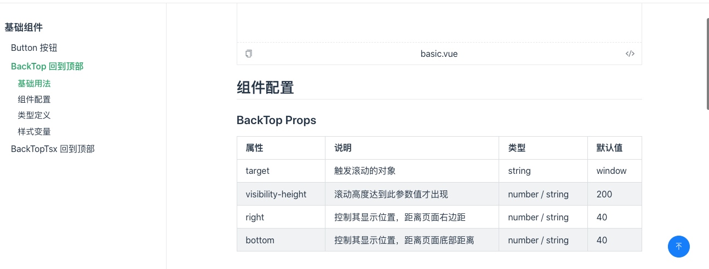

现在代码规范和组件文档都已经搭建完成了，接下来开始开发组件。

在开发之前明确我们的开发组件的定位是什么？为了满足什么场景？从零开发所有的组件？基于某一个组件库的扩展和补充？从零开发所有的组件基本上很少能做到的，我们要考虑如何长期维护和稳定。所以一般都是基于开源组件库的扩展和补充。

最近在开发移动端的项目，所以此篇就基于 [Vant](https://github.com/vant-ui/vant) 开发一个组件，如果你想基于其他的组件库或者不基于组件库那也是没有问题的，后面代码中都没有强绑定。本篇新增的完整代码可查看单独的分支 [3-ui](https://github.com/bfehub/vlib-starter/tree/3-ui)。

> 如果你还不了解这个系列要做什么，那你可以先阅读 [【实践 Vue3 组件库-介绍一下这个系列】](./2022-08-10.md) 的介绍，以便你对整个系列有清晰的认识。

## 分析开源库

既然我们基于开源组件库开发，那么可以找一个简单的组件去看它的源码，了解它大概实现方式是什么。

- 它有哪些工具函数，在处理某些参数上必须使用相同的工具函数保证统一。

- 它的样式命名风格是什么，虽然不影响但还是尽量统一。

- 它是如何处理主题切换的。

- 它是如何处理国际化的。

- 等等等，你甚至可以去抄一个组件去了解各个细节。

## 开发一个组件

先安装下相关依赖。

```sh
# 前置依赖
pnpm add vue vant -D --filter @bfehub/vlib-ui
# 工具包
pnpm add @vant/use lodash-es --filter @bfehub/vlib-ui
# 类型库
pnpm add @types/lodash-es -D --filter @bfehub/vlib-ui
```

在 `vant` 中是 `van-` 开头组件，如果要改前缀名称就要重新写一个创建函数。

```ts
// packages/vlib-ui/src/utils/create.ts
import { createBEM, createTranslate } from "vant/es/utils";
export function createNamespace(name: string) {
  const prefixedName = `vlib-${name}`;
  return [prefixedName, createBEM(prefixedName), createTranslate(prefixedName)] as const;
}
```

列如在 `vant` 里没有 `back-top` 组件，这时我们就可以自己开发一个，先创建一个基础的结构。

```sh
# packages/vlib-ui/src/back-top
├── back-top
├──├── README.md
├──├── __demos__
├──│   └── basic.vue
├──├── index.ts
├──├── src
├──│   ├── back-top.vue
├──│   └── props.ts
├──└── style
├── └── index.scss
```

先设计组件接收哪些 `props`，我们单独写在 `props.ts` 文件里便于导出到外部使用。这里就用到 `vant` 内部的工具类，帮助我们创建 `props` 的默认值和类型。

```ts
// packages/vlib-ui/src/back-top/src/props.ts
import { makeNumericProp, makeStringProp } from "vant/es/utils";
import type { ExtractPropTypes } from "vue";

export const backTopProps = {
  /**
   * 滚动高度达到此参数值才出现
   */
  visibilityHeight: makeNumericProp(200),
  /**
   * 触发滚动的对象
   */
  target: makeStringProp(""),
  /**
   * 控制其显示位置，距离页面右边距
   */
  right: makeNumericProp(""),
  /**
   * 控制其显示位置，距离页面底部距离
   */
  bottom: makeNumericProp(""),
};

export type BackTopProps = ExtractPropTypes<typeof backTopProps>;
```

接着我们设想这个组件的效果。页面上有一个按钮默认是隐藏的，当页面滚动的时候监听滚动的距离到达指定的阈值的时候显示按钮。当点击按钮的时候匀速的滚动到顶部。代码不多直接贴出代码，几个关键点单独说一下。

```vue
<template>
  <transition name="van-fade">
    <div
      v-if="visible"
      :class="bem()"
      :style="{
        right: addUnit(props.right),
        bottom: addUnit(props.bottom),
      }"
      @click.stop="handleClick"
    >
      <slot>
        <Button type="primary" icon="back-top" round vlib-back-top />
      </slot>
    </div>
  </transition>
</template>

<script lang="ts" setup>
import { ref, shallowRef, onMounted } from "vue";
import { throttle } from "lodash-es";
import { Button } from "vant";
import { useEventListener } from "@vant/use";
import { addUnit, getScrollTop, unitToPx } from "vant/es/utils";
import { createNamespace } from "../../utils";
import { backTopProps } from "./props";

const [_, bem] = createNamespace("back-top");

defineOptions({
  name: "vlib-back-top",
});

const props = defineProps(backTopProps);
const emit = defineEmits(["click"]);

const visible = ref(false);
const target = shallowRef<HTMLElement | Window>(window);

// 回到顶部
const handleClick = (event: MouseEvent) => {
  emit("click", event);

  target.value.scrollTo({
    top: 0,
    behavior: "smooth",
  });
};

// 监听滚动
const handleScroll = () => {
  visible.value = getScrollTop(target.value) >= unitToPx(props.visibilityHeight);
};

const throttleScroll = throttle(handleScroll, 200);
useEventListener("scroll", throttleScroll, { target });

// 获取目标元素
onMounted(() => {
  if (props.target) {
    const el = document.querySelector<HTMLElement>(props.target);
    if (!el) {
      throw new Error(`[Vlib] target is not existed: ${props.target}`);
    }
    target.value = el;
  }
});
</script>
```

- 使用 `utils` 工具类，这里使用了 `bem()` 创建类名，使用 `addUnit()` 处理单位。

- 使用 `button` 组件，利用现有组件便于扩展。

- 使用 `@vant/use` 的 `useEventListener` 监听事件。

- 使用 `lodash` 的 `throttle` 实现节流函数优化性能。

- 等等等。

现在导出这个组件。

```ts
// packages/vlib-ui/src/back-top/index.ts
import { withInstall } from "vant/es/utils";
import _BackTop from "./src/back-top.vue";

export const BackTop = withInstall(_BackTop);
export default BackTop;

export * from "./src/props";
```

再给这个组件添加些样式就完成了。

```scss
// packages/vlib-ui/src/back-top/index.scss
body {
  --vlib-back-top-right: 40px;
  --vlib-back-top-bottom: 40px;
  --vlib-back-top-button-size: 40px;
}

.vlib-back-top {
  position: fixed;
  right: var(--vlib-back-top-right);
  bottom: var(--vlib-back-top-bottom);

  .van-button[vlib-back-top] {
    width: var(--vlib-back-top-button-size);
    height: var(--vlib-back-top-button-size);
  }
}
```

在主导出文件中分别导入组件和样式。

```ts
// packages/vlib-ui/src/index.ts
import type { App } from "vue";
import { BackTop } from "./back-top";

const components = [BackTop];
function install(app: App) {
  components.forEach((item) => {
    if (item.install!) {
      app.use(item);
    } else if (item.name) {
      app.component(item.name, item);
    }
  });
}

export default {
  install,
  components,
};
```

```scss
// packages/vlib-ui/src/index.scss
@import "./back-top/style/index.scss";
```

## 指定组件名称

在 `setup` 中指定组件名称必须再多写个 `script` 标签，但并不想这么做。你可能注意到上面的 `defineOptions` 这个编译宏并不属于 `vue` 内置的，它是由 [unplugin-vue-define-options](https://github.com/sxzz/unplugin-vue-macros/tree/main/packages/define-options) 这个插件提供的。

先解决 `defineOptions` 在代码中提示找不到的问题，安装此依赖并在 `tsconfig.json` 中加入类型声明。

```sh
pnpm add unplugin-vue-define-options -D -w
```

```json
// tsconfig.json
{
  "compilerOptions": {
    // ...
    "types": ["unplugin-vue-define-options"]
  }
}
```

由于我们未打包的组件还要在文档中运行，所以我们也给 `vuepress` 添加此支持。

```sh
pnpm add unplugin-vue-define-options -D --filter @bfehub/docs
```

```ts
// docs/.vuepress/config.ts
import vueDefineOptions from "unplugin-vue-define-options/vite";
export default defineUserConfig({
  // ....
  bundler: viteBundler({
    viteOptions: {
      plugins: [vueDefineOptions()],
    },
    vuePluginOptions: {},
  }),
});
```

## 编写组件文档

把组件库安装到文档子包内，并在全局使用它。

```sh
pnpm add vant @bfehub/vlib-ui --filter @bfehub/docs
```

```ts
// docs/.vuepress/client.ts
import { defineClientConfig } from "@vuepress/client";
import Vant from "vant";
import VlibUI from "@bfehub/vlib-ui/src";

import "vant/lib/index.css";
import "@bfehub/vlib-ui/src/index.scss";

export default defineClientConfig({
  enhance({ app }) {
    app.use(Vant);
    app.use(VlibUI);
  },
});
```

```ts
// docs/.vuepress/configs/sidebar/zh.ts
import type { SidebarConfig } from "vuepress";
export const zh: SidebarConfig = {
  "/components": [
    {
      text: "基础组件",
      children: [
        {
          text: "BackTop 回到顶部",
          link: "/components/backtop/",
        },
      ],
    },
  ],
};
```

我们还需编写组件的文档，组件的文档都按照一种格式编写后续便于解析，给出一个参考格式。

```vue
<!-- packages/vlib-ui/src/back-top/__demos__/basic.vue -->
<template>
  <vlib-back-top />
</template>
```

```md
---
permalink: /components/backtop
---

<!-- packages/vlib-ui/src/back-top/README.md -->

# BackTop

返回页面顶部的操作按钮。

## 基础用法

通过滑动来查看容器右下角的按钮。

<demo src="./__demos__/basic.vue"></demo>

## 组件配置

### BackTop Props

| 属性              | 说明                             | 类型            | 默认值 |
| ----------------- | -------------------------------- | --------------- | ------ |
| target            | 触发滚动的对象                   | string          | window |
| visibility-height | 滚动高度达到此参数值才出现       | number / string | 200    |
| right             | 控制其显示位置，距离页面右边距   | number / string | 40     |
| bottom            | 控制其显示位置，距离页面底部距离 | number / string | 40     |

### BackTop Events

| 事件名 | 说明               | 参数                          |
| ------ | ------------------ | ----------------------------- |
| click  | 点击按钮触发的事件 | `(event: MouseEvent) => void` |

### BackTop Slots

| 插槽名  | 说明           |
| ------- | -------------- |
| default | 自定义默认内容 |

## 样式变量

组件提供了下列 CSS 变量，可用于自定义样式。

| 名称                        | 默认值 |
| --------------------------- | ------ |
| --vlib-back-top-right       | 40px   |
| --vlib-back-top-bottom      | 40px   |
| --vlib-back-top-button-size | 40px   |
```



## 你可以...

- 你可以根据本章内容自己实现一遍完善我们的组件库。

- 你可以使用 `jsx` 把组件重新实现一遍，有些情况下使用 `jsx` 还是很方便的。

- 如果对你有帮助可以点个 **赞** 和 **关注** 以示鼓励。
