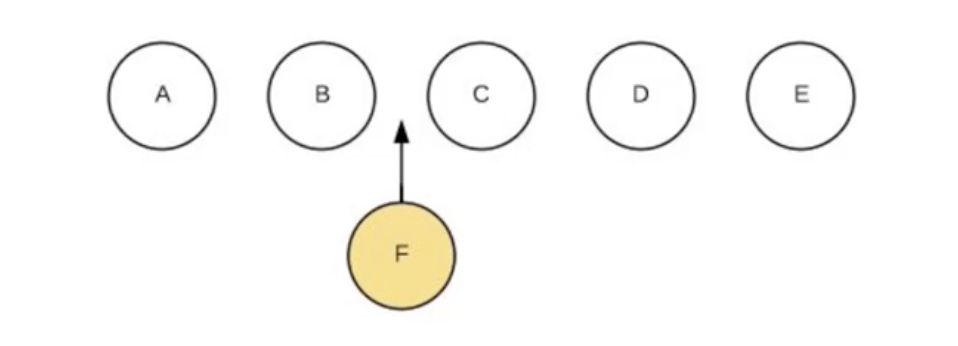
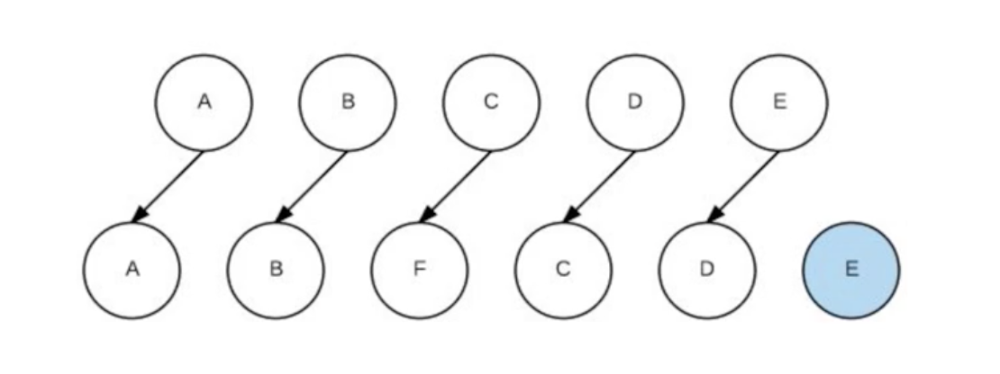

`key` 是vue中 `diff` 算法的重要标识，借助 `key` 通常可以非常精确找到相同节点。具体的算法过程查看 [vue中diff算法的理解](./vue中diff算法的理解.md)。

## key的作用和工作原理

以下是vue中对比两个节点是否一致的函数，通过 `key` 和 `tag` 判断。

```js
function sameVnode (a, b) {
  return (
    a.key === b.key && (
      (
        a.tag === b.tag &&
        a.isComment === b.isComment &&
        isDef(a.data) === isDef(b.data) &&
        sameInputType(a, b)
      ) || (
        isTrue(a.isAsyncPlaceholder) &&
        a.asyncFactory === b.asyncFactory &&
        isUndef(b.asyncFactory.error)
      )
    )
  )
}
```

如，我们想要在 `b` 后面插入一个 `f`。



如果不加 `key` 会有什么影响。那么此时 `key` 是 `undefined`，那么在执行对比的时候 `undefined === undefined`，就会认为是同一个节点，然后去执行 `patch`， 执行 `patch` 的时候发现内容不一样，就会更新dom。



如果加 `key` 就能找到相同的节点。

## 总结

key的作用主要是为了高效的更新虚拟DOM，其原理是vue在path过程中通过key可以精准判断两个节点是否是
同一个，从而避免频繁更新不同元素，使得整个path过程更加高效，减少dom操作量，提高性能。

