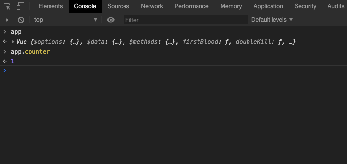
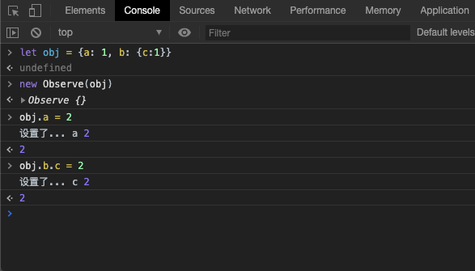
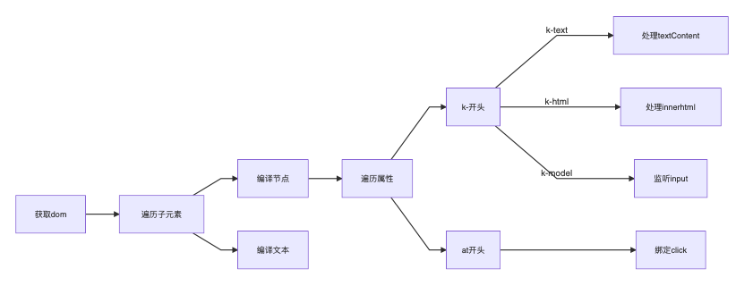
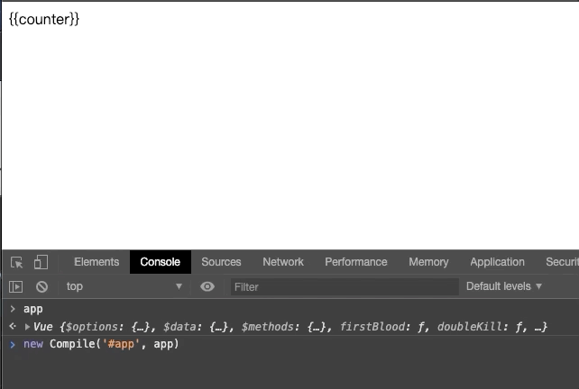
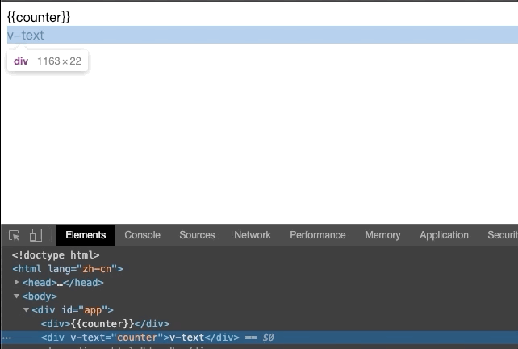
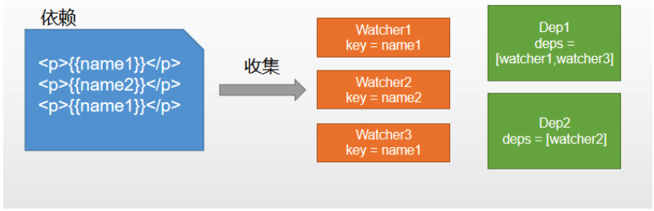
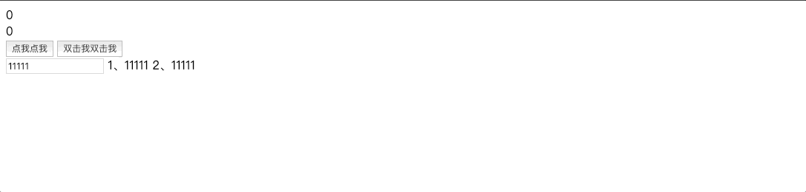

简单实现版本，实现最基础的功能。

虽然没有涉及到 vue 的新加的概念和虚拟 dom ，但可以理解 vue 的基础的实现原理。

## 起手示例

完整示例。

[vue简单实现](https://github.com/haiweilian/laboratory/tree/Vue%40vue-simple-implementation)

先写一个小例子跑下效果。测试自己写的时候，更改下引用地址，引入自己写的就行了。

```html
<!DOCTYPE html>
<html lang="zh-cn">
  <head>
    <meta charset="UTF-8" />
    <meta name="viewport" content="width=device-width, initial-scale=1.0" />
    <title>vue简单实现</title>
  </head>
  <body>
    <div id="app">
      <div>{{counter}}</div>
      <div v-text="counter">v-text</div>
      <div v-html="desc"></div>
      <div>
        <button @click="firstBlood">点我点我</button>
        <button @dblclick="firstBlood">双击我双击我</button>
      </div>
      <div>
        <input v-model="name" type="text"/>
        1、<span>{{name}}</span>
        2、<span>{{name}}</span>
      </div>
    </div>
    <script src="https://cdnjs.cloudflare.com/ajax/libs/vue/2.6.11/vue.min.js"></script>
    <!-- <script src="./vue.js"></script> -->
    <script>
      const app = new Vue({
        el: "#app",
        data: {
          counter: 1,
          desc: '<span style="color:red">desc</span>',
          name: "11111",
        },
        methods: {
          firstBlood() {
            this.doubleKill();
          },
          doubleKill() {
            this.counter = 0;
            alert("double kill");
          },
        },
      });
    </script>
  </body>
</html>
```

## 原理分析


- Vue: 框架构造函数。
- Observer: 执行数据响应化。
- Compile: 编译模板，初始化视图，收集依赖(更新函数、watcher创建)。
- Watcher: 执行更新函数更新dom(Dep执行watcher)。
- Dep: 管理多个Watcher，批量更新。

## Vue构造函数

初始化构造函数。

```js
// 定义 vue 类，初始化解析选项，响应式、编译等
class Vue {
  constructor(options) {
    this.$options = options;
    this.$data = options.data;
    this.$methods = options.methods;
    // 代理数据
    proxy(this);
  }
}
```

为当前实例做代理，定义一些 key 和 data 相对应。如：vm.$data.name --> vm.name。

```js
// 为当前实例的值做代理
function proxy(vm) {
  // 如：vm.$data.name --> vm.name
  Object.keys(vm.$data).forEach((key) => {
    Object.defineProperty(vm, key, {
      get() {
        return vm.$data[key];
      },
      set(newVal) {
        vm.$data[key] = newVal;
      },
    });
  });
  // 如：vm.$methods.firstBlood --> vm.firstBlood
  Object.keys(vm.$methods).forEach((key) => {
    vm[key] = vm.$methods[key];
  });
}
```



## Observer数据响应化

vue是利用 `Object.defineProperty` 做数据响应式。定义一个 `Observe` 类实现这个功能。

```js
function defineReactive(obj, key, val) {
  // val 可能还是对象，继续递归
  new Observe(val);

  Object.defineProperty(obj, key, {
    get() {
      return val;
    },
    set(newVal) {
      if (newVal !== val) {
        console.log("设置了...", key, newVal);
      }
    },
  });
}

// 定义数据响应式
class Observe {
  constructor(obj) {
    if (typeof obj === "object") {
      this.walk(obj)
    }
  }
  walk (obj) {
    Object.keys(obj).forEach((key) => {
      defineReactive(obj, key, obj[key]);
    });
  }
}
```



## Compile编译模板

编译模板需要做的就是，遍历视图模板的节点，解析其中的特殊模板语法，做不同的处理。



### 文本节点

```js
// 遍历视图模板，解析其中的特殊模板语法
class Compile {
  // el: 主元素选择器、vm: vue的实例
  constructor(el, vm) {
    this.$el = document.querySelector(el);
    this.$vm = vm;
    this.compile(this.$el);
  }

  // 解析节点
  compile(el) {
    el.childNodes.forEach((node) => {
      if (node.nodeType === 1) {
        // 元素节点
      } else if (node.nodeType === 3 && /\{\{(.*)\}\}/.test(node.textContent)) {
        // 文本节点 && 包含插值语法
        this.compileText(node);
      }
      // 递归子节点
      if (node.childNodes) {
        this.compile(node);
      }
    });
  }

  // 编译文本表达式
  compileText(node) {
    // RegExp.$1的使用: https://developer.mozilla.org/zh-CN/docs/Web/JavaScript/Reference/Global_Objects/RegExp/n
    this.update(node, RegExp.$1, "text");
  }

  /**
   * 更新模板，使用同一函数更新，dir 用于区分。
   * @param {*} node node 节点
   * @param {*} key 更新值的键，也就是 data 里面的值
   * @param {*} dir 更新类型(指令：如：html、text、model)
   */
  update(node, key, dir) {
    // 获取更新方法：如 text --> textUpdater
    const fn = this[dir + "Updater"];
    // 默认渲染一次结果
    fn && fn(node, this.$vm[key]);
  }

  // 更新文本类型 dom
  textUpdater(node, value) {
    node.textContent = value;
  }
}
```



### 编译指令

```js
// 遍历视图模板，解析其中的特殊模板语法
class Compile {
  // el: 主元素选择器、vm: vue的实例
  constructor(el, vm) {
    this.$el = document.querySelector(el);
    this.$vm = vm;
    this.compile(this.$el);
  }

  // 解析节点
  compile(el) {
    el.childNodes.forEach((node) => {
      if (node.nodeType === 1) {
        // 元素节点
        this.compileElement(node);
      } else if (node.nodeType === 3 && /\{\{(.*)\}\}/.test(node.textContent)) {
        // 文本节点 && 包含插值语法
        this.compileText(node);
      }
      // 递归子节点
      if (node.childNodes) {
        this.compile(node);
      }
    });
  }

  // 编译元素节点：判断指令和事件
  compileElement(node) {
    // 获取节点属性 v-text...
    const attrs = node.attributes;
    Array.from(attrs).forEach((attr) => {
      // attr = {name: 'v-text', value: 'counter'}
      const { name, value } = attr;
      // 判断是否是指令
      if (name.startsWith("v-")) {
        const dir = name.substring(2);
        // 执行指令对应的函数
        this[dir] && this[dir](node, value);
      }
    });
  }

  /**
   * 更新模板，使用同一函数更新，dir 用于区分。
   * @param {*} node node 节点
   * @param {*} key 更新值的键，也就是 data 里面的值
   * @param {*} dir 更新类型(指令：如：html、text、model)
   */
  update(node, key, dir) {
    // 获取更新方法：如 text --> textUpdater
    const fn = this[dir + "Updater"];
    // 默认渲染一次结果
    fn && fn(node, this.$vm[key]);
  }

  // v-text
  text(node, key) {
    this.update(node, key, "text");
  }

  // 更新文本类型 dom
  textUpdater(node, value) {
    node.textContent = value;
  }
}
```



### 指令v-model

```js
// v-model
model(node, key) {
  this.update(node, key, "model");
  this.modelHander(node, key)
}

// 更新输入框类型
modelUpdater(node, value) {
  node.value = value;
}

// 监听输入框事件
modelHander(node, key) {
  node.addEventListener("input", (event) => {
    this.$vm[key] = event.target.value;
  });
}
```

### 指令v-html

```js
// v-html
html(node, exp) {
  this.update(node, exp, 'html')
}

// 更新dom
htmlUpdater(node, value) {
  node.innerHTML = value
}
```

### 事件绑定

判断节点属性是不是以 @ 开头。

```js
// 编译元素节点：判断指令和事件
compileElement(node) {
  // 获取节点属性 v-text、@click...
  const attrs = node.attributes;
  Array.from(attrs).forEach((attr) => {
    if (name.startsWith("@")) {
      const dir = name.substring(1);
      // 执行事件对应的函数
      this.eventHander(node, value, dir);
    }
  });
}

// 监听事件执行方法
eventHander(node, key, event) {
  const fn = this.$vm[key];
    fn && node.addEventListener(event, fn.bind(this.$vm));
  }
}
```

## Watcher、Dep依赖收集



我们模板中的每一个绑定的 `data` 中的 `key` 都称为依赖。同一个 `key` 可能会出现多次，所以要为每个依赖创建一个 Watcher。这个过程称为依赖收集。

### 实现方式


- defineReactive 时为每一个 key 创建一个 Dep 实例。
- 初始化模板视图时读取某个 key，例如 name1 ，创建一个 watcher1，触发 name1 的 getter 方法。
- 由于触发 name1 的 getter 方法，便将 watcher1 添加到 name1 对应的 Dep 中。
- 当 name1 更新，setter 触发时，便可通过对应 Dep 通知其管理所有 Watcher 更新。

### Watcher管理依赖

在 `Compile` 里面是不是有 `update` 函数更新模板的，所以我们在 `update` 的时候，把这个更新函数收集起来，在未来某个时候执行。

```js
update(node, key, dir) {
  // 获取更新方法：如 text --> textUpdater
  const fn = this[dir + "Updater"];
  // 默认渲染一次结果
  fn && fn(node, this.$vm[key]);
  // 创建 watcher 实例，回调函数的作用和上一行一样，更新模板。
  new Watcher(this.$vm, key, (val) => {
    fn && fn(node, val);
  });
}
```

创建 watcher，实现 `update` 去执行 Watcher 的回调方法。

```js
class Watcher {
  // vm: vue实例
  // key: data中对应的 key 名称
  // fn: 更新 dom 的回调
  constructor(vm, key, fn) {
    this.$vm = vm;
    this.$key = key;
    this.$fn = fn;

    // 建立 dep 和 watcher 之间的关系
    Dep.target = this;
    this.$vm[this.$key]; // 读一下 key 的值触发其 getter
    Dep.target = null;
  }

  // 更新函数，由 Dep 调用
  update() {
    this.$fn.call(this.$vm, this.$vm[this.$key]);
  }
}
```

### Dep管理Watcher

创建 Dep 有两个作用，为对应的响应式的 key 收集 watcher 和 通知 watcher 更新模板。

```js
// 管理多个 watcher 实例，当对应 key 发生变化时，通知他们更新
class Dep {
  constructor() {
    this.deps = [];
  }

  // 收集 watcher
  addDep(watcher) {
    this.deps.push(watcher);
  }

  // 通知 watcher 更新模板
  notify() {
    this.deps.forEach((w) => w.update());
  }
}
```

创建 Dep实例。当 new Watcher() 触发 getter，把当前 watcher收集起来，当触发 setter 执行 watcher。

```js
function defineReactive(obj, key, val) {
  // val 可能还是对象，继续递归
  new Observe(val);

  // 创建 Dep 实例，它和 key 一对一对应关系
  const dep = new Dep();

  Object.defineProperty(obj, key, {
    get() {
      // Dep.target 就是当前新创建 Watcher 实例
      Dep.target && dep.addDep(Dep.target);
      return val;
    },
    set(newVal) {
      if (newVal !== val) {
        val = newVal;
        dep.notify();
        console.log("set...", key, newVal);
      }
    },
  });
}
```

## Observer、Compile、Watcher、Dep关系

关系有点绕，上图。


最终效果。


