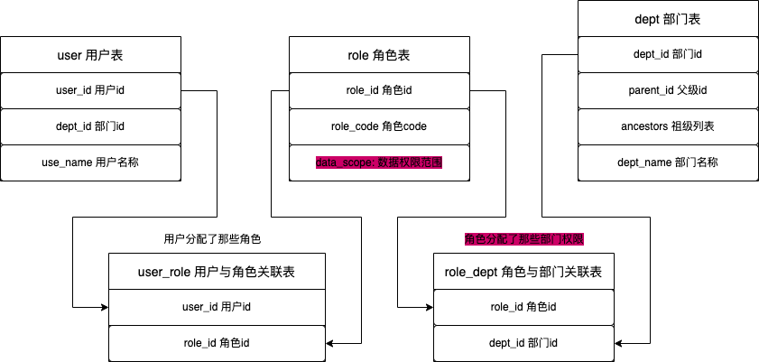

在实际项目开发中我们不仅要控制一个用户能访问那些资源，还需要控制用户只能访问资源中的某部分数据。

比如一个用户可以访问用户列表资源，但只能看到自己本部门下的用户数据，也只能操作(增、删、改、查)自己本部门下的用户数据，这也就是我们常说的数据权限。

控制用户访问那些资源通常使用成熟的 RBAC 权限管理模型，接下来我们将在 RBAC 模型上融入数据权限的管理控制。本文的数据权限参考 (Java RuoYi) 项目的实现方案。

## 前置

假设我们 RBAC 模型的数据库设计如下：



- 在 `role` 角色表新增了 `data_scope` 数据权限范围字段，来表示此角色数据权限级别，列如有 `1.全部数据权限`、`2.自定数据权限`、`3.本部门数据权限`、`4.本部门及以下数据权限`、`5.仅本人数据权限` 等等。

- 新增 `role_dept` 角色与部门关联表，当数据权限范围是自定数据权限时来表示角色可以访问哪些部门。

为了方便后面测试使用，初始化下表和数据：

```sql
SET NAMES utf8mb4;
SET FOREIGN_KEY_CHECKS = 0;

-- ----------------------------
-- Table structure for dept
-- ----------------------------
DROP TABLE IF EXISTS `dept`;
CREATE TABLE `dept` (
  `dept_id` bigint NOT NULL AUTO_INCREMENT COMMENT '部门ID',
  `parent_id` bigint NOT NULL DEFAULT '0' COMMENT '父部门ID',
  `ancestors` varchar(200) COLLATE utf8mb4_unicode_ci NOT NULL DEFAULT '0' COMMENT '祖级列表',
  `dept_name` varchar(50) COLLATE utf8mb4_unicode_ci NOT NULL COMMENT '部门名称',
  PRIMARY KEY (`dept_id`)
) ENGINE=InnoDB AUTO_INCREMENT=40 DEFAULT CHARSET=utf8mb4 COLLATE=utf8mb4_unicode_ci;

-- ----------------------------
-- Records of dept
-- ----------------------------
BEGIN;
INSERT INTO `dept` (`dept_id`, `parent_id`, `ancestors`, `dept_name`) VALUES (1, 0, '0', '总公司');
INSERT INTO `dept` (`dept_id`, `parent_id`, `ancestors`, `dept_name`) VALUES (2, 1, '0,1', '北京分公司');
INSERT INTO `dept` (`dept_id`, `parent_id`, `ancestors`, `dept_name`) VALUES (3, 1, '0,1', '上海分公司');
INSERT INTO `dept` (`dept_id`, `parent_id`, `ancestors`, `dept_name`) VALUES (20, 2, '0,1,2', '人事部门');
INSERT INTO `dept` (`dept_id`, `parent_id`, `ancestors`, `dept_name`) VALUES (21, 2, '0,1,2', '财务部门');
INSERT INTO `dept` (`dept_id`, `parent_id`, `ancestors`, `dept_name`) VALUES (30, 3, '0,1,3', '人事部门');
INSERT INTO `dept` (`dept_id`, `parent_id`, `ancestors`, `dept_name`) VALUES (31, 3, '0,1,3', '财务部门');
COMMIT;

-- ----------------------------
-- Table structure for role
-- ----------------------------
DROP TABLE IF EXISTS `role`;
CREATE TABLE `role` (
  `role_id` bigint NOT NULL AUTO_INCREMENT COMMENT '角色ID',
  `role_code` varchar(50) COLLATE utf8mb4_unicode_ci NOT NULL COMMENT '角色编码',
  `data_scope` char(1) COLLATE utf8mb4_unicode_ci NOT NULL DEFAULT '1' COMMENT '数据范围',
  PRIMARY KEY (`role_id`)
) ENGINE=InnoDB AUTO_INCREMENT=4 DEFAULT CHARSET=utf8mb4 COLLATE=utf8mb4_unicode_ci;

-- ----------------------------
-- Records of role
-- ----------------------------
BEGIN;
INSERT INTO `role` (`role_id`, `role_code`, `data_scope`) VALUES (1, 'admin', '1');
INSERT INTO `role` (`role_id`, `role_code`, `data_scope`) VALUES (2, 'manager', '4');
INSERT INTO `role` (`role_id`, `role_code`, `data_scope`) VALUES (3, 'common', '5');
COMMIT;

-- ----------------------------
-- Table structure for role_dept
-- ----------------------------
DROP TABLE IF EXISTS `role_dept`;
CREATE TABLE `role_dept` (
  `role_id` bigint NOT NULL COMMENT '用户ID',
  `dept_id` bigint NOT NULL COMMENT '部门ID',
  PRIMARY KEY (`role_id`,`dept_id`)
) ENGINE=InnoDB DEFAULT CHARSET=utf8mb4 COLLATE=utf8mb4_unicode_ci;

-- ----------------------------
-- Records of role_dept
-- ----------------------------
BEGIN;
INSERT INTO `role_dept` (`role_id`, `dept_id`) VALUES (2, 20);
INSERT INTO `role_dept` (`role_id`, `dept_id`) VALUES (2, 30);
COMMIT;

-- ----------------------------
-- Table structure for user
-- ----------------------------
DROP TABLE IF EXISTS `user`;
CREATE TABLE `user` (
  `user_id` bigint NOT NULL AUTO_INCREMENT COMMENT '用户ID',
  `dept_id` bigint DEFAULT NULL COMMENT '部门ID',
  `user_name` varchar(50) COLLATE utf8mb4_unicode_ci NOT NULL COMMENT '用户账号',
  PRIMARY KEY (`user_id`),
  UNIQUE KEY `IDX_9d0ba62d30b6362c5651c6c261` (`user_name`)
) ENGINE=InnoDB AUTO_INCREMENT=6 DEFAULT CHARSET=utf8mb4 COLLATE=utf8mb4_unicode_ci;

-- ----------------------------
-- Records of user
-- ----------------------------
BEGIN;
INSERT INTO `user` (`user_id`, `dept_id`, `user_name`) VALUES (1, 0, '管理员');
INSERT INTO `user` (`user_id`, `dept_id`, `user_name`) VALUES (2, 2, '经理');
INSERT INTO `user` (`user_id`, `dept_id`, `user_name`) VALUES (3, 20, '员工1');
INSERT INTO `user` (`user_id`, `dept_id`, `user_name`) VALUES (4, 30, '员工2');
COMMIT;

-- ----------------------------
-- Table structure for user_role
-- ----------------------------
DROP TABLE IF EXISTS `user_role`;
CREATE TABLE `user_role` (
  `user_id` bigint NOT NULL COMMENT '用户ID',
  `role_id` bigint NOT NULL COMMENT '角色ID',
  PRIMARY KEY (`user_id`,`role_id`)
) ENGINE=InnoDB DEFAULT CHARSET=utf8mb4 COLLATE=utf8mb4_unicode_ci;

-- ----------------------------
-- Records of user_role
-- ----------------------------
BEGIN;
INSERT INTO `user_role` (`user_id`, `role_id`) VALUES (1, 1);
INSERT INTO `user_role` (`user_id`, `role_id`) VALUES (2, 2);
INSERT INTO `user_role` (`user_id`, `role_id`) VALUES (3, 3);
INSERT INTO `user_role` (`user_id`, `role_id`) VALUES (4, 3);
COMMIT;

SET FOREIGN_KEY_CHECKS = 1;
```

目前人员组织结构如下：

```sh
总公司
├── 北京分公司 (经理 = 2 , role = manager , 部门及以下数据权限)
│       └── 人事部门 (员工1 = 3, role = common, 仅本人数据权限)
│       └── 财务部门
├── 上海分公司
│       └── 人事部门 (员工2 = 4, role = common, 仅本人数据权限)
│       └── 财务部门
```

## 原理

数据权限的实现原理是：在查询数据之前，先根据**当前登录用户**和**数据权限类型**，计算出当前用户可以访问的数据范围，然后将查询条件中的 WHERE 子句加上数据权限的范围条件，从而实现数据权限的过滤。

1. 列如一个无数据权限的查询：

```sql
SELECT * FROM user LEFT JOIN dept ON user.dept_id = dept.dept_id
```

2. 列如一个仅本人数据的查询：

```sql{3}
SELECT * FROM user LEFT JOIN dept ON user.dept_id = dept.dept_id
-- 数据权限范围
WHERE user.user_id = 3
```

3. 列如一个部门及以下数据权限的查询：

```sql{3}
SELECT * FROM user LEFT JOIN dept ON user.dept_id = dept.dept_id
-- 数据权限范围：从 `sys_dept` 表中查出本部门和子部门，再通过 `IN` 查找多个部门的数据
WHERE dept.dept_id IN(SELECT dept_id FROM dept WHERE dept_id = 2 OR FIND_IN_SET(2, ancestors))
```

以上对比可以看出只有查询条件不一样，所以只需要动态的生成数据范围 SQL 条件语句，并在业务中添加到查询条件中即可。简单的演示实现如下，当然我们需要更好的封装。

```ts
export class UserController {
  @Get()
  list(@User() user) {
    let dsSql = "";
    if (user.dataScope === "5") {
      dsSql = `user.user_id = ${user.userId}`;
    }
    if (user.dataScope === "4") {
      dsSql = `dept.dept_id IN(SELECT dept_id FROM dept WHERE dept_id = ${user.deptId} OR FIND_IN_SET(${user.deptId}, ancestors))`;
    }

    this.userRepository
      .createQueryBuilder("user")
      .leftJoin(Dept, "dept", "dept.dept_id = user.dept_id")
      .where(dsSql)
      .getMany();
  }
}
```

## 功能开发

### 用户信息

登录功能就不开发了，用一个授权守卫写死用户登录并存储在请求上即可。

```ts
// auth.guard.ts
import { CanActivate, ExecutionContext } from "@nestjs/common";

export class AuthGuard implements CanActivate {
  canActivate(context: ExecutionContext): boolean {
    const request = context.switchToHttp().getRequest();

    // 管理员
    // request.user = { userId: 1, roleId: 1, deptId: 1 };

    // 经理
    request.user = { userId: 2, roleId: 2, deptId: 2, dataScope: "4" };

    // 员工
    // request.user = { userId: 3, roleId: 3, deptId: 20, dataScope: "5" };

    return true;
  }
}
```

### 数据权限装饰器

自定义一个数据权限装饰器，用于标识当前方法需要数据权限过滤和配置表别名信息。

```ts
// datascope.decorator.ts
import { SetMetadata } from "@nestjs/common";

export interface TableAlias {
  deptAlias: string;
  userAlias: string;
}

export const DataScope = (tableAlias: TableAlias) => {
  return SetMetadata("DATA_SCOPE_METADATA", tableAlias);
};
```

### 数据权限拦截器

在拦截器中可以获取到请求上的用户信息和控制器的配置信息。我们根据这些信息生成数据范围 SQL 条件语句并保存在请求上以便后续获取。

```ts
// datascope.interceptor.ts
import { CallHandler, ExecutionContext, Injectable, NestInterceptor } from "@nestjs/common";
import { Reflector } from "@nestjs/core";
import { TableAlias } from "./datascope.decorator";

@Injectable()
export class DataScopeInterceptor implements NestInterceptor {
  constructor(private readonly reflector: Reflector) {}
  intercept(context: ExecutionContext, next: CallHandler) {
    // 获取别名配置
    const alias: TableAlias = this.reflector.get("DATA_SCOPE_METADATA", context.getHandler());
    if (!alias) return next.handle();

    // 获取用户信息
    const request = context.switchToHttp().getRequest();
    const { deptAlias, userAlias } = alias;
    const { userId, roleId, deptId, dataScope } = request.user;
    const isAdmin = userId === 1;

    // 生成数据范围SQL
    let sqlString = "";
    if (isAdmin || dataScope === "1") {
      // 1.全部数据权限：不限制查询条件
      sqlString = "";
    } else if (dataScope === "2") {
      // 2.自定数据权限：从 `sys_role_dept` 表中查出角色分配的部门，再通过 `IN` 查找多个部门的数据
      sqlString = `${deptAlias}.dept_id IN(SELECT dept_id from role_dept WHERE role_id = ${roleId})`;
    } else if (dataScope === "3") {
      // 3.部门数据权限：根据 `dept_id` 查询本部门的数据
      sqlString = `${deptAlias}.dept_id = ${deptId}`;
    } else if (dataScope === "4") {
      // 4.部门及以下数据权限：从 `sys_dept` 表中查出本部门和子部门，再通过 `IN` 查找多个部门的数据
      sqlString = `${deptAlias}.dept_id IN(SELECT dept_id FROM dept WHERE dept_id = ${deptId} OR FIND_IN_SET(${deptId}, ancestors))`;
    } else if (dataScope === "5") {
      // 5.仅本人数据权限：根据 `user_id` 查询本人的数据
      sqlString = `${userAlias}.user_id = ${userId}`;
    }

    // 保存在请求中
    request["DATA_SCOPE_SQL"] = sqlString;

    return next.handle();
  }
}
```

### 数据权限参数装饰器

在拦截器中把 SQL 保存在 DATA_SCOPE_SQL 属性上，我们通过自定义参数装饰器获取到就可以在业务中使用了。

```ts
// datascope-sql.decorator.ts
import { createParamDecorator, ExecutionContext } from "@nestjs/common";

export const DataScopeSql = createParamDecorator((data: unknown, ctx: ExecutionContext) => {
  const request = ctx.switchToHttp().getRequest();
  return request["DATA_SCOPE_SQL"];
});
```

## 业务开发

### 查询接口数据权限

一个查询接口的列子：

```ts
@Controller()
export class UserController {
  constructor(
    @InjectRepository(User)
    private readonly userRepository: Repository<User>
  ) {}

  @Get("users")
  @DataScope({
    deptAlias: "dept",
    userAlias: "user",
  })
  async list(@DataScopeSql() dataScopeSql: string) {
    console.log("dataScopeSql:", dataScopeSql);
    const queryBuilder = this.userRepository
      .createQueryBuilder("user")
      .leftJoin(Dept, "dept", "dept.dept_id = user.dept_id");

    if (dataScopeSql) {
      queryBuilder.andWhere(dataScopeSql); // 加上数据权限范围
    }

    console.log("queryBuilderSql:", queryBuilder.getSql());
    return queryBuilder.getMany();
  }
}
```

列如当前登录的用户是 `经理`，因为分配的权限是 `部门及以下部门的数据权限`，那么 `SQL` 条件将会是：

```sql
-- dataScopeSql: 数据范围条件
dept.dept_id IN(SELECT dept_id FROM dept WHERE dept_id = 2 OR FIND_IN_SET(2, ancestors))

-- queryBuilderSql: 最终的查询SQL
SELECT `user`.`user_id` AS `user_user_id`, `user`.`dept_id` AS `user_dept_id`, `user`.`user_name` AS `user_user_name` FROM `user` `user` LEFT JOIN `dept` `dept` ON `dept`.`dept_id` = `user`.`dept_id`
WHERE `dept`.`dept_id` IN(SELECT dept_id FROM dept WHERE dept_id = 2 OR FIND_IN_SET(2, ancestors))
```

查询结果就只包含本部门及以下的数据，达到了数据权限控制的目的。

```json
[
  { "userId": "2", "deptId": "2", "userName": "经理" },
  { "userId": "3", "deptId": "20", "userName": "员工1" }
]
```

### 修改接口数据权限

如果只在查询列表限制还不够，比如手动修改了参数 `userId`，那么还会导致修改没有权限的数据。所以应该在任何操作数据的地方验证是否有数据操作权限。在查询中我们已经实现列表的权限控制，我们只需再判断当前数据在不在列表中即可。

一个修改接口的列子：

```ts
@Controller()
export class UserController {
  constructor(
    @InjectRepository(User)
    private readonly userRepository: Repository<User>
  ) {}

  @Get("update/:userId")
  @DataScope({
    deptAlias: "dept",
    userAlias: "user",
  })
  async update(@Param("userId") userId: string, @DataScopeSql() dataScopeSql: string) {
    console.log("dataScopeSql:", dataScopeSql);
    const queryBuilder = this.userRepository
      .createQueryBuilder("user")
      .leftJoin(Dept, "dept", "dept.dept_id = user.dept_id")
      .where("user.user_id = :userId", { userId }); // 再加上指定用户的条件

    if (dataScopeSql) {
      queryBuilder.andWhere(dataScopeSql); // 加上数据权限范围
    }

    console.log("queryBuilderSql:", queryBuilder.getSql());
    const count = await queryBuilder.getCount(); // 能查出有权限，不能查出无权限
    return count > 0 ? "有权限修改" : "无权限修改";
  }
}
```

在查询列表的基础上，加上数据唯一标识的条件(`where("user.user_id = :userId", { userId })`)。看能不能查出数据，能查出有权限，不能查出无权限。

```sh
http://localhost:3000/update/3 >>> 有修改权限
http://localhost:3000/update/4 >>> 无修改权限
```

## 异步本地存储优化 DX

什么是异步本地存储？如果你不了解可以官网文档介绍。

- <https://nodejs.org/api/async_context.html>

- <https://docs.nestjs.com/recipes/async-local-storage>

在 `Controller` 的使用案例中，我们需要使用 `DataScopeSql` 获取到 SQL。每个有数据权限的接口都要添加并且还要一层层的往下传递，处理麻烦也不利于封装。有了异步本地存储，我们可以不在控制器中获取到请求对象，可以在容器中的任意的地方随意获取请求对象。这避免了在各服务之间传递参数，可以增加封装性。

### 接入 CLS

NestJS 生态中有封装好的包 [nestjs-cls](https://docs.nestjs.com/recipes/async-local-storage#nestjs-cls) 直接接入就好了。

```ts
import { Module } from "@nestjs/common";
import { ClsModule } from "nestjs-cls";

@Module({
  imports: [
    ClsModule.forRoot({
      middleware: {
        mount: true,
        saveReq: true,
      },
    }),
  ],
})
export class AppModule {}
```

在服务中我们就可以很容易的获取请求对象。

```ts
import { Injectable } from "@nestjs/common";
import { ClsService, CLS_REQ } from "nestjs-cls";

@Injectable()
export class DataScopeService {
  constructor(private readonly cls: ClsService) {}
  sql(handler: Function) {
    this.cls.get(CLS_REQ); // 请求对象
  }
}
```

### 数据权限服务

我们可以创建一个单独的 `Service` 处理在拦截器中做的事情，只需要改参数来源和请求来源就行了。

- 参数配置：数据权限装饰器加在服务层的处理方法上。

- 请求对象：通过 `this.cls.get(CLS_REQ)` 获取请求对象。

```ts
// datascope.service.ts
import { Injectable } from "@nestjs/common";
import { Reflector } from "@nestjs/core";
import { ClsService, CLS_REQ } from "nestjs-cls";
import { TableAlias } from "./datascope.decorator";

@Injectable()
export class DataScopeService {
  constructor(private readonly cls: ClsService, private readonly reflector: Reflector) {}

  sql(handler: Function) {
    // 获取别名配置
    const alias: TableAlias = this.reflector.get("DATA_SCOPE_METADATA", handler);
    if (!alias) return "";

    // 获取用户信息
    const request = this.cls.get(CLS_REQ);
    const { deptAlias, userAlias } = alias;
    const { userId, roleId, deptId, dataScope } = request.user;
    const isAdmin = userId === 1;

    // 生成数据范围SQL
    let sqlString = "";
    if (isAdmin || dataScope === "1") {
      // 1.全部数据权限：不限制查询条件
      sqlString = "";
    } else if (dataScope === "2") {
      // 2.自定数据权限：从 `sys_role_dept` 表中查出角色分配的部门，再通过 `IN` 查找多个部门的数据
      sqlString = `${deptAlias}.dept_id IN(SELECT dept_id from role_dept WHERE role_id = ${roleId})`;
    } else if (dataScope === "3") {
      // 3.部门数据权限：根据 `dept_id` 查询本部门的数据
      sqlString = `${deptAlias}.dept_id = ${deptId}`;
    } else if (dataScope === "4") {
      // 4.部门及以下数据权限：从 `sys_dept` 表中查出本部门和子部门，再通过 `IN` 查找多个部门的数据
      sqlString = `${deptAlias}.dept_id IN(SELECT dept_id FROM dept WHERE dept_id = ${deptId} OR FIND_IN_SET(${deptId}, ancestors))`;
    } else if (dataScope === "5") {
      // 5.仅本人数据权限：根据 `user_id` 查询本人的数据
      sqlString = `${userAlias}.user_id = ${userId}`;
    }

    return sqlString;
  }
}
```

### 改造业务开发

我们只需要在 `Service` 中调用 `DataScopeService` 的 `sql` 方法，就能获取到数据权限的 SQL 语句。

以下代码很明显更简洁易于扩展，还可以提取一个专用于处理数据权限的查询构造器，更方便的在多个地方使用。我们在服务层的处理方法上添加 `DataScope` 装饰器也更能表示它是专用于处理数据权限的。

```ts
// user.controller.ts
@Controller()
export class UserController {
  constructor(
    @InjectRepository(User)
    private readonly userService: UserService
  ) {}
  @Get("users2")
  async list2() {
    return this.userService.list2();
  }

  @Get("update2/:userId")
  async update2(@Param("userId") userId: string) {
    return this.userService.update2(userId);
  }
}
```

```ts
import { Injectable } from "@nestjs/common";
import { InjectRepository } from "@nestjs/typeorm";
import { Repository } from "typeorm";
import { User } from "../entities/user.entity";
import { DataScope } from "../datascope.decorator";
import { DataScopeService } from "../datascope.service";

@Injectable()
export class UserService {
  constructor(
    @InjectRepository(User)
    private readonly userRepository: Repository<User>,
    private readonly dataScopeService: DataScopeService
  ) {}

  @DataScope({
    deptAlias: "d",
    userAlias: "u",
  })
  private dsBuilder() {
    const dataScopeSql = this.dataScopeService.sql(this.dsBuilder);
    console.log("dataScopeSql:", dataScopeSql);

    const queryBuilder = this.userRepository
      .createQueryBuilder("u")
      .leftJoin("dept", "d", "d.dept_id = u.dept_id");

    if (dataScopeSql) {
      queryBuilder.andWhere(dataScopeSql); // 加上数据权限范围
    }

    console.log("queryBuilderSql:", queryBuilder.getSql());
    return queryBuilder;
  }

  async list2() {
    return this.dsBuilder().getMany();
  }

  async update2(userId: string) {
    const count = await this.dsBuilder()
      .andWhere("u.user_id = :userId", { userId }) // 再加上指定用户的条件
      .getCount(); // 能查出有权限，不能查出无权限
    return count > 0 ? "有权限修改" : "无权限修改";
  }
}
```

## 总结

[完整代码](https://github.com/haiweilian/demos/tree/master/Nest/nest-datascope)

我们从设计、原理、实现、使用理解了数据权限是怎么个回事。当然不同的项目的需求可能不同和更复杂，但实现方式都是相似的。

**项目推荐**：上面的实现取自这个项目中具体的实现 [基于 Nest.js & React.js 的后台权限管理系统](https://github.com/haiweilian/vivy-nest-admin)，此项目实践 Nest.js 开发。
