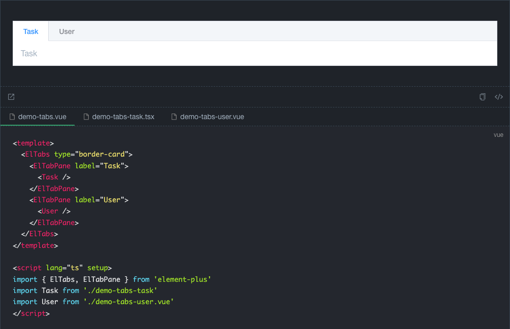

## 前言

[项目地址](https://github.com/bfehub/vmi)

[详细文档及快速预览](https://bfehub.github.io/vmi/zh/guide/)

在 `react` 体系中大部分都会选择 `dumi` 作为写文档的工具。

而在 `vue` 体系中大部分都会选择 `VuePress` 或者 `VitePress`，但它们都提供了很强大的文字的编写能力，但没有提供 `demo` 的演示能力。

社区中有很多插件的解决方案但没有无限接近 `dumi` 的 `demo` 体验。所以产生了通过一系列插件去实现 `dumi` 体验的想法，同时又能保持 `VuePress` 强大的文档编写能力和极速的热更新。选择 `VuePress` 的原因是它的扩展能力，而且也支持使用 `Vite` 作为服务。

目前实现了以下特性：

- 强大的 demo 演示能力，支持多种展示模式。

- 支持页面路径映射，自定义组织组件文档。

- 支持翻译缺失，自动生成缺失语言的页面。

## 组件演示

基本上实现了 `dumi` 的所有的配置和功能。

- 包括但不限于 `inline`、`iframe` 、`debug` 模式。

- 用做展示的 `title`、`desc` 等属性的配置。

- 展示组件导入的子文件。

上图看效果吧，还有所有的配置项。





## 页面映射

通常在编写组件的文档的时候我们可能会把组件的文档直接和组件的实现放在一起，这时候 `VuePress` 不能很好的处理路径。此功能对应 `dumi` 的标准文档结构。

如果有以下目录结构。

```sh
├── docs
│   ├── README.md
│   ├── components // 介绍组件的文档
│   │   └── README.md
├── packages
│   ├── components
│   │   ├── npm-badge
│   │   │   ├── docs // 具体组件的文档
│   │   │   │   ├── index.md
│   │   │   │   └── index.zh-CN.md
│   │   │   ├── examples
│   │   │   │   └── basic.vue
│   │   │   └── src
│   │   │       └── npm-badge.vue
```

以上组件的文档的 _访问路径_ 和 _临时文件_ 的路径就会被转换成。

`/packages/components/npm-badge/docs/index.md` => `/components/npm-badge/index.md`

`/packages/components/npm-badge/docs/index.zh-CN.md` => `/zh/components/npm-badge/index.md`

## 翻译缺失

将默认语言的文档作为未翻译语言的兜底文档，对应 `dumi` 的翻译缺失功能。

如果有以下目录结构。

```sh
├── docs
│   ├── guide
│   │   └── page-missing.md
│   └── zh
│   │   └── guide
│   │       ├── # 缺失的 page-missing.md 页面
│   components
│   ├── npm-badge
│   │   ├── docs
│   │   │   ├── index.md
│   │   │   └── # 如果使用 *页面映射* 插件同样支持生成 index.zh-CN.md 页面
```

那么就会自动生成 `/zh/guide/page-missing.html` 和 `/zh/components/npm-badge/index.html` 的页面和路由。

## 结尾

[项目地址](https://github.com/bfehub/vmi)

[详细文档及快速预览](https://bfehub.github.io/vmi/zh/guide/)

其实还有其他功能可以同步过来使用，比如 `移动端组件研发` 和 `组件 API 自动生成` 这部分还在思考中有兴趣的伙伴们多多参与。
