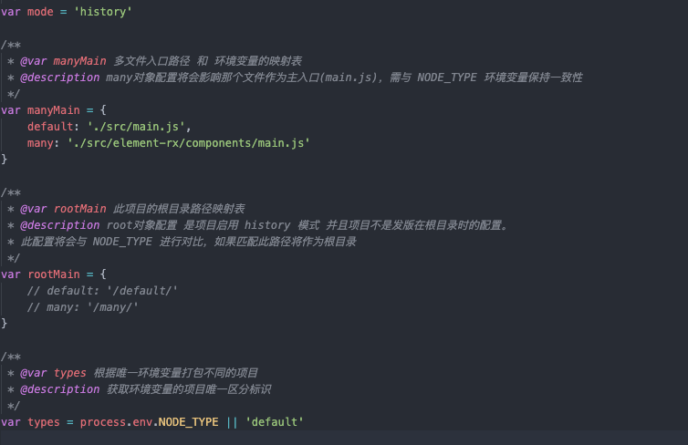
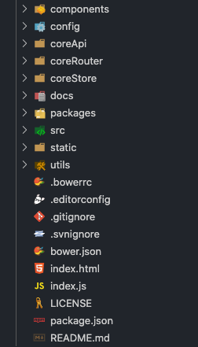
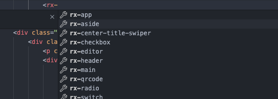

## 项目简介

为什么说 _基础_ ？首先我自认为确实比较基础掘友们都可以，二是我自认为还有很大的提升空间。

为什么说 _体系_ ？因为这是一套连贯的项目，分为 **样式库**、**脚手架**、**组件库**、**编辑器扩展**、**生成模板**、**代码仓库**。6 个独立的项目组成了我们现在用的基础结构。

为什么说 _历程_ ? 因为这些项目见证了我的成长。项目是不同时间段开发的，前前后后基本一年左右不断的补充，达到基本够用的地步（还不如说自己一直没升级），前期基本上是自己负责主开发，后期负责基础的维护。

因为是为公司内部的项目服务，所以部分针对我们独有的系统结构，也都不涉及内部独有代码。

## 项目背景

_这段废话较多，需要从我入职起开始说，也算是对我工作经历的回顾。_

**第一段**：我来的时候算是 xiao guan xi 进来的，也不是互联网公司是给自己的传统业务做线上流程的。刚开始自己也是切图仔一枚，新技术也没怎么接触过。刚来的时候项目是用 `c#` 写页面的，开始工作就是在 `vs` 里写写页面和绑绑数据，公司大部分系统都是后台管理系统所以也不用怎么写样式。

**第二段**：大概就这样是工作半年吧，部门经理决定使用前端后分离的模式。一是复杂的项目写着太麻烦，二是开发进度确实慢。因为部门那时候没人会三大框架所以就选了比较简单的 `Vue` 框架，然后就是有时间了看文档就自学也找了一个有经验的带着写，不过几个月吧因为一些原因离职了（现在也是好朋友）。

**第三段**：然后就是一直维护老项目，一边用 `Vue` 写新项目。基本也没怎么设计结构，没有公用组件，没有结构规范，基本就是很随意的写，业务很复杂，项目依赖乱，热更新那简直是地域。

**第四段**：自己下班加周末查询各种资料学习，学习优秀的解决方案。一边去理解深层的业务寻找共同点和套路，一边编写基础的组件、设计结构和定义规范。最后得到的结果也很满意。基础结构有了、规范标准了、模板也补充了很多，开发起来清晰和简单了很多。开始只有自己部门是使用这套结构，由于公司结构调整和方向调整业务大幅度增长，而我们现在的这套方案自然拿了出来，最后整个公司的后台系统算是统一了技术栈，交流对接起来也方便了很多。这套标准可以说提高了很大的效率，自己也因此被很多人认识。

## 实践过程

#### 基础样式库

基本是参考 [theme-chalk](https://github.com/ElementUI/theme-chalk) 源码写的，也采用了它内部的函数。

这些命名规范和工具也是在看完源码学到的，所有同一个样式的模板用一套样式库不再重新编写提高开发效率。

1. 在命名规范上选择了 `BEM`、`OOCSS` 的命名思想。`BEM` 用于写组件的样式，也容易梳理结构。`OOCSS` 主要写公用类的，像颜色、布局、文本、间隔类的。

2. 预处理使用 `Scss` 做一些循环和公用的变量还是很方便的。

3. 编译也没什么特殊需求用最简单的 `Gulp`，加了一些插件 `autoprefixer` 和 `clean-css`。

4. 这个样式库开始做了 _ie8_ 的兼容处理，采用优雅降级的方式处理。

5. 最后发布到 `CDN` 外部引入的方式使用，其他特殊需求就在自己系统做了。

_比较普通的两段样式写法_

```scss
@include b(panel) {
  box-sizing: border-box;
  // ...
  @include when(not-shadow) {
    box-shadow: none;
  }
  @include e(main) {
    display: table;
    // ...
    @include when(not-border) {
      border-right: none;
    }
  }
}

.ie-8 {
  @include b(panel) {
    border: 1px solid #dddddd;
    &__main {
      border-bottom: 1px solid #dddddd;
    }
  }
}
```

```scss
@for $i from 12 through 60 {
  .lh-#{$i} {
    line-height: $i * 1px !important;
  }
}

@for $i from 12 through 40 {
  .fz-#{$i} {
    font-size: $i * 1px !important;
  }
}
```

#### 基础脚手架

说是脚手架，不如说就是刚开始为了保持每个项目的配置和依赖一致提取出来的模板(以前还不会写真正的脚手架)，创建新项目的时候以此基础开始。

很久以前的了，基于 `vue-cli 2.x` 开发的也没有升级。这个主要定义代码规范配置、模板配置做了一些其他的配置。从中学习到了了 `cli` 的详细的结构，以及 `webpack` 的配置。

1. 区分不同项目的入口，主要运用环境变量为了解决同一套项目过大的问题，使用 `cross-env NODE_TYPE=xxxxx` 解决。

2. 为了解决异步路由慢的问题，开发模式启用 `dynamic-import-node`。

3. 为了解决内存溢出的问题，配置好 `increase-memory-limit` 命令。

4. 因为后台系统的模板都是一个套路定义好结构，生成一个默认的模板即可。



#### 基础组件库

以前做培训的时候的主题基本如下。

1. 统一的资源管理。
2. 统一的布局管理。
3. 统一的开发思路。
4. 对不熟悉布局的开发相对友好。
5. 减少布局错误引发的样式错误。
6. 最大化利用已加载资源，最下化减少资源加载。
7. 最大化组件公用，最小化板块之间的影响。

首先它不并不是一个纯粹的组件库，包含一些业务的存在。首先说明一下我们后台管理系统的特性布局 **三段式 左、中、右**。我们达到了一个什么效果，就是人员随便跨部门协调，和后端人员开发写前端，能完全理解不熟悉的业务的结构。

1. 内置 `vuex`，必须存储用户信息的标准字段、当前选择的一段列表的数据、等。

2. 内置 `filter`，这类比较广泛了，图片裁剪、文字截取、统一的字典类的转换、等。

3. 内置 `directive`，计算高度的滚动条、提示信息、等。

4. 内置 `function`，系统之间的通信协议、等。

5. 内置 `interceptors`，统一的 `loading`、统一的错误 `message`、等。

6. 内置 `utils`，时间转换、数据操作、字符串操作、存储、验证、等。

7. 内置 `component`，`ElementUI` 还是用功能性的组件，布局不通用自己实现了。

8. 上传组件，我们的图片都是上传到阿里云，前台上传还需要进行认证等一列操作，封装在内部用到的时候只需要传配置就行了。

9. 比如还有图片预览、特定的单选、多选、切换之类的。基本也都是小功能但比较难处理的特定的基本就是各项目封装了。

10. 最后文档和示例也是比不可少的。



#### 编辑器插件

既然有内部的组件，编辑器提示也是必要的。代码提示是基于 `vetur` 。可以开发自定义的组件数据 [自定义组件数据](https://vuejs.github.io/vetur/guide/component-data.html#supported-frameworks)。具体的看文档吧，下面贴出几个效果。

_组件和属性提示_



_配置文件结构_


#### 生成模板

因为组件按照一定的标准规律拆分的，所以比较多标准的情况下的好处就是有规律可寻。主要功能，自动创建文件、自动创建默认的模块、自定创建组件和路由的配置、创建的其实就是前面说的基础模板那套。主要思路使用的就是拼接字符串最后输出文件即可。

以下为不完整的代码，基本就是 **读取配置文件 -> 读取模板文件 -> 配置传入到模板中 -> 返回渲染后的字符串 -> 写入文件** 。

```js
const fs = require("fs");
const path = require("path");
const config = require("../index.config");
const copy = require("../config/copy");

let fileDataPath = path.resolve(config.entry, "Resources");
let mkdirPath = path.resolve(config.output, "Resources");

let fileDataRoute = require("../template/Resources/Router/index");
let fileDataItemFn = require("../template/Resources/Router/item");

fs.mkdir(mkdirPath, (err) => {
  copy(path.resolve(fileDataPath, "Api"), path.resolve(mkdirPath, "Api"));
  copy(path.resolve(fileDataPath, "Static"), path.resolve(mkdirPath, "Static"));
  copy(path.resolve(fileDataPath, "Store"), path.resolve(mkdirPath, "Store"));
  fs.mkdir(path.resolve(mkdirPath, "Router"), (err) => {
    fs.writeFile(mkdirPath + "/Router/index.js", fileDataRoute, (err) => {});
    config.data.center.forEach((item) => {
      if (item.en !== "state") {
        fs.writeFile(mkdirPath + `/Router/${item.en}.js`, fileDataItemFn(item), (err) => {});
      }
    });
  });
});
```

因为模块的名字是中文的，但建立的模块名需要英文，为了方便直接调用百度翻译接口翻译一下。中文还是展示因为作为文件和路由名。最后我们达到了一个共识，就是不管是生成还是手写，就是看路由就知道文件在那，直接复制路由地址直接搜文件名即可。

```js
//请求翻译
request.get(parmas(_allCn), (error, response, body) => {
  let fanyicallback = function (res) {
    let result = res.trans_result[0];
    let cn = result.src.split("/");
    let en = result.dst.split("/");
    let obj = new Object();
    cn.forEach((item, index) => {
      obj[item] = en[index].toLocaleLowerCase().replace(/ /gim, "");
    });
    // console.log(obj)
    translate(obj);
  };
  eval(body);
});

// 处理源数据的中文翻译
let translate = function (value) {
  for (let item of config.data.center) {
    if (item.en === "example") {
      item.en = value[item.cn];
    }
    if (item.module) {
      for (let ite of item.module) {
        if (ite.en === "example") {
          ite.en = value[ite.cn];
        }
        if (ite.module) {
          for (let it of ite.module) {
            if (it.en === "example") {
              it.en = value[it.cn];
            }
          }
        }
      }
    }
  }
};
```

可以升级的地方，特别是这种有标准模板的，可视化拖拽生成需求模板，对接好需求后在一次性生成文件。

#### 代码仓库

根据我们现有的问题，在提出使用 `GitLab` 平台的时候只提出了了几点建议就接收了提议。平台不是我部署的，我只是负责跟踪推进。

解决了什么问题？**缺少一套完整的项目管理、文档、测试、持续集成、部署的平台** 。

现在急需解决的问题？**无法校验代码质量。无法把控质量。没有公开的代码仓库，代码分享不方便** 。

## 总结思考

上面的项目在实施过程中问题是必不可少的，但以现在信息共享的时代必然可以解决。自己多查询，多思考都不是问题。

这只是我们后台管理系统的结构，其他的我也不是主负责的。还要其他一些小东西，也不整理了基本就是为了开发效率捣鼓一些小东西。

回头回顾这两年的公共性项目，站在现在大前端的时代或许不算什么。放在现在的我或许能做的更好，但不得不说它们确实是我成长的历程中的一环。

最后再说一句，现在的公司不是什么大公司能做的也有限，如果您也不在大公司或许可以寻找公司需要的技术突破点以使自己上升。写给自己：虽然我现在是主负责部门的业务的。如果今年我还在，我想我会尽自己最大的努力升级现有的技术支持和建立团队毕竟技术为本。

## 本文参与

本文正在参与「掘金 2021 春招闯关活动」, 点击查看[活动详情](https://juejin.cn/post/6933147477399109640)。
