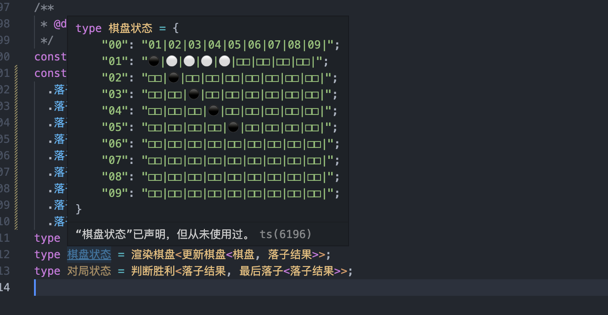
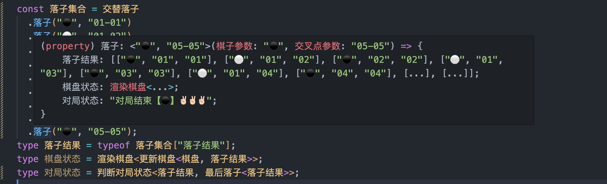
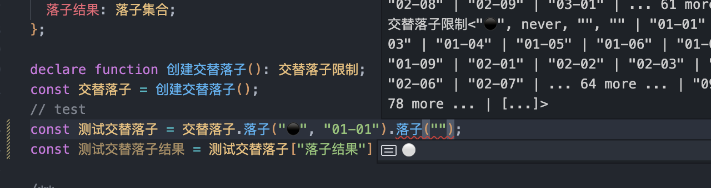
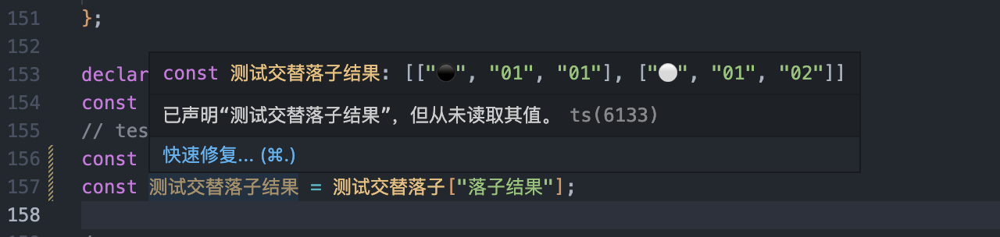
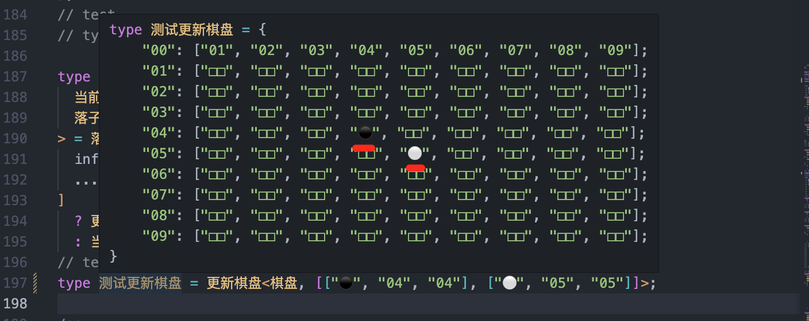
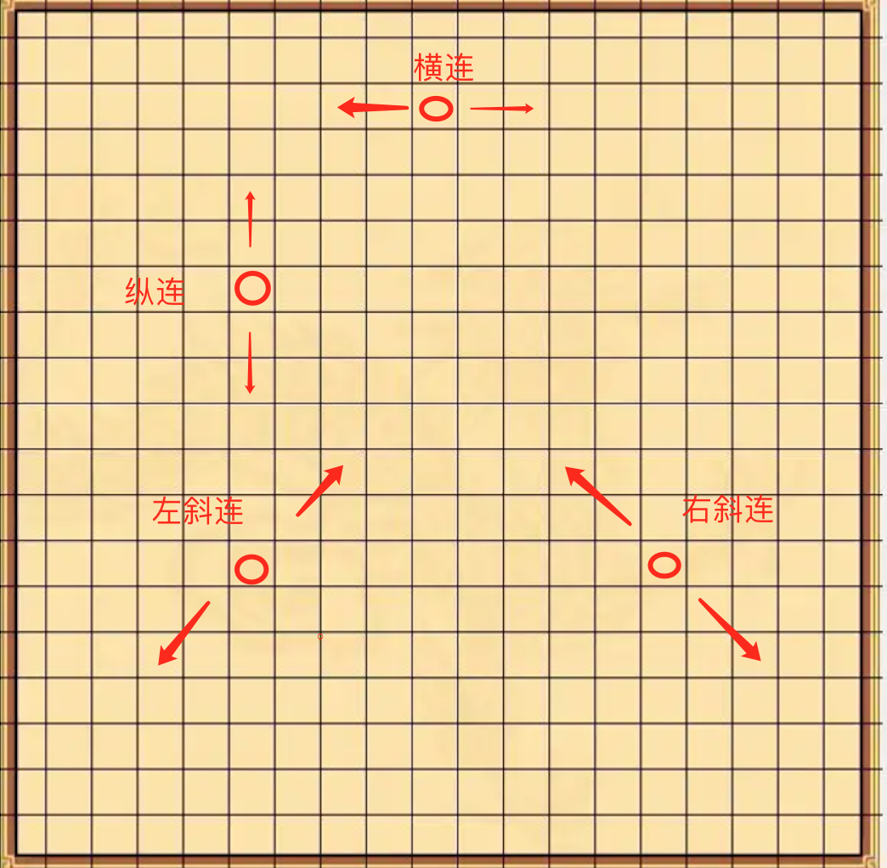
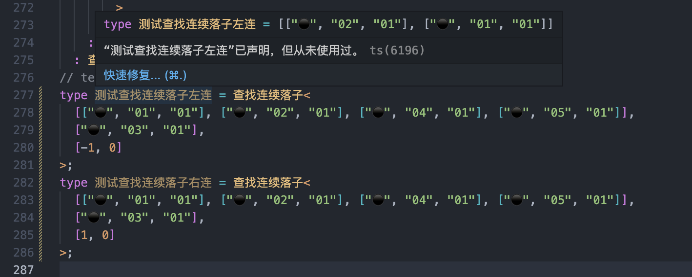
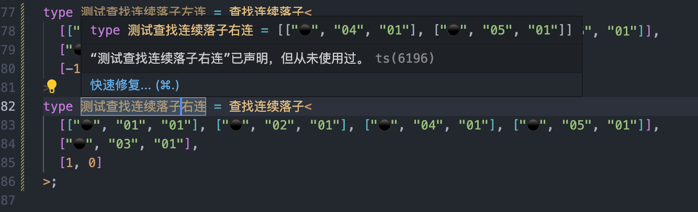
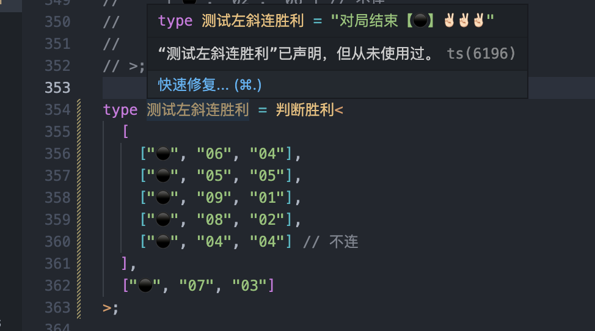

之前有看到有大佬用类型运算实现了[中国象棋程序](https://zhuanlan.zhihu.com/p/426966480) 和 [Lisp 解释器](https://zhuanlan.zhihu.com/p/427309936) 甚是震惊，之前不太会看不懂。

最近也学了点类型体操的内容想着自己也玩一下。选择五子棋的原因是相对来说规则是更简单一些的也比较好实现。此实现没有考虑性能上优化和最佳实现方式只关注功能的实现。以下变量全部为中文命名不要介意。

可以直接点击链接在线体验。[https://tsplay.dev/LhwGoBangGame](https://tsplay.dev/LhwGoBangGame)





## 需求分析

首先我们了解下五子棋的规则。只实现核心的几个规则，一步一步的拆解去实现。

1. 创建棋盘：创建一个棋盘的 “横线” 和 “纵线”，形成的交叉点就是落子点。

2. 交替落子：实现 “黑棋” 和 “白棋” 交替落子，之前的落子点不能再落子。

3. 判断胜利：当一方的棋子 “横联”、“纵连”、“左斜连”、“右斜连” 达到五个时候则为胜利。

## 创建棋盘

五子棋分为 “黑棋” 和 “白棋” 使用类型定义出来。

```ts
type 黑棋 = "⚫";
type 白棋 = "⚪";
type 棋子 = 黑棋 | 白棋;
```

创建一个 `9 * 9` 的棋盘。其实多大都无所谓只是现在有个问题没有解决，太大的棋盘在显示的时候会省略显示影响显示状态，这里就暂不考虑了。

```ts
type 棋盘 = {
  "00": ["01", "02", "03", "04", "05", "06", "07", "08", "09"];
  "01": ["□□", "□□", "□□", "□□", "□□", "□□", "□□", "□□", "□□"];
  "02": ["□□", "□□", "□□", "□□", "□□", "□□", "□□", "□□", "□□"];
  "03": ["□□", "□□", "□□", "□□", "□□", "□□", "□□", "□□", "□□"];
  "04": ["□□", "□□", "□□", "□□", "□□", "□□", "□□", "□□", "□□"];
  "05": ["□□", "□□", "□□", "□□", "□□", "□□", "□□", "□□", "□□"];
  "06": ["□□", "□□", "□□", "□□", "□□", "□□", "□□", "□□", "□□"];
  "07": ["□□", "□□", "□□", "□□", "□□", "□□", "□□", "□□", "□□"];
  "08": ["□□", "□□", "□□", "□□", "□□", "□□", "□□", "□□", "□□"];
  "09": ["□□", "□□", "□□", "□□", "□□", "□□", "□□", "□□", "□□"];
};
```

创建落子点的限制，落子点为横纵的交叉点。这里使用字符串的分布式特性去创建。

```ts
type 横点 = "01" | "02" | "03" | "04" | "05" | "06" | "07" | "08" | "09";
type 纵点 = "01" | "02" | "03" | "04" | "05" | "06" | "07" | "08" | "09";
type 落子信息 = [棋子, 横点, 纵点];

type 交叉点 = `${横点}-${纵点}`;
type 拆分交叉点<S extends 交叉点> = S extends `${infer _横点}-${infer _纵点}` ? [_横点, _纵点] : [];
// test
type 测试拆分交叉点 = 拆分交叉点<"05-05">;
```

以上就把棋盘的相关信息定义出来了。

## 交替落子

在五子棋规则中是交替落子：

1. 如果当前位置中已有棋子则不能下棋。

2. 如果上一步是【白棋】下的，那么下一步为【黑棋】下。反之如果上一步是【黑棋】下的，那么下一步为【白棋】下。

那么如何实现呢？这里最主要的是限制下一步棋的类型，所以我们需要在走完当前这一步棋之后返回一个新的类型。所以符合这种形式的就只有函数可以实现，执行一次函数后返回一个新的函数从而限制参数的类型，且可以无限调用。

```ts
type 交替落子限制<
  可下棋子 extends 棋子 = 棋子,
  可下交叉点 extends 交叉点 = 交叉点,
  已下棋子 extends 棋子 | "" = "",
  已下交叉点 extends 交叉点 | "" = "",
  落子集合 extends 落子信息[] = []
> = {
  落子: <当前棋子 extends 可下棋子, 当前交叉点 extends 可下交叉点>(
    棋子参数: 当前棋子,
    交叉点参数: 当前交叉点
  ) => 交替落子限制<
    Exclude<棋子, 当前棋子>,
    Exclude<交叉点, 已下交叉点 | 当前交叉点>,
    已下棋子,
    已下交叉点 | 当前交叉点,
    当前交叉点 extends 交叉点 ? [...落子集合, [当前棋子, ...拆分交叉点<当前交叉点>]] : 落子集合
  >;
  落子结果: 落子集合;
};

declare function 创建交替落子(): 交替落子限制;
const 交替落子 = 创建交替落子();
// test
const 测试交替落子 = 交替落子.落子("⚫", "01-01").落子("⚪", "01-02");
const 测试交替落子结果 = 测试交替落子["落子结果"];
```

可以看到已经限制到了下一步棋，并且获取到最终的落子结果集合。





## 更新棋盘

此时可以获取到最终的落子集合。遍历每个落子集合，根据【当前纵点】找到对应的横点集合，再根据【当前横点】和【横点集合】找到对应的位置更新为【当前棋子】。

更新棋盘交叉点就是通过索引找到对应的位置替换字符，因为我们传入是 `01` 这种字符串所以在查找时要转成数字。

```ts
export type 转数字<S extends string> = S extends `0${infer R extends number}`
  ? R
  : S extends `${infer R extends number}`
  ? R
  : never;
// test
type 测试转数字一 = 转数字<"01">;
type 测试转数字二 = 转数字<"10">;

type 更新棋盘交叉点<
  横点集合 extends string[],
  当前落子 extends 落子信息,
  当前索引 extends unknown[] = [unknown]
> = 横点集合 extends [infer _横点, ...infer _剩余横点 extends string[]]
  ? 当前索引["length"] extends 转数字<当前落子[2]>
    ? [当前落子[0], ...更新棋盘交叉点<_剩余横点, 当前落子, [unknown, ...当前索引]>]
    : [_横点, ...更新棋盘交叉点<_剩余横点, 当前落子, [unknown, ...当前索引]>]
  : [];
// test
type 测试更新棋盘交叉点 = 更新棋盘交叉点<["□□", "□□", "□□"], ["⚫", "01", "02"]>;
```

通过遍历棋盘的属性找到纵点的位置再更新棋盘交叉点完成一次更新。

```ts
type 更新一次棋盘<当前棋盘 extends Record<string, string[]>, 当前落子 extends 落子信息> = {
  [_纵点 in keyof 当前棋盘]: _纵点 extends 当前落子[1]
    ? 更新棋盘交叉点<当前棋盘[_纵点], 当前落子>
    : 当前棋盘[_纵点];
};
// test
type 测试更新一次棋盘 = 更新一次棋盘<棋盘, ["⚫", "05", "05"]>;

type 更新棋盘<
  当前棋盘 extends Record<string, string[]>,
  落子集合 extends 落子信息[]
> = 落子集合 extends [infer _当前落子 extends 落子信息, ...infer _剩余落子 extends 落子信息[]]
  ? 更新棋盘<更新一次棋盘<当前棋盘, _当前落子>, _剩余落子>
  : 当前棋盘;
// test
type 测试更新棋盘 = 更新棋盘<棋盘, [["⚫", "04", "04"], ["⚪", "05", "05"]]>;
```

当前的棋盘的显示状态算是处理完了。



## 判断胜利

在五子棋的规则中，如果横连、纵连、左斜连、右斜连达到五个为胜利。



#### 查找分析

以最后一次落子的位置向四条线八个方向开始查找。

1. 横连：向左查找【横点递减并纵点相同】的棋子 和 向右查找【横点递增并纵点相同】的棋子。

2. 纵连：向上查找【纵点递减并横点相同】的棋子 和 向下查找【纵点递增并横点相同】的棋子。

3. 左斜连：向左下查找【横点递减同时纵点递增】的棋子 和 向右上查找【横点递增同时纵点递减】的棋子。

4. 右斜连：向左上查找【横点递减同时纵点递减】的棋子 和 向右下查找【横点递增同时纵点递增】的棋子。

#### 查找连续落子

举个例子，当前落子为 `["⚫", "03", "01"]` 那么左连的棋子为 `["⚫", "02", "01"]`，如果能找到那么就继续向左查找，如果不能找到代表中断了就停止查找。

这里涉及到一些加减的运算，比如 `03` 向左递减为 `02`。实现就是先把字符串转成数字，做完加减运算后再转为字符串。

```ts
export type 转数字<S extends string> = S extends `0${infer R extends number}`
  ? R
  : S extends `${infer R extends number}`
  ? R
  : never;
// test
type 测试转数字一 = 转数字<"01">;
type 测试转数字二 = 转数字<"10">;

export type 转字符串<N extends number> = 比较<10, N> extends true ? `0${N}` : `${N}`;
// test
type 测试转转字符串一 = 转字符串<1>;
type 测试转转字符串二 = 转字符串<10>;

export type 加<A extends number, B extends number> = [...构建数组<A>, ...构建数组<B>]["length"];
// test
type 测试加 = 加<3, 5>;

export type 减<A extends number, B extends number> = 构建数组<A> extends [
  ...args1: 构建数组<B>,
  ...args2: infer Rest
]
  ? Rest["length"]
  : never;
// test
type 测试减 = 减<5, 3>;

export type 比较<A extends number, B extends number, Result extends unknown[] = []> = A extends B
  ? false
  : Result["length"] extends B
  ? true
  : Result["length"] extends A
  ? false
  : 比较<A, B, [unknown, ...Result]>;
// test
type 测试比较 = 比较<10, 5>;

export type 构建数组<
  Length extends number,
  Item = unknown,
  Result extends unknown[] = []
> = Result["length"] extends Length ? Result : 构建数组<Length, Item, [...Result, Item]>;
// test
type 测试构建数组 = 构建数组<5, number>;
```

```ts
type 查找类型 = 0 | 1 | -1; // 0: 不变、1: 递增、-1：递减
type 查找方向 = [查找类型, 查找类型]; // [横点查找类型, 纵点查找类型]
type 下一次查找位置<当前位置 extends string, 当前查找类型 extends 查找类型> = 当前查找类型 extends 0
  ? 当前位置
  : 当前查找类型 extends 1
  ? 加<转数字<当前位置>, 1> extends number
    ? 转字符串<加<转数字<当前位置>, 1>>
    : "00"
  : 当前查找类型 extends -1
  ? 减<转数字<当前位置>, 1> extends number
    ? 转字符串<减<转数字<当前位置>, 1>>
    : "00"
  : "00";
// test
type 测试下一次查找位置不变 = 下一次查找位置<"01", 0>;
type 测试下一次查找位置递增 = 下一次查找位置<"01", 1>;
type 测试下一次查找位置递减 = 下一次查找位置<"02", -1>;
```

以最后一次落子开始，向指定的方向递归查找并记录下来。

```ts
type 查找当前落子<落子集合 extends 落子信息[], 当前落子 extends 落子信息> = 落子集合 extends [
  infer _当前落子 extends 落子信息,
  ...infer _剩余落子 extends 落子信息[]
]
  ? _当前落子 extends 当前落子
    ? _当前落子
    : 查找当前落子<_剩余落子, 当前落子>
  : [];

type 查找连续落子<
  落子集合 extends 落子信息[],
  最后一次落子 extends 落子信息,
  当前查找方向 extends 查找方向,
  查找结果 extends 落子信息[] = []
> = 下一次查找位置<最后一次落子[1], 当前查找方向[0]> extends 横点
  ? 下一次查找位置<最后一次落子[2], 当前查找方向[1]> extends 纵点
    ? 查找当前落子<
        落子集合,
        [
          最后一次落子[0],
          下一次查找位置<最后一次落子[1], 当前查找方向[0]>,
          下一次查找位置<最后一次落子[2], 当前查找方向[1]>
        ]
      > extends 落子信息
      ? 查找连续落子<
          落子集合,
          [
            最后一次落子[0],
            下一次查找位置<最后一次落子[1], 当前查找方向[0]>,
            下一次查找位置<最后一次落子[2], 当前查找方向[1]>
          ],
          当前查找方向,
          [
            ...查找结果,
            [
              最后一次落子[0],
              下一次查找位置<最后一次落子[1], 当前查找方向[0]>,
              下一次查找位置<最后一次落子[2], 当前查找方向[1]>
            ]
          ]
        >
      : 查找结果
    : 查找结果
  : 查找结果;
// test
type 测试查找连续落子左连 = 查找连续落子<
  [["⚫", "01", "01"], ["⚫", "02", "01"], ["⚫", "04", "01"], ["⚫", "05", "01"]],
  ["⚫", "03", "01"],
  [-1, 0]
>;
type 测试查找连续落子右连 = 查找连续落子<
  [["⚫", "01", "01"], ["⚫", "02", "01"], ["⚫", "04", "01"], ["⚫", "05", "01"]],
  ["⚫", "03", "01"],
  [1, 0]
>;
```





#### 判断对局状态

横连胜利：向左查找【横点递减并纵点相同】的棋子 和 向右查找【横点递增并纵点相同】的棋子。

```ts
type 横连胜利<落子集合 extends 落子信息[], 最后一次落子 extends 落子信息> = [
  ...查找连续落子<落子集合, 最后一次落子, [-1, 0]>,
  最后一次落子,
  ...查找连续落子<落子集合, 最后一次落子, [1, 0]>
];
```

纵连胜利：向上查找【纵点递减并横点相同】的棋子 和 向下查找【纵点递增并横点相同】的棋子。

```ts
type 纵连胜利<落子集合 extends 落子信息[], 最后一次落子 extends 落子信息> = [
  ...查找连续落子<落子集合, 最后一次落子, [0, -1]>,
  最后一次落子,
  ...查找连续落子<落子集合, 最后一次落子, [0, 1]>
];
```

左斜连胜利：向左下查找【横点递减同时纵点递增】的棋子 和 向右上查找【横点递增同时纵点递减】的棋子。

```ts
type 左斜连胜利<落子集合 extends 落子信息[], 最后一次落子 extends 落子信息> = [
  ...查找连续落子<落子集合, 最后一次落子, [-1, 1]>,
  最后一次落子,
  ...查找连续落子<落子集合, 最后一次落子, [1, -1]>
];
```

右斜连胜利：向左上查找【横点递减同时纵点递减】的棋子 和 向右下查找【横点递增同时纵点递增】的棋子。

```ts
type 右斜连胜利<落子集合 extends 落子信息[], 最后一次落子 extends 落子信息> = [
  ...查找连续落子<落子集合, 最后一次落子, [-1, -1]>,
  最后一次落子,
  ...查找连续落子<落子集合, 最后一次落子, [1, 1]>
];
```

其中一个方向达到五个则胜利。

```ts
type 判断对局状态<
  落子集合 extends 落子信息[],
  最后一次落子 extends 落子信息 | []
> = 最后一次落子 extends 落子信息
  ? 横连胜利<落子集合, 最后一次落子>["length"] extends 5
    ? `对局结束【${最后一次落子[0]}】✌🏻✌🏻✌🏻`
    : 纵连胜利<落子集合, 最后一次落子>["length"] extends 5
    ? `对局结束【${最后一次落子[0]}】✌🏻✌🏻✌🏻`
    : 左斜连胜利<落子集合, 最后一次落子>["length"] extends 5
    ? `对局结束【${最后一次落子[0]}】✌🏻✌🏻✌🏻`
    : 右斜连胜利<落子集合, 最后一次落子>["length"] extends 5
    ? `对局结束【${最后一次落子[0]}】✌🏻✌🏻✌🏻`
    : "进行中"
  : "未开始";
// test
type 测试左斜连胜利 = 判断对局状态<
  [
    ["⚫", "06", "04"],
    ["⚫", "05", "05"],
    ["⚫", "09", "01"],
    ["⚫", "08", "02"],
    ["⚫", "04", "04"] // 不连
  ],
  ["⚫", "07", "03"]
>;
```



## 创建对局

创建对局我们只需要把上面的功能组合起来就可以了。

```ts
type 最后落子<落子集合 extends 落子信息[]> = 落子集合 extends [...infer _剩余落子, infer _最后落子]
  ? _最后落子
  : [];

type 转换棋盘<横点集合 extends string[]> = 横点集合 extends [
  infer _当前横点 extends string,
  ...infer _剩余横点 extends string[]
]
  ? `${_当前横点}|${转换棋盘<_剩余横点>}`
  : "";

type 渲染棋盘<当前棋盘 extends Record<string, string[]>> = {
  [_纵点 in keyof 当前棋盘]: 转换棋盘<当前棋盘[_纵点]>;
};
```

```ts
const 落子集合 = 交替落子
  .落子("⚫", "01-01")
  .落子("⚪", "01-02")
  .落子("⚫", "02-02")
  .落子("⚪", "01-03")
  .落子("⚫", "03-03")
  .落子("⚪", "01-04")
  .落子("⚫", "04-04")
  .落子("⚪", "01-05")
  .落子("⚫", "05-05");
type 落子结果 = (typeof 落子集合)["落子结果"];
type 棋盘状态 = 渲染棋盘<更新棋盘<棋盘, 落子结果>>;
type 对局状态 = 判断对局状态<落子结果, 最后落子<落子结果>>;
```


## 写在最后

其实写这个并没有什么实际的用途，也算是锻炼熟练度了。👋🏻👋🏻
