本系列已接近尾声，本篇是主要部分的最后一篇。再有其它也都是扩展性的内容。接下来看如何发布组件库和管理更新日志。本篇新增的完整代码可查看单独的分支 [9-publish](https://github.com/bfehub/vlib-starter/tree/9-publish)。

> 如果你还不了解这个系列要做什么，那你可以先阅读 [【实践 Vue3 组件库-介绍一下这个系列】](./vlib-starter-1.md) 的介绍，以便你对整个系列有清晰的认识。

## 使用流程及概念

什么是 [changesets](https://github.com/changesets/changesets)？根据官网的介绍 changesets 是用于管理版本及变更日志的工具，专注多包管理。

### 安装及初始化(init)

现在先安装它到项目中。

```sh
pnpm add @changesets/cli -w -D
```

执行 `pnpm changeset init` 初始化，会看到项目中生成了一个 `.changeset` 的文件夹，里面会生成 `config.json` 文件。生成的是默认配置一般不用做过多更改，你可以查看 [config-file-options](https://github.com/changesets/changesets/blob/main/docs/config-file-options.md) 的具体描述。

```sh
pnpm changeset init
```

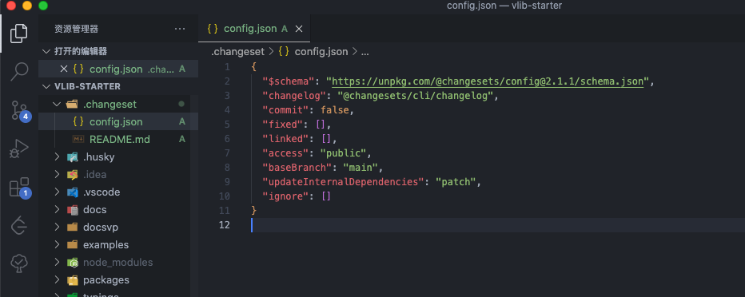

### 生成 changeset 文件(add)

什么是 changeset 文件(带疑问)？执行 `pnpm changeset add` 命令(add 可省略)，会弹出一些询问窗口。

```sh
pnpm changeset add
```

1. 哪些包是需要发布的？(有修改的和未修改的包会分开列出)

2. 发布包的版本是什么？(遵循 [semver](https://semver.org/lang/zh-CN/) 规范)。

3. 以及此次变更的描述？(后续根据它生成 changelog 内容)。

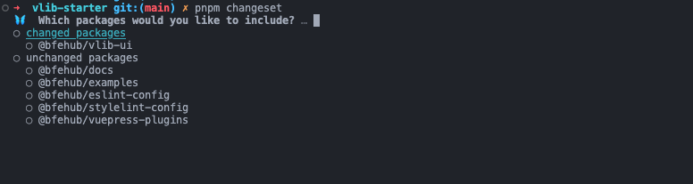

全部选择完毕后会在 `.changeset` 目录下生成一个文件。

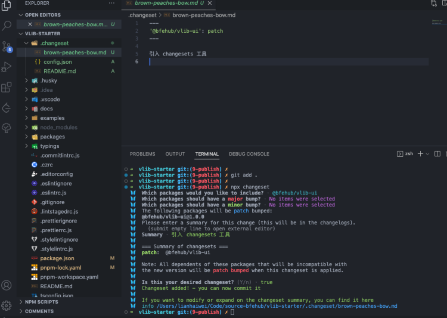

这个文件就是 `changeset` 文件，可以看到里面的内容，就是我们刚才选择的。所以 `changeset` 文件是什么呢，就是记录此次更新的信息(包名称、包版本更新级别、CHANGELOG 信息) 的文件。

如果想把这些变更攒一攒，现在就可以把 changeset 文件提交了。每当开发了一个新功能或修复了一个问题并且想要记录在 changelog 中都需要生成一个 changeset 文件。

### 消耗 changeset 文件(version)

现在已经有了一些 changeset 文件，那么如何使用它。执行 `pnpm changeset version` 命令来消耗 changeset 文件并且修改对应包版本以及依赖该包的包版本，同时会根据之前 changeset 文件里面的信息来生成对应的 CHANGELOG 信息。

```sh
pnpm changeset version
```

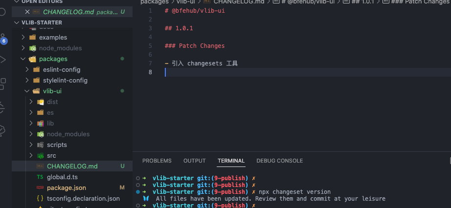

### 完善 changelog 信息(changelog-github)

现在生成的 changelog 有点简单，我们可能想加一些哪次提交的、提交人是谁、关联 PR 等。

```sh
pnpm add @changesets/changelog-github -w -D
```

修改 `config.json` 文件的 `changelog` 配置。

```json
// .changeset/config.json
{
  // ...
  "changelog": [
    "@changesets/changelog-github",
    {
      // 这个是 github 上的包路径
      "repo": "bfehub/vlib-starter"
    }
  ]
}
```

看名称就知道它是从 github 上获取信息的，所以我们还需要做两步：

1. 把 changeset 文件提交到 github 上。

2. 生成 github 的 `Access Token` 用于调用 github 的 api 接口。

点击此地址 <https://github.com/settings/tokens/new> 生成 token，起个名字选择时间就可以了，其他可以不用选。

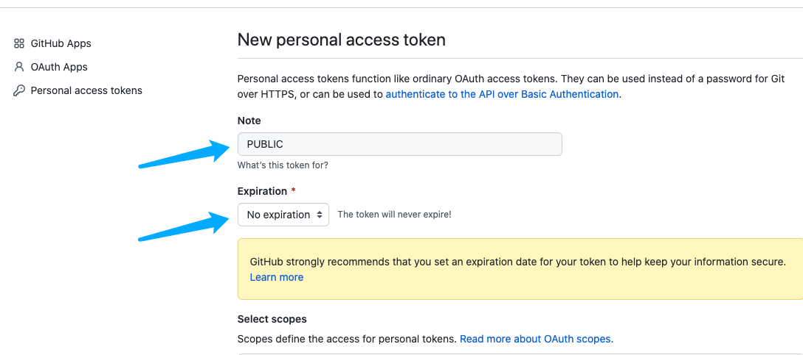

然后把它设置为临时环境变量，后续自动化发布会自动鉴权不需要这个。如果你想手动发布就写入的系统的环境变量里。

```sh
# win
set GITHUB_TOKEN=Your Yoken

# mac
export GITHUB_TOKEN=Your Yoken
```

此时执行 `pnpm changeset version` 消耗 changeset 文件，可以看到内容变详细了。

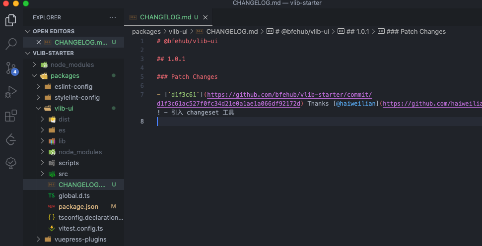

### 发布包版本(publish)

终于到了激动人心的时刻，把组件库发布出去。在这之前修改下 `package.json` 中的必要字段内容，更多字段可以阅读 [这篇文章](https://juejin.cn/post/7023539063424548872) 了解更多。

只发布打包的产物文件。

```json
// packages/vlib-ui/package.json
{
  "files": ["es", "lib", "dist", "global.d.ts"]
}
```

命名空间的包必须指定 public 才能发布公开包。

```json
// packages/vlib-ui/package.json
{
  "publishConfig": {
    "access": "public"
  }
}
```

在发包之前需要保证测试、打包完成，这里可以合并成一个命令。

```json
// package.json
// --recursive 执行所有的子包中的命令
// --stream 输出中添加包的目录前缀
{
  "release": "pnpm --recursive --stream build && changeset publish"
}
```

执行 `pnpm release` 发布。前提是你得登录 npm 的账号，没登录过的请自行搜素。

> 如果你是测试的，发布之后没用可以立即删除掉，维护生态环境人人有责。

```sh
pnpm release
```

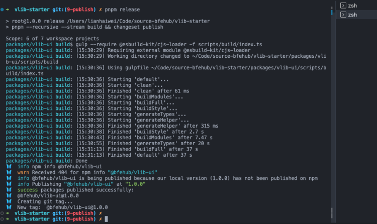

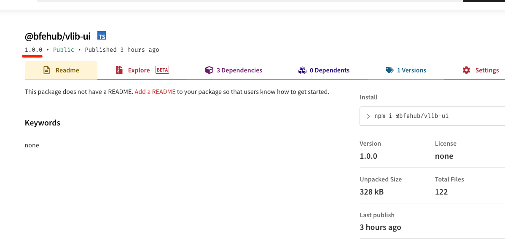

### 工作流程示意

上面的流程我简单的画了个图。

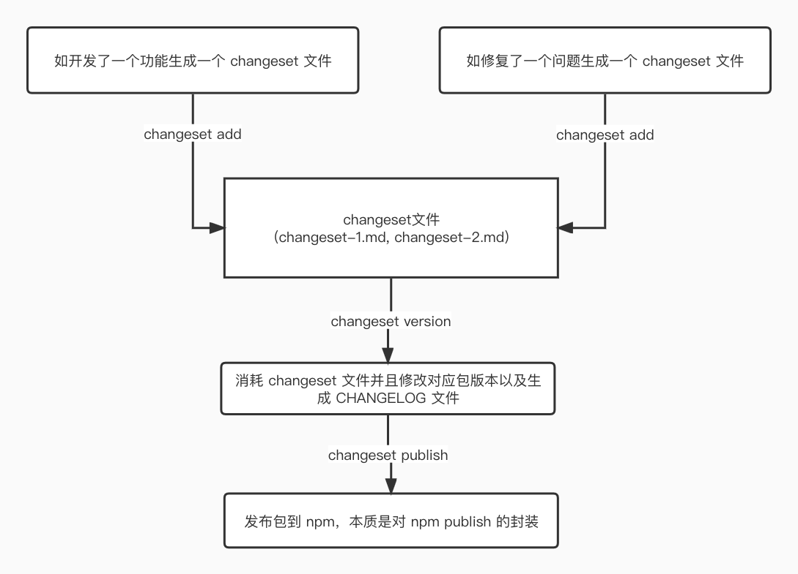

## 实现自动化发布

我们利用 [GitHub Actions](https://docs.github.com/en/actions) 来实现自动化发布。如果你完全不知道这个是什么，你可以阅读[这篇文章](https://juejin.cn/post/7113562222852309023)的基础部分。

自动化发布流程是由 [changesets/action](https://github.com/changesets/action) 实现，先了解下它的工作方式是什么。

1. 如果我们有新的 changeset 文件提交，它会自动执行 `changeset version` 命令。

2. 如果有变更会创建一个发布用的 PR，每当 changeset 文件有变更都会更新这个 PR 的内容。

3. 当我们合并这个 PR 时，此时包版本和 Npm 上的包版本不一致就会执行 `publish` 配置。

### 编写发布流程

在项目下 `.github/workflows` 文件中新建 `release.yml` 文件，当符合条件时 Actions 会自动运行它。

```yml
# https://docs.github.com/en/actions/using-workflows/about-workflows
# 整个工作流的名称
name: Release

# 监听 main 分支的 push 事件(有更新时)
on:
  push:
    branches:
      - main

# 所有的 jobs
jobs:
  # 定义一个名为 release 的 job
  release:
    # 运行环境
    runs-on: ubuntu-latest
    # 定义步骤
    steps:
      # https://github.com/actions/checkout
      # 拉取代码
      - name: Checkout Repo
        uses: actions/checkout@v2

      # https://github.com/actions/setup-node
      # 安装 node
      - name: Setup Node.js
        uses: actions/setup-node@v3
        with:
          node-version: 16.x

      # https://github.com/pnpm/action-setup
      # 安装 pnpm
      - name: Setup Pnpm
        uses: pnpm/action-setup@v2
        with:
          version: 7.x

      # https://pnpm.io/zh/cli/install#--frozen-lockfile
      # 下载依赖
      - name: Install Dependencies
        run: pnpm install --frozen-lockfile

      # https://github.com/changesets/action
      # 自动创建发布 PR 或 发布 npm
      - name: Create Release Pull Request or Publish to npm
        uses: changesets/action@v1
        # 参数配置
        with:
          # 发布时执行什么命令
          publish: pnpm release
          # 消耗 changeset 文件的命令；不需要自定义可不填
          version: pnpm changeset version
          # 提交的信息是什么；如果有 commitlint 验证，需要更改。
          commit: "chore: version packages"
        # 此步骤的环境变量，下一步讲解
        env:
          NPM_TOKEN: ${{ secrets.NPM_TOKEN }}
          GITHUB_TOKEN: ${{ secrets.GITHUB_TOKEN }}
```

### 获取发布权限

在上面的配置中有两个 `NPM_TOKEN` 和 `GITHUB_TOKEN` 变量看怎么去获取。

其中 `GITHUB_TOKEN` 不用配置，这使用的 Actions 内置的[自动身份令牌认证](https://docs.github.com/cn/actions/security-guides/automatic-token-authentication)。

其中 `NPM_TOKEN` 需要从 Npm 账户中生成 `Access Token`，并配置到 Actions 中。

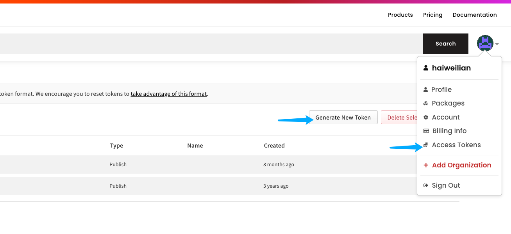

选择 `Automation` 类型，专门用于 `CI/CD` 的跳过 2FA 的验证(保存好只展现一次)。

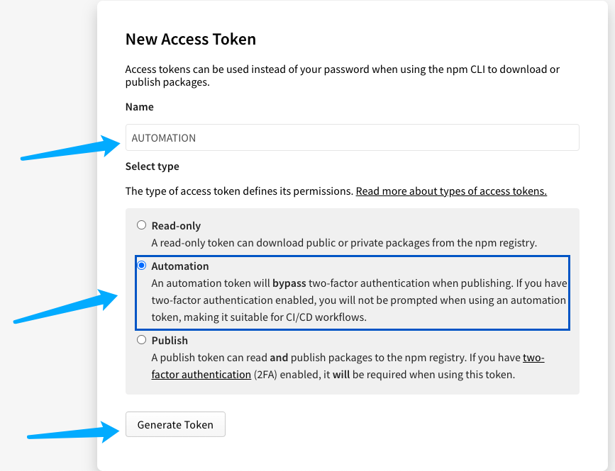

添加到 `GitHub Actions secrets` 中，这里存放一些私密的变量什么的，可以在 Actions 中获取到。

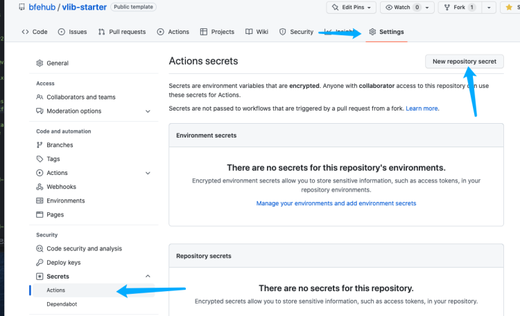

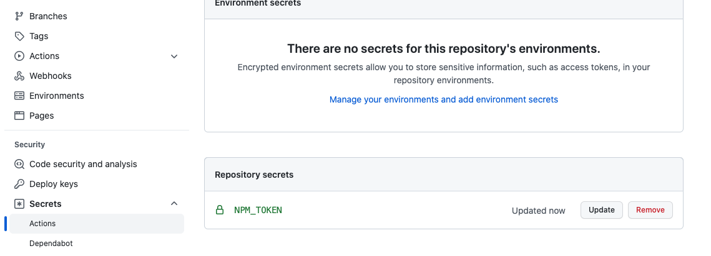

### 触发自动发布

如果现在提交后，会发现不会自动创建 PR，这是因为没有新的 changeset 文件，现在创建一个新的。和之前步骤一样，使用 `pnpm changeset` 创建一个 changeset 文件并提交。

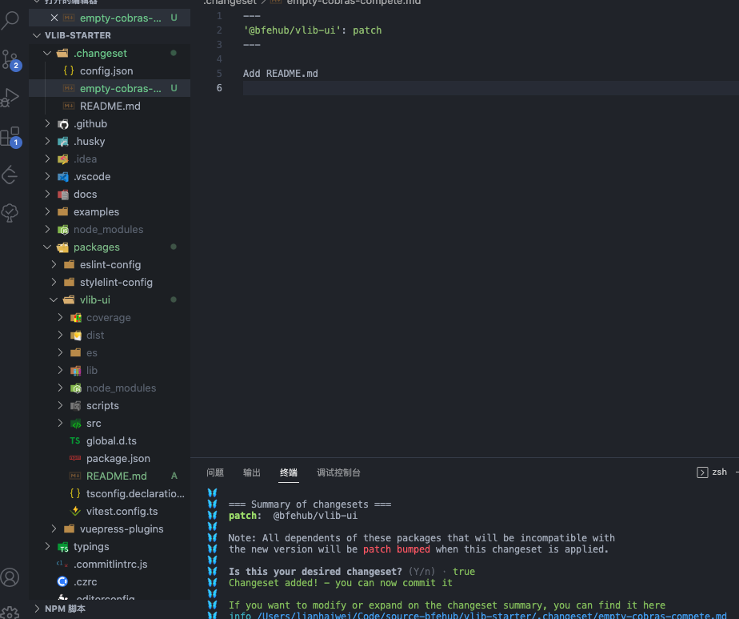

这时再去看 Actions 中构建步骤的日志会触发 PR 请求。

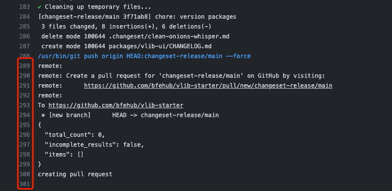

并且在 Pull Requests 中会多一个 PR 请求，并且描述了发布的包版本和变更日志，如果你一直不合并会一直更新。

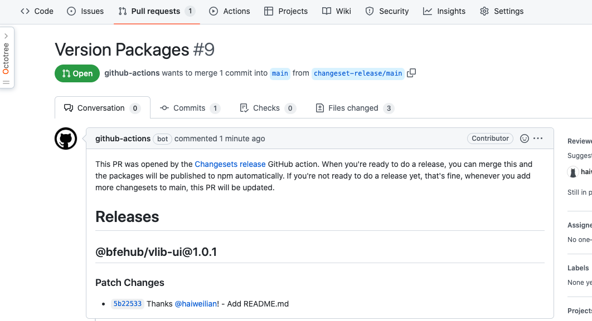

现在去合并这个 PR 到 main 分支。

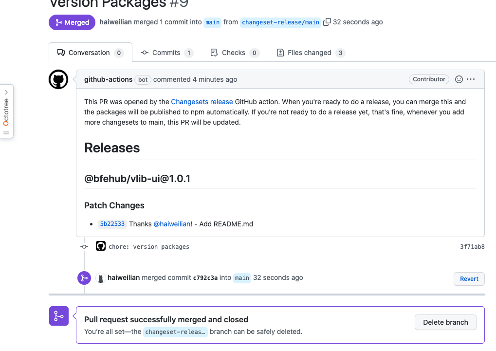

合并完成后在看 Actions 中构建步骤的日志，已经执行了打包和发布。

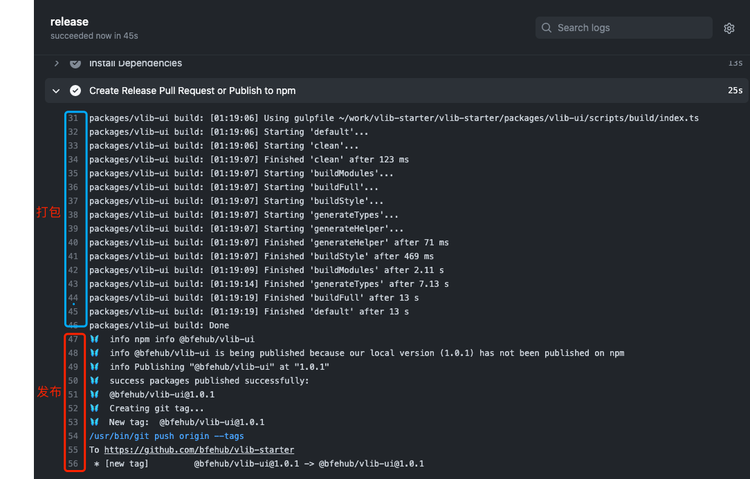

现在已经发布到 Npm 上了。

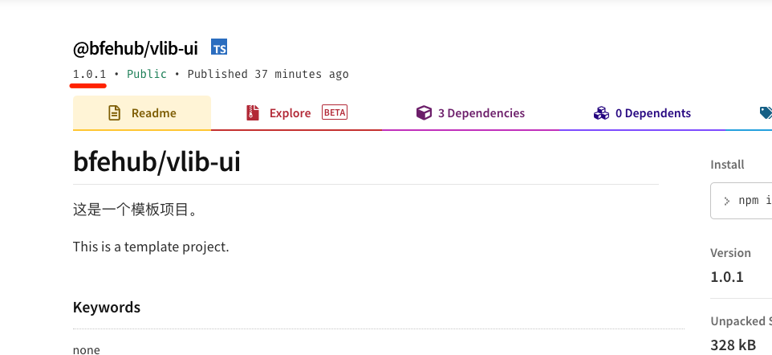

好了，到此就自动化发布完成了。

## 你可以...

- 你可以根据本章内容自己实现一遍完善我们的组件库。

- 如果对你有帮助可以点个 **赞** 和 **关注** 以示鼓励。
