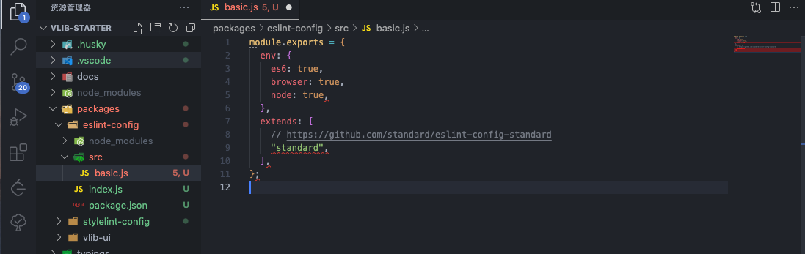
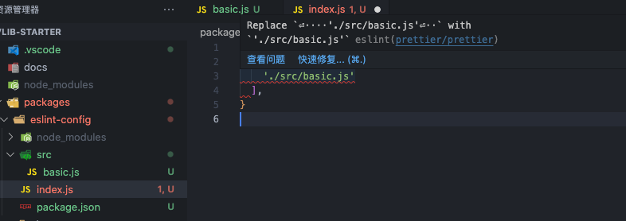
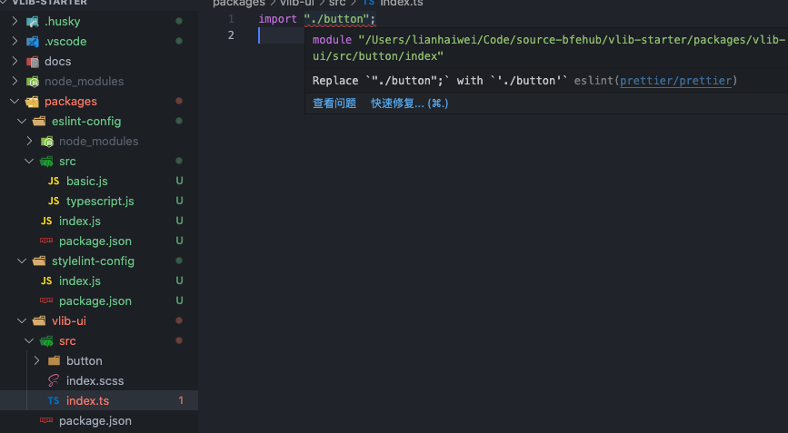
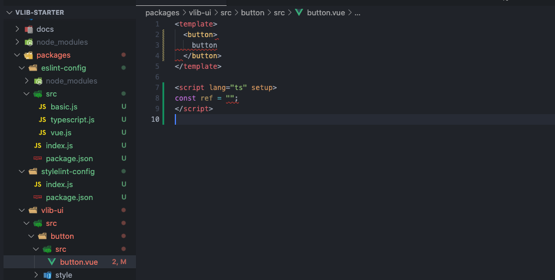
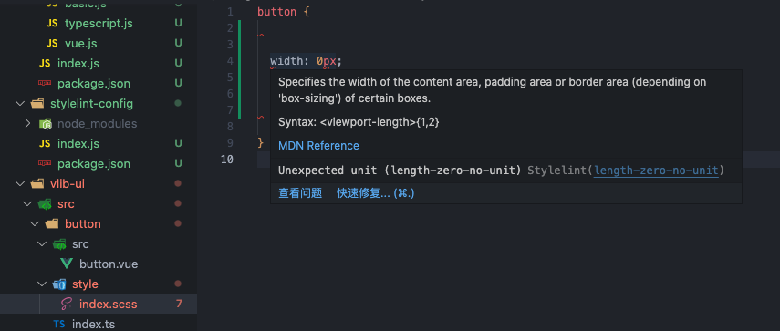
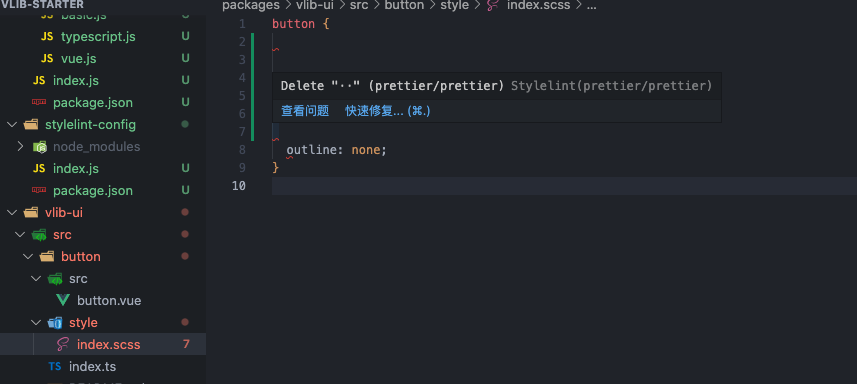
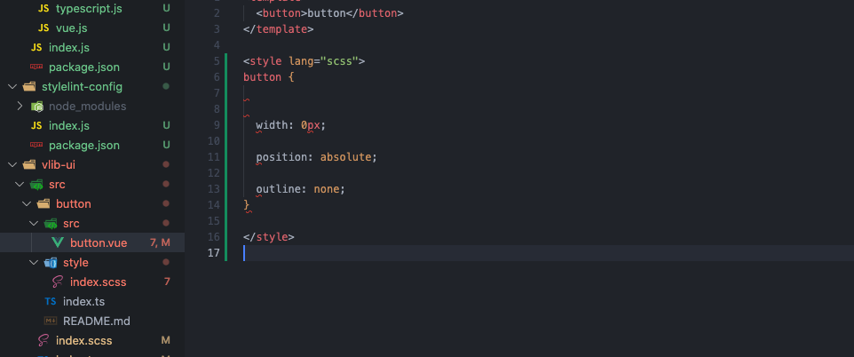

这篇我们搭建一个可共享的规范配置。所谓可共享就是把我们常用的配置提取成一个单独的包利用配置继承的特性可以在不同的项目中使用。就算我们不单独发布包也可以拆分出来，便于管理结构和依赖。

接下来我们就就把社区中常用的规范工具集成到项目中，本篇新增的完整代码可查看单独的分支 [1-lint](https://github.com/bfehub/vlib-starter/tree/1-lint)，你也可以查看 [lint](https://github.com/bfehub/lint) 更完善的规则配置。

> 如果你还不了解这个系列要做什么，那你可以先阅读 [【实践 Vue3 组件库-介绍一下这个系列】](./vlib-starter-1.md) 的介绍，以便你对整个系列有清晰的认识。

## eslint

在开始之前你可以先自行了解 `eslint` 的继承规则和覆盖规则 [configuration-files](https://eslint.org/docs/latest/user-guide/configuring/configuration-files#extending-configuration-files)，我们使用渐进式的模式先支持最基本的 _js_ 文件的校验，继续扩展为支持 _ts_ 文件的校验，继续扩展为支持 _vue_ 文件的校验。

我们先基于我们基础结构在 `packages` 创建一个 `eslint-config` 子文件夹。包名称为 `@bfehub/eslint-config`，并安装相关依赖。

```json
// packages/eslint-config/package.json
{
  "name": "@bfehub/eslint-config",
  "private": true,
  "main": "index.js",
  "version": "1.0.0",
  "description": "Eslint Config.",
  "peerDependencies": {
    "eslint": ">=8.0.0",
    "prettier": ">=2.0.0"
  },
  "dependencies": {},
  "devDependencies": {}
}
```

```bash
pnpm add eslint -D -w
pnpm add eslint -D --filter @bfehub/eslint-config
```

### eslint+js

我们可以在社区中先选择一个基础的规范作为我们基础的依赖，这里选择你平常接触最多的即可，这里拿 [standard](https://github.com/standard/eslint-config-standard) 作为基础规范作为其依赖。

```sh
# 本身的规则集
pnpm add eslint-config-standard --filter @bfehub/eslint-config
# 内部依赖的规则集
pnpm add eslint-plugin-promise eslint-plugin-import eslint-plugin-n --filter @bfehub/eslint-config
```

接着新建一个 `basic.js` 编写基础的配置，以及一个 `index.js` 作为主入口。

```js
// packages/eslint-config/src/basic.js
module.exports = {
  env: {
    es6: true,
    browser: true,
    node: true,
  },
  extends: [
    // https://github.com/standard/eslint-config-standard
    "standard",
  ],
};
```

```js
// packages/eslint-config/index.js
module.exports = {
  extends: ["./src/basic.js"],
};
```

至此我们就单独封装了一个单独规则包，我们在自身项目中使用它。

```sh
pnpm add @bfehub/eslint-config -D -w
```

在根目录下新建 `.eslintrc.js` 文件使用它。

```js
// .eslintrc.js
module.exports = {
  root: true,
  extends: "@bfehub/eslint-config",
};
```

再回到代码中写点不规范的代码就可以校验出来了。



如果需要编辑器提示和自动修复，还需要安装 `vscode-eslint` 插件并添加以下配置。

```json
// .vscode/settings.json
{
  "editor.codeActionsOnSave": {
    "source.fixAll.eslint": true
  }
}
```

### eslint+prettier

只有 `eslint` 的质量校验还不行，我们还要使用 `prettier` 统一我们代码风格。比如写多少必须换行，加不加分号都是属于 `prettier` 风格范畴的。

```sh
pnpm add prettier -D -w
pnpm add prettier -D --filter @bfehub/eslint-config
```

官方有开发一套 `eslint` 和 `prettier` 结合的配置[eslint-plugin-prettier](https://github.com/prettier/eslint-plugin-prettier#recommended-configuration)，它也处理了冲突的规则。

```sh
pnpm add eslint-config-prettier eslint-plugin-prettier --filter @bfehub/eslint-config
```

在 `basic.js` 中加入新的配置。

```js
// packages/eslint-config/src/basic.js
module.exports = {
  // ...
  extends: [
    // ...
    // https://github.com/prettier/eslint-plugin-prettier
    "plugin:prettier/recommended",
  ],
};
```

在根目录下新建 `.prettierrc.js` 文件配置 `prettier` 的规则。

```js
// .prettierrc.js
module.exports = {
  semi: false,
  trailingComma: "es5",
  singleQuote: true,
};
```

在回到代码中比如换行和长度限制之类风格问题就可以检查出来了。



### eslint+ts

校验 ts 有单独的工具 [typescript-eslint](https://typescript-eslint.io/docs/)，它主要的作用就是覆盖了 `eslint` 的默认的解析器以支持 ts 校验。

```sh
# 前置依赖
pnpm add typescript -D -w
pnpm add typescript -D --filter @bfehub/eslint-config
# 解析器和内置规则集
pnpm add @typescript-eslint/parser @typescript-eslint/eslint-plugin --filter @bfehub/eslint-config
```

我们新建一个 `typescript.js` 文件，并且使用 `extends` 配置继承刚写的 `basic.js`。我们也需要关闭一些冲突的规则和一些你想关闭的规则。

```js
// packages/eslint-config/src/typescript.js
module.exports = {
  extends: [
    // https://github.com/typescript-eslint/typescript-eslint/tree/main/packages/eslint-plugin
    "plugin:@typescript-eslint/recommended",
    "./basic",
  ],
  rules: {
    // override rules
    "no-useless-constructor": "off",
    "no-unused-vars": "off",
    "no-redeclare": "off",
    "no-use-before-define": "off",

    // off rules
    "@typescript-eslint/ban-types": "off",
    "@typescript-eslint/no-explicit-any": "off",
    "@typescript-eslint/no-non-null-assertion": "off",
    "@typescript-eslint/explicit-function-return-type": "off",
    "@typescript-eslint/explicit-member-accessibility": "off",
    "@typescript-eslint/explicit-module-boundary-types": "off",
  },
};
```

我们再把主入口 `index.js` 默认导出的配置也改下。

```js
// packages/eslint-config/index.js
module.exports = {
  extends: ["./src/typescript.js"],
};
```

我们在回到代码中测试也可以校验出来了。



### eslint+vue

校验 vue 官方也有相应的工具 [eslint-plugin-vue](https://eslint.vuejs.org/)，和 ts 类似当是 vue 文件的时候使用 vue 的解析器解析。

```sh
pnpm add eslint-plugin-vue --filter @bfehub/eslint-config
```

我们新建一个 `vue.js` 文件，并且使用 `extends` 配置继承刚写的 `typescript.js`。需要注意的是 vue 的解析器我们只限制在 vue 文件类型不能全局覆盖，我们也关闭一些规则兼容 vue 的语法。

```js
// packages/eslint-config/src/vue.js
// https://eslint.vuejs.org/user-guide
module.exports = {
  overrides: [
    {
      files: ["*.vue"],
      parser: "vue-eslint-parser",
      parserOptions: {
        parser: "@typescript-eslint/parser",
      },
      rules: {
        "no-undef": "off",
        "no-unused-vars": "off",
        "@typescript-eslint/no-unused-vars": "off",
      },
    },
  ],
  extends: [
    // https://eslint.vuejs.org/user-guide/#bundle-configurations
    "plugin:vue/vue3-recommended",
    "./typescript",
  ],
  rules: {
    // off rules
    "vue/max-attributes-per-line": "off",
    "vue/no-v-html": "off",
    "vue/require-prop-types": "off",
    "vue/require-default-prop": "off",
    "vue/multi-word-component-names": "off",
  },
};
```

我们再把主入口 `index.js` 默认导出的配置也改下。

```js
// packages/eslint-config/index.js
module.exports = {
  extends: ["./src/vue.js"],
};
```

我们在回到代码中测试也可以校验出来了。



## stylelint

在开始之前你也可以先自行了解 [stylelint](https://stylelint.io/user-guide/get-started/) 的基本使用。我们分为两部分搭建：一部分是 `stylelint` 默认支持的，一部分是 `*.vue` 中的 `css/less/scss` 代码。

我们接着在 `packages` 创建一个 `stylelint-config` 子文件夹。包名称为 `@bfehub/stylelint-config`，并安装相关依赖。

```json
// packages/stylelint-config/package.json
{
  "name": "@bfehub/stylelint-config",
  "private": true,
  "main": "index.js",
  "version": "1.0.0",
  "description": "Stylelint Config.",
  "peerDependencies": {
    "postcss": ">=8.0.0",
    "prettier": ">=2.0.0",
    "stylelint": ">=14.0.0"
  },
  "dependencies": {},
  "devDependencies": {}
}
```

```bash
pnpm add stylelint postcss -D -w
pnpm add stylelint postcss -D --filter @bfehub/stylelint-config
```

### stylelint+css

同样我们先选择一个默认的规则集 [standard](https://github.com/stylelint/stylelint-config-standard)，以及编写属性顺序的规则 [order](https://github.com/hudochenkov/stylelint-order)，我们基于此做规则扩展。

```sh
# 默认规则集
pnpm add stylelint-config-standard --filter @bfehub/stylelint-config
# 属性书写顺序规则集
pnpm add stylelint-order stylelint-config-recess-order --filter @bfehub/stylelint-config
```

接着新建一个 `index.js` 编写预设配置。

```js
// packages/stylelint-config/index.js
// https://stylelint.io/user-guide/get-started
module.exports = {
  extends: [
    // https://github.com/stylelint/stylelint-config-standard
    "stylelint-config-standard",
    // https://github.com/stormwarning/stylelint-config-recess-order
    "stylelint-config-recess-order",
  ],
  plugins: [
    // https://github.com/hudochenkov/stylelint-order
    "stylelint-order",
  ],
  rules: {
    "no-empty-source": null,
    "unit-no-unknown": null,
    "at-rule-no-unknown": null,
    "value-no-vendor-prefix": null,
    "selector-class-pattern": null,
  },
};
```

至此我们就单独封装了一个单独规则包，我们在自身项目中使用它。

```sh
pnpm add @bfehub/stylelint-config -D -w
```

在根目录下新建 `.stylelintrc.js` 文件使用它。

```js
// .stylelintrc.js
module.exports = {
  root: true,
  extends: "@bfehub/stylelint-config",
};
```

再回到代码中写点不规范的代码就可以校验出来了。



如果需要编辑器提示和自动修复，还需要安装 `vscode-stylelint` 插件并添加以下配置。

```json
// .vscode/settings.json
{
  "editor.codeActionsOnSave": {
    "source.fixAll.stylelint": true
  }
}
```

### stylelint+prettier

同样我们也可以结合 `prettier` 做代码风格规范。

```sh
pnpm add prettier -D -w
pnpm add prettier -D --filter @bfehub/stylelint-config
```

官方有开发一套 `stylelint` 和 `prettier` 结合的配置[stylelint-prettier](https://github.com/prettier/stylelint-prettier#recommended-configuration)，它也处理了冲突的规则。

```sh
pnpm add stylelint-prettier stylelint-config-prettier --filter @bfehub/stylelint-config
```

在 `index.js` 中加入新的配置。

```js
// packages/stylelint-config/index.js
module.exports = {
  extends: [
    // ...
    // https://github.com/prettier/stylelint-prettier
    "stylelint-prettier/recommended",
  ],
};
```



### stylelint+vue

主要使用 [stylelint-config-html](https://github.com/ota-meshi/stylelint-config-html) 预设插件，它提供 `.vue/.html/.svelte` 等文件解析。

```sh
# .vue/.html 类型支持
pnpm add postcss-html stylelint-config-html --filter @bfehub/stylelint-config

# .vue/.html 中的 less/scss 语法支持
pnpm add postcss-less postcss-scss --filter @bfehub/stylelint-config
```

在 `index.js` 中加入我们的规则。

```js
// packages/stylelint-config/index.js
module.exports = {
  extends: [
    // https://github.com/ota-meshi/stylelint-config-html
    "stylelint-config-html",
    // ...
  ],
};
```

我们还需要指定执行校验的文件类型。

```json
// .vscode/settings.json
{
  "stylelint.validate": ["css", "less", "scss", "html", "vue"]
}
```



## 提交规范

再说说提交规范部分，这部分会简单的介绍和给出基础的配置。如果不做深度的定制也没什么难度，具体的你可查看对应的官方文档学习更多配置。

### lint-staged

[lint-staged](https://github.com/okonet/lint-staged)是一个只对 `git` 暂存区的文件执行检测的工具，可以节省我们执行 `eslint` 和 `stylelint` 校验的时间。

```sh
pnpm add lint-staged -D -w
```

在项目根目录添加 `.lintstagedrc.js` 配置文件。

```js
// .lintstagedrc.js
module.exports = {
  "*.{js,jsx,ts,tsx}": ["eslint --fix", "prettier --write"],
  "*.{css,scss,less,styl}": ["stylelint --fix", "prettier --write"],
  "*.vue": ["eslint --fix", "stylelint --fix", "prettier --write"],
  "package.json": ["prettier --write"],
};
```

### commitlint

[commitlint](https://github.com/conventional-changelog/commitlint)是一个校验 `git` 的提交信息规范的工具，强制要求你按照一定的格式提交。

```sh
pnpm add @commitlint/cli @commitlint/config-conventional -D -w
```

在项目根目录添加 `.commitlintrc.js` 配置文件。

```js
// .commitlintrc.js
module.exports = {
  extends: ["@commitlint/config-conventional"],
};
```

### commitizen

[commitizen](https://github.com/commitizen/cz-cli)是一个总端交互式 `git` 提交规范工具，可以生成与 [commitlint](#commitlint) 相对应的提交格式。

```
pnpm add commitizen cz-conventional-changelog -D -w
```

在项目根目录添加 `.czrc` 配置文件。

```json
// .czrc
{
  "path": "cz-conventional-changelog"
}
```

在 `package.json` 的 `scripts` 字段添加 `commit` 命令，每次使用 `npm run commit` 提交。

```json
{
  "scripts": {
    "commit": "npx git-cz"
  }
}
```

### husky

[husky](https://github.com/typicode/husky) 是便于我们使用 `git` 钩子的工具。比如我们在提交之前自动执行 [lint-staged](#lint-staged) 校验代码，在提交的时候自动执行 [commitlint](#commitlint) 校验我们的提交信息。

```sh
pnpm add husky -D -w
```

初始的时候需要手动启用，如果没有自动生成 `.husky` 文件夹。

```sh
npx husky install
```

如果想安装包后自动启用，变价 `package.json` 添加以下内容。

```sh
{
  "scripts": {
    "prepare": "husky install"
  }
}
```

如果想当 `pre-commit` 时执行 `lint-staged` 校验，创建 `.husky/pre-commit` 添加以下内容。

```sh
#!/bin/sh
. "$(dirname "$0")/_/husky.sh"
npx lint-staged
```

如果想当 `commit-msg` 时执行 `commitlint` 校验，创建 `.husky/commit-msg` 添加以下内容。

```sh
#!/bin/sh
. "$(dirname "$0")/_/husky.sh"
npx --no-install commitlint --edit $1
```

## 你可以...

- 你可以根据本章内容自己实现一遍完善我们的组件库。

- 你可以根据本章内容搭建自己内部的规范预设工具。

- 如果对你有帮助可以点个 **赞** 和 **关注** 以示鼓励。
