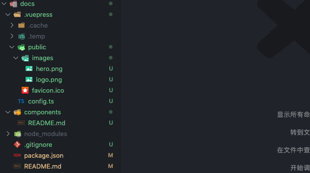
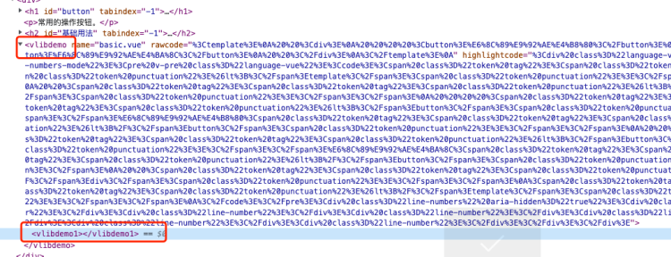
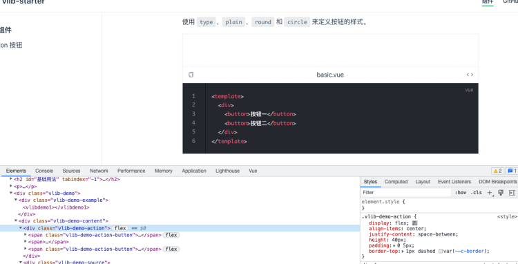
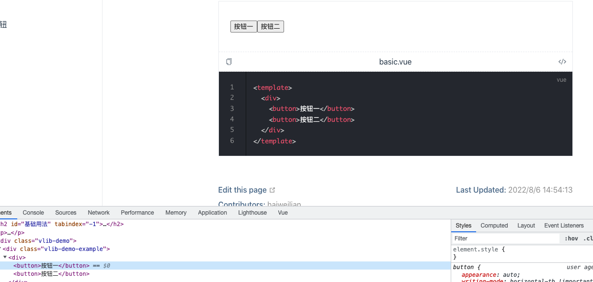
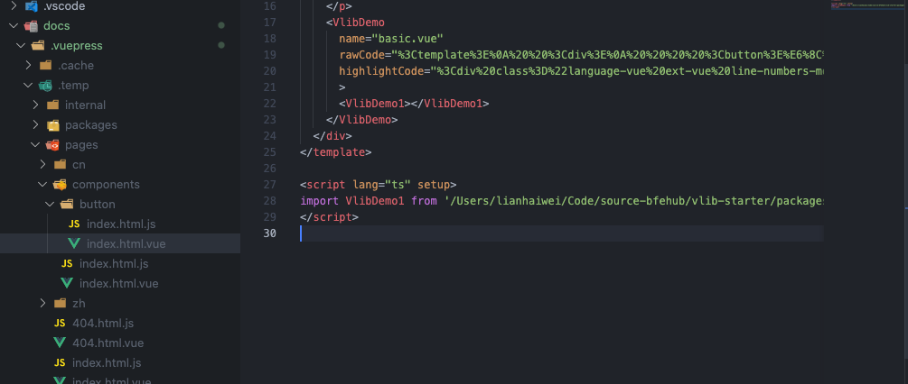

这篇我们来搭建一个文档系统，文档系统有很多选择比如 storybook、vuepress、vitepress 或者自建文档。这里选择基于 vuepress 搭建，因为 vuepress 功能完善也容易扩展。后续也会有单独基于 vitepress 的文档系统。

接下来我们就基于 vuepress 搭建文件，并自己实现一个组件演示的插件。本篇新增的完整代码可查看单独的分支 [2-docs](https://github.com/bfehub/vlib-starter/tree/2-docs)。也顺便推荐我提取出来的用于组件开发场景的 VuePress 的插件 [vmi](https://github.com/bfehub/vmi)，实现了接近于 dumi 的体验和功能。

> 如果你还不了解这个系列要做什么，那你可以先阅读 [【实践 Vue3 组件库-介绍一下这个系列】](./vlib-starter-1.md) 的介绍，以便你对整个系列有清晰的认识。

## 版本问题

无论是 vuepress 还是 vitepress 都没有发布正式版本，它们在每个版本里都会有些破坏性更新。而 vuepress 最近也是将要全部迁移到了 `Pure ESM` 现在还不稳定。所以本篇文章全部基于 `2.0.0-beta.49` 版本，如果你需要更新可以查看 [CHANGELOG](https://github.com/vuepress/vuepress-next/blob/main/CHANGELOG.md) 的变更记录。

## 文档结构

先根据 [VuePress](https://v2.vuepress.vuejs.org/zh/) 的文档在根目录下新建 `docs` 目录把基础的结构搭建完成。

```sh
# 工具包
pnpm add vue rimraf anywhere -D --filter @bfehub/docs
# VuePress 依赖
pnpm add vuepress@2.0.0-beta.49 @vuepress/client@2.0.0-beta.49  -D --filter @bfehub/docs
```

新建一个 `config.ts` 添加一些默认的配置。

```ts
// docs/.vuepress/config.ts
import { defineUserConfig, defaultTheme } from "vuepress";
import { viteBundler } from "@vuepress/bundler-vite";

export default defineUserConfig({
  base: "/vlib-starter/",

  locales: {
    "/": {
      lang: "zh-CN",
      title: "vlib-starter",
      description: "Vue3 组件库开发模板 & Vue3 组件库实践指南",
    },
  },

  bundler: viteBundler({
    viteOptions: {},
    vuePluginOptions: {},
  }),

  theme: defaultTheme({
    locales: {
      "/": {
        navbar: [],
        sidebar: {},
        selectLanguageName: "简体中文",
        selectLanguageText: "选择语言",
        selectLanguageAriaLabel: "选择语言",
      },
    },
  }),
});
```

再补充完善一些其他的配置，得到一个如下的结构。



### 扩展页面

默认情况下 `VuePress` 只抓取源目录的文件(`docs`)，但是我们设计的文档和组件是放在一起的在 `packages/vlib-ui/src` 下各个组件内，这时我们改怎么处理？

首先更改 [pagePatterns](https://v2.vuepress.vuejs.org/zh/reference/config.html#pagepatterns) 配置，把组件的文档包含在内。

```ts
// docs/.vuepress/config.ts
export default defineUserConfig({
  pagePatterns: [
    "**/*.md",
    "!.vuepress",
    "!node_modules",
    // 查找组件的文件
    "../packages/vlib-ui/**/*.md",
    "!../packages/**/node_modules",
  ],
});
```

那我们在配置侧边栏的时候就要这样去写。

```ts
import type { SidebarConfig } from "vuepress";

export const zh: SidebarConfig = {
  "/components": [
    {
      text: "基础组件",
      children: [
        {
          text: "Button 按钮",
          link: "/components/button/",
        },
      ],
    },
  ],
};
```

为了使页面路由访问正常，还需要利用 [permalink](https://v2.vuepress.vuejs.org/zh/reference/frontmatter.html#permalink) 的特性，在文档页面手动自定页面访问路径。

```md
---
permalink: /components/button
---

<!-- packages/vlib-ui/src/button/README.md -->

# button
```

这里我们启动文档服务即可访问到我们在 `packages/vlib-ui/src/button/README.md` 中写的文档。

## 组件演示

我们需要给文档添加组件演示的功能，你也可以使用社区现有的插件如之前提到的 [vmi](https://github.com/bfehub/vmi)。如果为了便于扩展也可以自己开发。接下来我们就开发一个这样的插件，先定义期望的用法和语法。

所有的组件 demo 都放在 `__demos__` 目录下，使用单文件的方式编写可以有更好的代码规范。

```html
<!-- packages/vlib-ui/src/button/__demos__/basic.vue -->
<template>
  <div>
    <button>按钮一</button>
    <button>按钮二</button>
  </div>
</template>
```

在文档中自定义一个标签引入。

```md
<!-- packages/vlib-ui/src/button/README.md -->

<demo src="./__demos__/basic.vue"></demo>
```

我们继续在 `packages` 创建一个 `vuepress-plugins` 子文件夹。包名称为 `@bfehub/vuepress-plugins`，并安装相关依赖。

```json
// packages/vuepress-plugins/package.json
{
  "name": "@bfehub/vuepress-plugins",
  "private": true,
  "main": "index.ts",
  "version": "1.0.0",
  "description": "Vuepress Plugins."
}
```

```sh
# 前置依赖
pnpm add vue vite -D --filter @bfehub/vuepress-plugins

# 核心开发工具包
pnpm add @vuepress/core@2.0.0-beta.49 @vuepress/client@2.0.0-beta.49 @vuepress/utils@2.0.0-beta.49 --filter @bfehub/vuepress-plugins

# 解析 markdown 语法工具包
pnpm add @vuepress/markdown@2.0.0-beta.49 @vuepress/plugin-prismjs@2.0.0-beta.49 --filter @bfehub/vuepress-plugins

# 解析标签(<demo></demo>)语法工具包
pnpm add posthtml-parser posthtml-render --filter @bfehub/vuepress-plugins

# 客户端开发工具包
pnpm add @vueuse/core --filter @bfehub/vuepress-plugins
```

### 开发插件

一个 `VuePress` 插件一般为分两部分：一部分是 `node` 端用来解析 markdown 语法、读取文件控制最终生成的文件内容。一部分是 `client` 端用来处理组件最终展示的效果。可以访问 [架构](https://v2.vuepress.vuejs.org/zh/advanced/architecture.html) 部分的文档了解更多。

现在在 `vuepress-plugins` 下创建如下的结构，文件的内容分别如下。

```sh
├── code-block
│   ├── client
│   │   └── clientConfig.ts
│   ├── node
│   │ └── index.ts
│   ├── index.ts
└── index.ts
```

```ts
// packages/vuepress-plugins/code-block/client/clientConfig.ts
import { defineClientConfig } from "@vuepress/client";

export default defineClientConfig({
  enhance(app) {
    console.log("clientConfig", app);
  },
});
```

```ts
// packages/vuepress-plugins/code-block/index.ts
import { path } from "@vuepress/utils";

export const codeBlockPlugin = () => {
  return {
    name: "@bfehub/vuepress-plugin-code-block",

    clientConfigFile: path.resolve(__dirname, "./client/clientConfig.ts"),
  };
};
```

```ts
// packages/vuepress-plugins/index.ts
export * from "./code-block";
```

这样就开发一个一个基础的插件虽然没功能，在自身项目中使用它。

```sh
pnpm add @bfehub/vuepress-plugins -D --filter @bfehub/docs
```

```ts
// docs/.vuepress/config.ts
import { defineUserConfig } from "vuepress";
import { codeBlockPlugin } from "@bfehub/vuepress-plugins";

export default defineUserConfig({
  // ...
  plugins: [
    // @bfehub/vuepress-plugins
    codeBlockPlugin(),
  ],
});
```

这时再访问文档服务查看页面控制台会打印出 `clientConfig` 证明插件就生效了。

### 服务端开发

VuePress 使用 [markdown-it](https://github.com/markdown-it/markdown-it) 来解析 Markdown 内容，因此可以借助于 markdown-it 插件来实现语法扩展。如果你不熟悉 markdown-it 的解析语法你可以阅读 [冴羽大佬的系列文章](https://github.com/mqyqingfeng/Blog/issues?q=markdown-it%E6%8F%92%E4%BB%B6%E5%A6%82%E4%BD%95%E5%86%99)

VuePress 暴露了 [extendsMarkdown](https://v2.vuepress.vuejs.org/zh/reference/plugin-api.html#extendsmarkdown) 用于我们扩展 Markdown 语法。

先整理以下开发思路：

1. 使用 markdown-it 插件解析新增的 markdown 语法，查找到 `demo` 标签。

2. 使用 posthtml-parser 解析 `demo` 的标签 `src` 属性(使用这个包是为了方便扩展解析)。

3. 根据 `src` 属性读取到 `demo` 的 _文件路径_ 用于当前文档页面需要加载的组件，_文件内容_ 用于我们的高亮代码和原始代码。

4. 把当前文档中解析到 `demo` 信息以文档路径存储起来，在最终文件生成的时候添加进去。

先使用插件的 `extendsMarkdown` 扩展来开发一个 `resolveHtmlBlock` 的语法解析插件。

```ts
// packages/vuepress-plugins/code-block/index.ts
import { path } from "@vuepress/utils";
import { resolveHtmlBlock } from "./node";

export const codeBlockPlugin = () => {
  // 存储当前的文档页面引入了哪些 demo 组件
  const store = new Map<string, Set<string>>();

  return {
    name: "@bfehub/vuepress-plugin-code-block",

    clientConfigFile: path.resolve(__dirname, "./client/clientConfig.ts"),

    // 扩展 markdown
    extendsMarkdown(md) {
      resolveHtmlBlock(md, store);
    },
  };
};
```

在 `resolveHtmlBlock` 方法中扩展 `markdown-it` 的 `html_block` 的渲染规则，判断当前的 `token` 是不是我们定义的 `demo` 标签，如果是解析并覆盖当前的 `token` 内容。

```ts
// packages/vuepress-plugins/code-block/node/resolveHtmlBlock.ts
import type { Markdown, MarkdownEnv } from "@vuepress/markdown";
import { parseCodeBlock } from ".";

export function resolveHtmlBlock(md: Markdown, store: Map<string, Set<string>>) {
  const rawRule = md.renderer.rules.html_block!;

  // 扩展 html_block 渲染规则，保存原始的渲染规则处理完后再调用原始的渲染规则。
  md.renderer.rules.html_block = function (tokens, idx, opts, env: MarkdownEnv, self) {
    const content = tokens[idx].content;

    // 判断当前 token 是否是我们需要的
    if (content.startsWith(`<demo`)) {
      tokens[idx].content = parseCodeBlock(store, content, env.filePath!);
    }

    return rawRule(tokens, idx, opts, env, self);
  };
}
```

在 `parseCodeBlock` 中解析标签的属性、存储到缓存、读取文件内容等一系列操作后，返回最终的 html 片段就是我们需要需要渲染的。

```ts
// packages/vuepress-plugins/code-block/node/parseCodeBlock.ts
import { path } from "@vuepress/utils";
import { type Node, parser } from "posthtml-parser";
import { render } from "posthtml-render";
import { readSource } from ".";

export function parseCodeBlock(
  store: Map<string, Set<string>>,
  content: string,
  pagePath: string
): string {
  const html: Node[] = parser(content);

  let i = -1;
  for (const node of html) {
    i++;

    if (typeof node !== "object") {
      continue;
    }

    if (node.tag !== "demo") {
      continue;
    }

    if (typeof node.attrs?.src !== "string") {
      continue;
    }

    // 当前页面引用的外部添加进缓存，页面扩展时使用
    const dirPath = path.dirname(pagePath);
    const compPath = path.resolve(dirPath, node.attrs?.src);
    if (!store.has(pagePath)) store.set(pagePath, new Set());
    store.get(pagePath)?.add(compPath);

    // 读取文件，生成新的标签结构。
    // tag: 节点的名称，在 vue 文件中是组件名。
    // attrs: 节点的属性，在 vue 文件中是 props 属性。
    // content: 子节点，在 vue 文件中用 slot 渲染。
    const source = readSource(compPath);
    html[i] = {
      tag: "VlibDemo",
      attrs: {
        name: source.name,
        rawCode: encodeURIComponent(source.rawCode),
        highlightCode: encodeURIComponent(source.highlightCode),
      },
      content: [
        {
          tag: `VlibDemo${store.get(pagePath)?.size}`,
        },
      ],
    };
  }

  return render(html);
}
```

读取文件单独提取出了 `readSource` 文件，在这个函数我们实现读取文件内容和高亮文件内容。

````ts
import { fs, path, warn } from "@vuepress/utils";
import { createMarkdown } from "@vuepress/markdown";
import { resolveHighlighter } from "@vuepress/plugin-prismjs";

export function readSource(filePath: string) {
  let code = "";
  const name = path.basename(filePath);
  const lang = path.extname(name).slice(1);

  if (fs.existsSync(filePath)) {
    code = fs.readFileSync(filePath, "utf-8");
  } else {
    warn("找不到文件:" + path);
  }

  return {
    name,
    rawCode: code,
    highlightCode: createMarkdown({
      highlight: resolveHighlighter(lang),
    }).render("```" + lang + "\n" + code + "```"),
  };
}
````

这时服务端部分就开发完毕。我们回到页面上看到已经渲染出来了，因为 `VlibDemo` 和 `VlibDemo1` 还不是 `Vue` 组件所以无法渲染。



### 客户端开发

客户端部分我们需要开发一个全局的 `VlibDemo` 组件。有两个主要的点：一个是 `slot` 对应 `content` 的内容；一个是 `props` 对应 `attrs` 的属性。这两部分放在那和怎么使用都可以自由发挥了。

下面部分是简单的写的，涉及到的样式和图标就不单独放出来了可以去源码中复制。

```html
<!-- packages/vuepress-plugins/code-block/client/components/demo.vue -->
<template>
  <div class="vlib-demo">
    <div class="vlib-demo-example">
      <ClientOnly>
        <slot>渲染 content 内容</slot>
      </ClientOnly>
    </div>
    <div class="vlib-demo-content">
      <div class="vlib-demo-action">
        <span class="vlib-demo-action-button" @click="handleCopy">
          <Copy v-show="!state.isCopy" />
          <CopySuccess v-show="state.isCopy" />
        </span>
        <span>{{ props.name }}</span>
        <span class="vlib-demo-action-button" @click="handleExpand">
          <Expand v-show="!state.isExpand" />
          <UnExpand v-show="state.isExpand" />
        </span>
      </div>
      <div
        v-show="state.isExpand"
        class="vlib-demo-source"
        v-html="decodeURIComponent(props.highlightCode)"
      ></div>
    </div>
  </div>
</template>

<script lang="ts" setup>
  import { ref, reactive } from "vue";
  import { useClipboard } from "@vueuse/core";
  import Expand from "../icons/Expand.vue";
  import UnExpand from "../icons/UnExpand.vue";
  import Copy from "../icons/Copy.vue";
  import CopySuccess from "../icons/CopySuccess.vue";

  const props = defineProps<{
    name: string;
    rawCode: string;
    highlightCode: string;
  }>();

  /**
   * Code status
   */
  const state = reactive({
    active: 0,
    isCopy: false,
    isExpand: false,
  });

  const handleExpand = () => {
    state.isExpand = !state.isExpand;
  };

  /**
   * Copy raw code
   */
  const rawCode = ref("");
  const { copy } = useClipboard({ source: rawCode });
  const handleCopy = async () => {
    rawCode.value = decodeURIComponent(props.rawCode);

    await copy();

    state.isCopy = true;

    setTimeout(() => {
      state.isCopy = false;
    }, 1000);
  };
</script>
```

之后把 `VlibDemo` 注册到全局组件中。

```ts
// packages/vuepress-plugins/code-block/client/clientConfig.ts
import { defineClientConfig } from "@vuepress/client";
import Demo from "./components/demo.vue";
import "./styles/index.scss";

export default defineClientConfig({
  enhance({ app }) {
    app.component("VlibDemo", Demo);
  },
});
```

这是我们再看文档已经展示基本的效果了。



但是 `VlibDemo1` 这个组件没有解析处理。这就要使用 [extendsPage](https://v2.vuepress.vuejs.org/zh/reference/plugin-api.html#extendspage) 和 [sfcBlocks](https://v2.vuepress.vuejs.org/zh/reference/node-api.html#sfcblocks) 在文档页面引入所需要 demo 组件。

由于在服务端的时候我们存储过缓存了，所以可以直接读取到。

```ts
// packages/vuepress-plugins/code-block/index.ts
import { resolveHtmlBlock, resolveScriptSetup } from "./node";

export const codeBlockPlugin = (): Plugin => {
  const store = new Map<string, Set<string>>();

  return {
    //...
    extendsPage(page) {
      resolveScriptSetup(page, store);
    },
  };
};
```

```ts
// packages/vuepress-plugins/code-block/node/resolveScriptSetup.ts
import type { Page } from "@vuepress/core";

const scriptRegExp = /<script\s(.*\s)?setup(\s.*)?>([\s\S]*)<\/script>/;

export const resolveScriptSetup = (page: Page, store: Map<string, Set<string>>) => {
  const deps = store.get(page.filePath!);
  if (!deps) return;

  let i = 0;
  let original = "";
  // 如果在页面中写了 `script setup` 提取内容，往里追加组件导入的代码，在重写回去。
  for (const tag of page.sfcBlocks) {
    if (tag.trim().startsWith("<script")) {
      original = tag.match(scriptRegExp)?.[3] ?? "";
      break;
    }

    i++;
  }

  // 根据缓存中存储的组件路径导入组件，组件名称和生成节点时的规则一致。
  page.sfcBlocks[i] = combineScriptSetup([...deps], original);
};

export const combineScriptSetup = (deps: string[], original: string) => {
  return `\n
<script lang="ts" setup>
  ${deps.map((path, index) => `import VlibDemo${index + 1} from '${path}'`).join("\n")}

  ${original}\n
</script>\n`;
};
```

现在基本上完善了所有的功能了。



而最终生成的临时文件内容如下。



## 你可以...

- 你可以根据本章内容自己实现一遍完善我们的组件库。

- 你可以尝试把手写的永久链接开发一个插件自动生成。

- 你可以尝试开始说过的其他文档工具选择合适的。

- 如果对你有帮助可以点个 **赞** 和 **关注** 以示鼓励。
