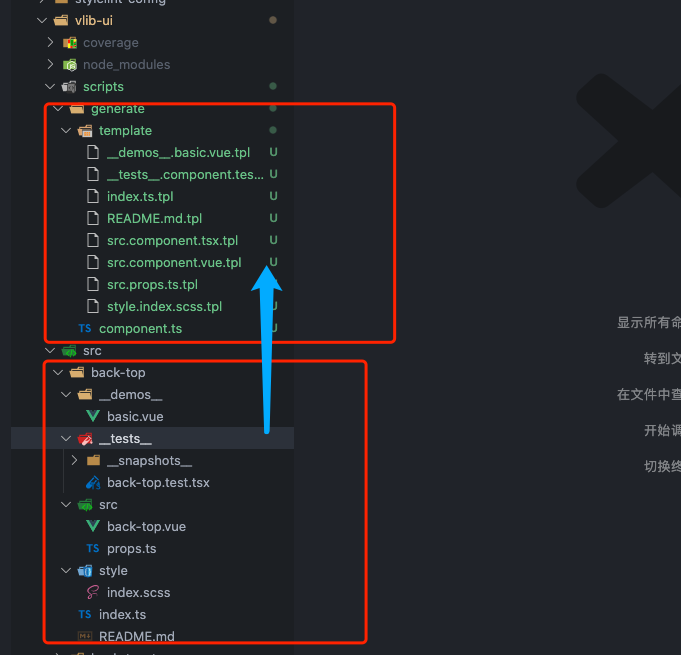
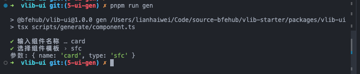
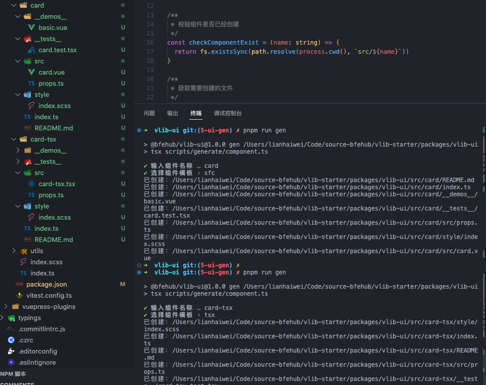
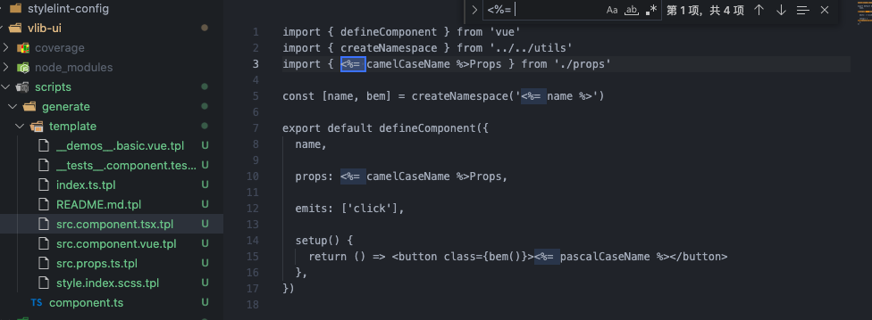
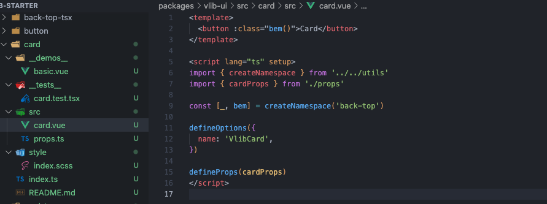

现在我们已经完整的开发一个组件了，如果我们再开发一个组件还要从头一个个的创建文件，那么有没有简便的方案呢？当然有我们开发一个生成脚本，一行命令创建一个组件。

本篇新增的完整代码可查看单独的分支 [ui-gen](https://github.com/bfehub/vlib-starter/tree/5-ui-gen)。

> 如果你还不了解这个系列要做什么，那你可以先阅读 [【实践 Vue3 组件库-介绍一下这个系列】](./vlib-starter-1.md) 的介绍，以便你对整个系列有清晰的认识。

## 前置文章

你需要先阅读以下文章。

- [实践 Vue3 组件库-基于开源组件库扩展业务组件(组件篇一)](./vlib-starter-4.md)

- [实践 Vue3 组件库-基于 Vitest/VTU 的组件单元测试(组件篇二)](./vlib-starter-5.md)

## 创建文件

首先我们要有模板，之前我们重头写过一个 `back-top` 组件，所有我们吧 `back-top` 当成一个基础的版本，创建与组件相同的模板文件，现在我们有以下结构。



## 总端交互

创建的时候我们可以采用交互的方法输入组件名称和选择模板。我们需要用到 [tsx](https://github.com/esbuild-kit/tsx) 是一个执行 ts 文件的工具；[prompts](https://github.com/terkelg/prompts) 帮助我们创建总端交互的窗口操作。

```sh
# 工具包
pnpm add tsx prompts fs-extra -D --filter @bfehub/vlib-ui
# 类型包
pnpm add @types/prompts @types/fs-extra -D --filter @bfehub/vlib-ui
```

添加脚本，使用 `tsx` 执行文件。

```json
// packages/vlib-ui/package.json
{
  "scripts": {
    "gen": "tsx scripts/generate/component.ts"
  }
}
```

编写初始化函数，我们使用 `prompts` 交互获取要创建的组件名称和创建的类型。并验证组件名称是否符合规范和是否存在。

```ts
// packages/vlib-ui/scripts/generate/component.ts
import path from "path";
import prompts from "prompts";
import fs from "fs-extra";

function checkComponentName(name: string) {
  return !/^[a-z][a-z|-]*[a-z]$/.test(name);
}

function checkComponentExist(name: string) {
  return fs.existsSync(path.resolve(process.cwd(), `src/${name}`));
}

async function init() {
  const result = await prompts([
    {
      type: "text",
      name: "name",
      message: "输入组件名称",
      validate: (name) => {
        if (checkComponentName(name)) {
          return "组件名称请使用(kebab-case)方式命名！";
        }
        if (checkComponentExist(name)) {
          return `组件库中已经存在名为${name}的组件！`;
        }
        return true;
      },
    },
    {
      type: "select",
      name: "type",
      message: "选择组件模板",
      choices: [
        { title: "sfc", value: "sfc" },
        { title: "tsx", value: "tsx" },
      ],
    },
  ]);
  console.log("参数:", result);
}
init();
```



## 生成文件

首先我们编写一个静态的配置，代表根据哪个模板生成到哪个文件。

```ts
/**
 * 获取需要创建的文件
 */
const getCreatedFiles = (name: string, type?: string) => {
  return [
    {
      file: "index.ts",
      template: "index.ts.tpl",
    },
    {
      file: "README.md",
      template: "README.md.tpl",
    },

    {
      file: "src/props.ts",
      template: "src.props.ts.tpl",
    },
    type === "tsx"
      ? {
          file: `src/${name}.tsx`,
          template: "src.component.tsx.tpl",
        }
      : {
          file: `src/${name}.vue`,
          template: "src.component.vue.tpl",
        },
    {
      file: "style/index.scss",
      template: "style.index.scss.tpl",
    },
    {
      file: "__demos__/basic.vue",
      template: "__demos__.basic.vue.tpl",
    },
    {
      file: `__tests__/${name}.test.tsx`,
      template: "__tests__.component.test.tsx.tpl",
    },
  ];
};
```

先梳理下我们的创建的流程：先读取到模板 -> 获取到输入的数据 -> 模板和数据加载一起渲染 -> 输出文件。渲染可以是任何的模板引擎，因为我们的依赖包里已经有 `loadsh` 了，所以就直接用 `loadsh.template` 渲染。

```ts
/**
 * 添加一个组件
 */
const addComponent = async (name: string, type?: string) => {
  getCreatedFiles(name, type).forEach(async (item) => {
    // 读取模板
    const tplPath = path.resolve(__dirname, `./template/${item.template}`);
    let data = await fs.readFile(tplPath, "utf-8");

    // 编译模板
    const compiled = _.template(data);
    data = compiled({
      name,
      type,
      camelCaseName: _.camelCase(name),
      pascalCaseName: _.upperFirst(_.camelCase(name)),
    });

    // 输入模板
    const outputPath = path.resolve(process.cwd(), `src/${name}/${item.file}`);
    await fs.outputFile(outputPath, data);
    console.log(`已创建：${outputPath}`);
  });
};
```

在交互完获取到名称和类型后调用生成。

```ts
async function init() {
  //...
  if (!result.name) return;
  await addComponent(result.name, result.type);
}

init();
```

执行 `pnpm run gen` 文件就会生成。



## 编写模板插值

现在我们生成的内容是空的，我们可以复制 `back-top` 的内容去除具体的实现只保留结构部分并用变量替换名称。

- 找到 `back-top` 用 `<%= name %>` 替换。

- 找到 `backTop` 用 `<%= camelCaseName %>` 替换。

- 找到 `BackTop` 用 `<%= pascalCaseName %>` 替换。



模板修改完成后重新生成输出结果。



## 你可以...

- 你可以根据本章内容自己实现一遍完善我们的组件库。

- 如果对你有帮助可以点个 **赞** 和 **关注** 以示鼓励。
