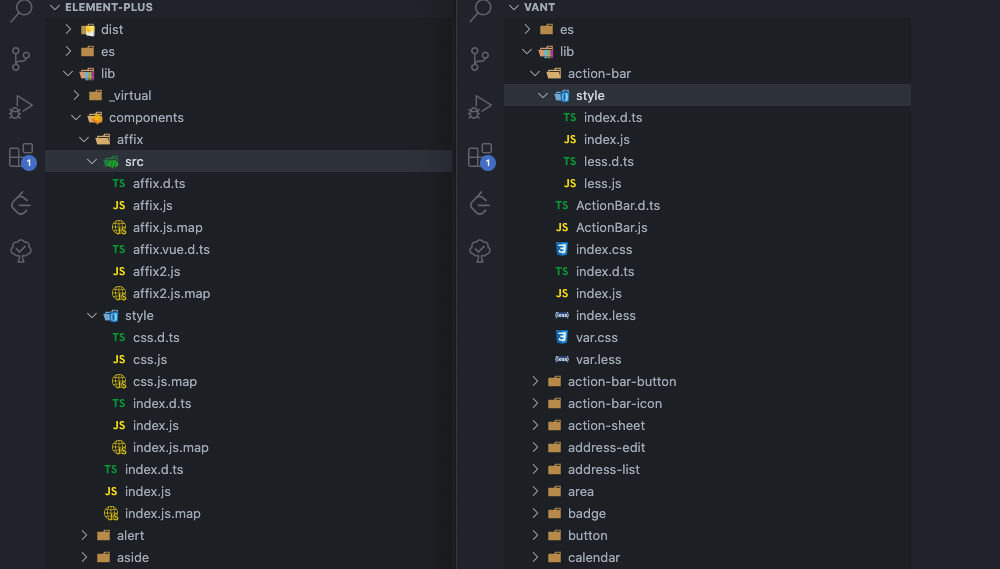
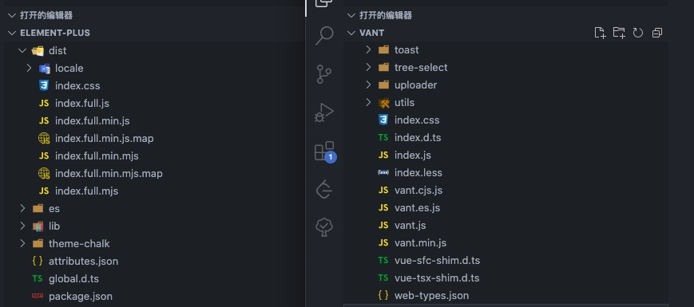
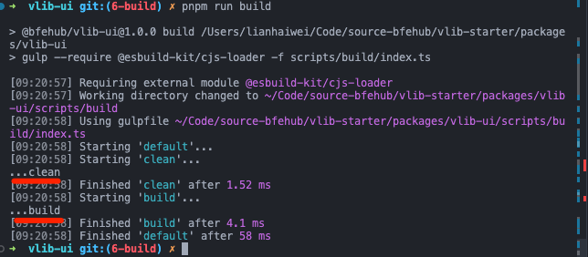
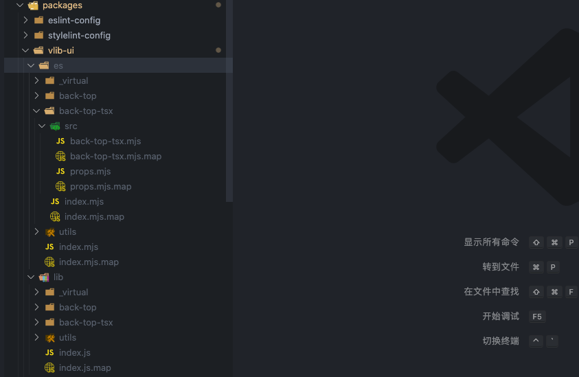
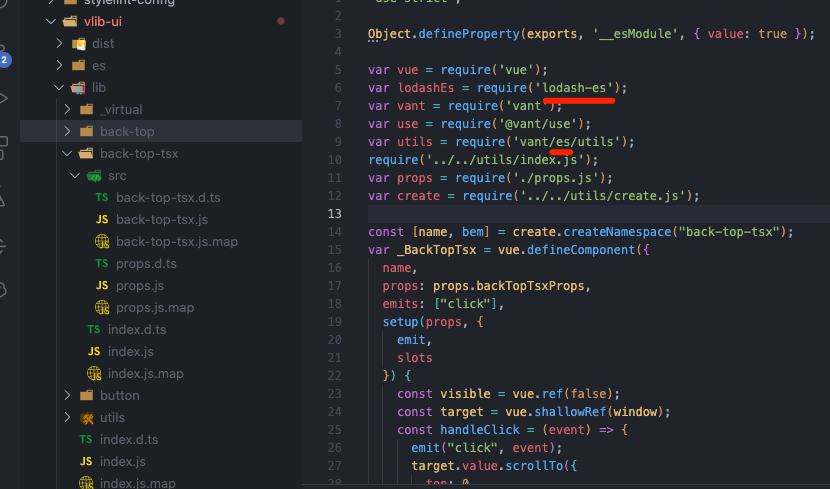
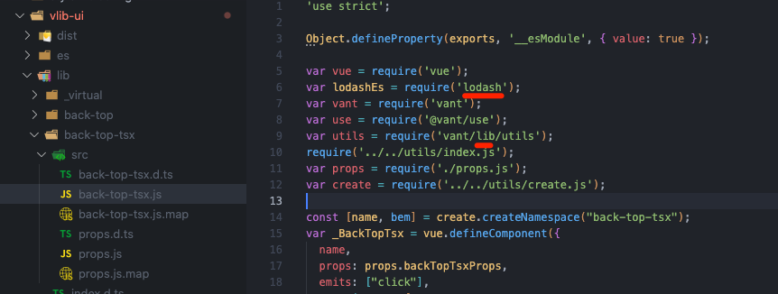
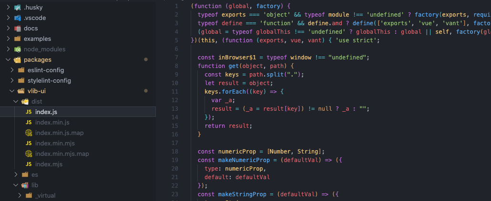
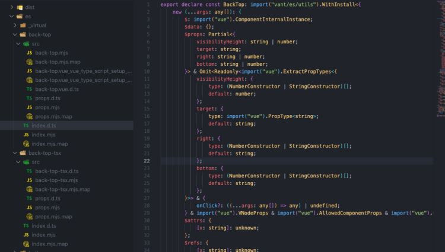

本篇我们正式进入打包篇。可以不打包吗？可以，如果是内部组件库并且项目工具链一致，那么就可以直接在内部直接发布源代码。打包复杂吗? 说也简单如果使用 `vite` 只需指定 `lib` 即可完成，说也麻烦一个开源的组件库需要处理诸多细节：多种格式、按需加载、开发体验等等。接下来我们就来看看打包一个开源组件库至少都需要做什么。

本篇新增的完整代码可查看单独的分支 [6-build](https://github.com/bfehub/vlib-starter/tree/6-build)。

> 如果你还不了解这个系列要做什么，那你可以先阅读 [【实践 Vue3 组件库-介绍一下这个系列】](./vlib-starter-1.md) 的介绍，以便你对整个系列有清晰的认识。

## 前置文章

你可能需要先阅读以下文章编写我们需要打包的组件。

- [实践 Vue3 组件库-基于开源组件库扩展业务组件(组件篇一)](./vlib-starter-4.md)

## 产物格式

下图是 [vant](https://unpkg.com/vant/) 和 [element-plus](https://unpkg.com/element-plus/) 两个组件库的包文件，图截不全可以点击链接在线查看。虽然具体的文件结构是不相同的，但提供的内容基本上一致的。

- `es` 文件下都是 `esm` 模块的文件。

- `lib` 文件下都是 `cjs` 模块的文件。

- `es` 和 `lib` 下的文件结构都和源文件的文件结构一致，这样做是为了结构清晰和按需加载等。现在的 Node 和打包工具两种都支持，使用哪种是看配置环境。

- `dist` 文件下是全量的包，有 `umd` 模块的可以直接在浏览器使用，有 `esm` 模块的现在也可以在浏览器中使用(打包全量是为了减少模块请求)。

- 还有列如 `*.json`、`*.d.ts` 是代码提示，组件类型等提升开发体验的。





## 产物拆分

我们经过分析和整理可以大概明确我们都需要做什么。提供那几种格式，分别提供哪些文件。

### es

- 组件的导入/导出采用 `ES Modules` 标准，支持单独导出每个组件。

- 编译每个组件的 `Vue & TS` 代码生成对应的 `JS` 文件。

- 每个组件生成 `*.d.ts` 类型声明文件。

- 编译组件下的 `scss` 代码生成对应的 `css` 文件，包含 `style/index.js` 链接编译后的 `css` 样式文件。

- 复制组件下的 `scss` 代码到对应的目录，包含 `style/scss.js` 链接未编译的 `scss` 样式文件。

### lib

- 组件的导入/导出采用 `CommonJs Modules` 标准，支持单独导出每个组件。

- 编译每个组件的 `Vue & TS` 代码生成对应的 `JS` 文件。

- 每个组件生成 `*.d.ts` 类型声明文件。

- 编译组件下的 `scss` 代码生成对应的 `css` 文件，包含 `style/index.js` 链接编译后的 `css` 样式文件。

- 复制组件下的 `scss` 代码到对应的目录，包含 `style/scss.js` 链接未编译的 `scss` 样式文件。

### dist

- 打包所有组件代码生成一个 `JS` 文件，采用 `UMD` 和 `ES Modules` 两个模块标准。

- 生成对应 `JS` 文件 `.min.js` 后缀的压缩版本的文件和 `.map` 文件。

- 打包所有样式代码生成一个压缩后的 `css` 文件。

- 提供所有的组件的 `VSCode` 和 `WebStorm` 编辑器全局组件提示。

## 任务管理(gulp)

上面我们列举的一条条的产物要求就像是我们待完成的任务，我们需要一个工具来管理。有请这方面的主角 [gulp](https://gulpjs.com/)，虽然 `gulp` 提供的功能很少，单凭借着那 _优雅_ 的设计和各个工具的对接仍然有一战之力(现在我有时仍然会用来做文件流相关的内容)。如果你不熟悉可以阅读那极少的文档。

那么我们编写一个简易的 `gulp` 任务来熟悉熟悉，我们需要一个单独的包 `@esbuild-kit/cjs-loader` 来支持 `ts` 文件。

```sh
pnpm add gulp @types/gulp @esbuild-kit/cjs-loader -D --filter @bfehub/vlib-ui
```

添加一个执行命令，并指定一个任务配置文件。

```json
{
  "scripts": {
    "build": "gulp --require @esbuild-kit/cjs-loader -f scripts/build/index.ts"
  }
}
```

接着我们使用 `series` 编写一个串行的任务。

```ts
// packages/ui/scripts/build/index.ts
import { series } from "gulp";

export async function clean() {
  console.log("...clean");
}

export async function build() {
  console.log("...build");
}

export default series(clean, build);
```

执行 `pnpm run build` 就会按顺序依次输出。



## 组件打包(rollup+esbuild)

我们使用 `rollup` 打包，基础配置和用法你可以在掘金上找篇文章初步了解，基础的配置也是很简单。

```sh
pnpm add rollup @rollup/plugin-node-resolve -D --filter @bfehub/vlib-ui
```

语法解析插件用 `vite` 的相关插件，因为 `vite` 本身是模拟了 `rollup` 的插件机制的，所以只要不用 `vite` 独有的钩子就可以兼容在 `rollup` 使用。

```sh
pnpm add @vitejs/plugin-vue @vitejs/plugin-vue-jsx unplugin-vue-define-options -D --filter @bfehub/vlib-ui
```

使用 `esbuild` 处理 `ts/tsx` 的代码，可以使打包更快。

```sh
pnpm add esbuild rollup-plugin-esbuild -D --filter @bfehub/vlib-ui
```

定义一些公用的常量和变量方便多个地方使用。

```ts
// packages/vlib-ui/scripts/build/utils/constants.ts
export const PKG_NAME = "vlib";
export const PKG_CAMELCASE_NAME = "Vlib";
```

```ts
// packages/vlib-ui/scripts/build/utils/paths.ts
import { resolve } from "path";

// root
export const root = resolve(__dirname, "..", "..", "..");
export const compRoot = resolve(root, "src");

// output
export const output = resolve(root, "dist");
export const outputEsm = resolve(root, "es");
export const outputCjs = resolve(root, "lib");

// package
export const compPackage = resolve(root, "package.json");
```

### 打包模块组件

整体来看 `rollup` 分两个主阶段，一个编译阶段只需编译一次，一个生成阶段可以多次指定输出的模块格式。我们可以使用 [Rollup JavaScript API](https://rollupjs.org/guide/en/#javascript-api) 的方法分别调用。

我们编写一个 `buildModules` 任务处理模块组件打包任务，分别输出 `esm` 和 `cjs` 格式的，并且每个模块都支持单独导入。

```ts
// packages/vlib-ui/scripts/build/task/build-modules.ts
import path from "path";
import { rollup } from "rollup";
import { nodeResolve } from "@rollup/plugin-node-resolve";
import vue from "@vitejs/plugin-vue";
import vueJsx from "@vitejs/plugin-vue-jsx";
import vueDefineOptions from "unplugin-vue-define-options/rollup";
import esbuild from "rollup-plugin-esbuild";
import { compRoot, outputEsm, outputCjs } from "../utils/paths";
import { target, generateExternal, generatePaths } from "../utils/rollup";

export const buildModules = async () => {
  // 入口
  const input = [path.resolve(compRoot, "index.ts")];

  // 编译解析
  const bundle = await rollup({
    input,
    plugins: [
      vueDefineOptions(),
      vue(),
      vueJsx(),
      nodeResolve(),
      esbuild({
        target,
        sourceMap: true,
      }),
    ],
    treeshake: false,
    external: generateExternal({ full: true }), // 外部模块，所有依赖都设置为外部模块
  });

  // 输出文件
  await Promise.all([
    bundle.write({
      format: "esm", // 模块格式
      dir: outputEsm, // 输出目录
      exports: undefined, // 导出模式
      preserveModules: true, // 与原始模块创建相同的文件
      preserveModulesRoot: "src",
      sourcemap: true, // 生成 sourcemap
      entryFileNames: `[name].mjs`, // 生成文件名
    }),
    bundle.write({
      format: "cjs",
      dir: outputCjs,
      exports: "named",
      preserveModules: true,
      preserveModulesRoot: "src",
      sourcemap: true,
      entryFileNames: `[name].js`,
    }),
  ]);
};
```

提取外部依赖，根据 `package.json` 中的 `dependencies` 和 `peerDependencies` 来判断是否是外部依赖。

```ts
// packages/vlib-ui/scripts/build/utils/rollup.ts
export const getCompPackage = () => {
  // eslint-disable-next-line @typescript-eslint/no-var-requires
  const { version, dependencies, peerDependencies } = require(compPackage);
  return {
    version,
    dependencies: Object.keys(dependencies),
    peerDependencies: Object.keys(peerDependencies),
  };
};

export const generateExternal = (options: { full: boolean }) => {
  const { dependencies, peerDependencies } = getCompPackage();

  const packages: string[] = peerDependencies;

  if (options.full) {
    packages.push(...dependencies);
  }

  return (id: string) => {
    return packages.some((pkg) => id === pkg || (options.full && id.startsWith(`${pkg}/`)));
  };
};
```

在 `gulp` 任务文件中加入此任务。

```ts
// packages/vlib-ui/scripts/build/index.ts
import { parallel } from "gulp";
import { buildModules } from "./task";

export default parallel(buildModules);
```

执行 `pnpm run build` 打包可以看到已经生成了。



但是这时候有个问题？外部模块是不解析的，但是我们的 `lodash-es` 和 `vant/es` 都是 `esm` 的模块的路径。那么怎么在输出 `cjs` 模块的时候改成 `cjs` 模块的路径呢。



还好 `rollup` 的有一个配置 [output.paths](https://rollupjs.org/guide/en/#outputpaths) 就是用来处理外部模块的路径的。我们创建一个单独的函数和映射来处理路径。

```ts
// packages/vlib-ui/scripts/build/utils/rollup.ts
export const generatePaths = () => {
  const paths = [
    ["lodash-es", "lodash"],
    ["vant/es", "vant/lib"],
  ];

  return (id: string) => {
    for (const [oldPath, newPath] of paths) {
      if (id.startsWith(oldPath)) {
        return id.replace(oldPath, newPath);
      }
    }

    return "";
  };
};
```

我们在输出 `cjs` 模块的时候加入此配置。

```ts
bundle.write({
  // ...
  format: "cjs",
  paths: generatePaths(),
});
```



**注**：把组件打包成一个个单独的模块，当使用 `import { BackTop } from "@bfehub/vlib-ui"` 这种方式使用时，默认支持 Tree Shaking，因此不需要配置任何插件。

### 打包全量组件

打包全量组件和模块组件使用的插件和配置差不多。我们编写一个 `buildFull` 任务处理打包任务，分别输出一个 `umd` 和 `esm` 模块格式的文件和相同的压缩版本。

外部模块我们只提取前置依赖(`peerDependencies`)，因为像 `lodash-es` 这种包我们只需要了几个方法直接打包进代码中即可，没必要也让用户在全局引入。

```ts
// packages/vlib-ui/scripts/build/task/build-full.ts
import path from "path";
import { rollup } from "rollup";
import { nodeResolve } from "@rollup/plugin-node-resolve";
import vue from "@vitejs/plugin-vue";
import vueJsx from "@vitejs/plugin-vue-jsx";
import vueDefineOptions from "unplugin-vue-define-options/rollup";
import esbuild, { minify as minifyPlugin } from "rollup-plugin-esbuild";
import { compRoot, output } from "../utils/paths";
import { target, generateExternal } from "../utils/rollup";
import { PKG_CAMELCASE_NAME } from "../utils/constants";

const build = async (minify: boolean) => {
  // 入口
  const input = [path.resolve(compRoot, "index.ts")];

  // 编译解析
  const bundle = await rollup({
    input,
    plugins: [
      vueDefineOptions(),
      vue(),
      vueJsx(),
      nodeResolve(),
      esbuild({
        target,
        sourceMap: minify,
        treeShaking: true,
      }),
      minify // 生成的是否是压缩版本
        ? minifyPlugin({
            target,
            sourceMap: minify,
          })
        : null,
    ],
    treeshake: true,
    external: generateExternal({ full: false }), // 外部模块，只提取前置依赖为外部模块
  });

  // 输出文件
  await Promise.all([
    bundle.write({
      format: "esm",
      file: path.resolve(output, `index${minify ? ".min" : ""}.mjs`),
      exports: undefined,
      sourcemap: minify,
    }),
    bundle.write({
      format: "umd",
      file: path.resolve(output, `index${minify ? ".min" : ""}.js`),
      exports: "named",
      sourcemap: minify,
      name: PKG_CAMELCASE_NAME, // 组件全局名称
      globals: {
        // 外部模块的全局名称
        vue: "Vue",
        vant: "vant",
      },
    }),
  ]);
};

// 合并为一个主任务
export const buildFull = async () => {
  await Promise.all([build(false), build(true)]);
};
```

在 `gulp` 任务文件中加入此任务。

```ts
// packages/vlib-ui/scripts/build/index.ts
import { parallel } from "gulp";
import { buildModules, buildFull } from "./task";

export default parallel(buildModules, buildFull);
```

执行 `pnpm run build` 打包可以看到已经生成了。



## 声明文件(vue-tsc)

要为组件生成声明文件，我了解了多种生成声明文件的方案，相比之下 [vue-tsc](https://github.com/johnsoncodehk/volar/tree/master/packages/vue-tsc) 是生成的最好的。因为它是基于 Volar 开发的命令行工具，所以生成的在 VSCode 中也提示更完善。

我们编写一个 `generateTypes` 任务处理声明文件的生成。但解析生成时需要时间的，所以我们只生成 `es` 目录下的声明文件，`lib` 下的声明文件通过任务复制过去。

```sh
pnpm add execa vue-tsc -D --filter @bfehub/vlib-ui
```

我们新建一个配置文件指定输入和输出目录并且只生成声明文件不生成代码。

```json
// packages/vlib-ui/tsconfig.declaration.json
{
  "extends": "../../tsconfig.json",
  "compilerOptions": {
    "outDir": "es",
    "declaration": true,
    "emitDeclarationOnly": true
  },
  "include": ["src"],
  "exclude": ["node_modules", "**/__tests__/**", "**/__demos__/**", "**/*.md"]
}
```

我们只需在任务中执行 `vue-tsc -p tsconfig.declaration.json` 即可，执行命令我们使用 [execa](https://www.npmjs.com/package/execa) 执行。

```ts
// packages/vlib-ui/scripts/build/task/generate-types.ts
import { execa } from "execa";
import { src, dest } from "gulp";
import { root, outputEsm, outputCjs } from "../utils/paths";

export const generateTypes = async () => {
  await execa("vue-tsc", ["-p", "tsconfig.declaration.json"], {
    cwd: root,
  });

  return src(`${outputEsm}/**/*.d.ts`).pipe(dest(`${outputCjs}`));
};
```

在 `gulp` 任务文件中加入此任务。

```ts
// packages/vlib-ui/scripts/build/index.ts
import { parallel } from "gulp";
import { buildModules, buildFull, generateTypes } from "./task";

export default parallel(buildModules, buildFull, generateTypes);
```

执行 `pnpm run build` 执行。



## 清理文件(fse)

再次打包之前需要先清理旧的产物避免无用的文件，编写一个 `clean` 任务把旧文件删除掉就可以。

```ts
// packages/ui/scripts/build/task/clean.ts
import fs from "fs-extra";
import { output, outputEsm, outputCjs } from "../utils";

export const clean = async () => {
  await Promise.all([
    fs.remove(output),
    fs.remove(outputEsm),
    fs.remove(outputCjs),
    // ...
  ]);
};
```

在 `gulp` 任务文件中加入此任务，我们的执行顺序是先清理，清理任务完成后再打包。

```ts
// packages/vlib-ui/scripts/build/index.ts
import { series, parallel } from "gulp";
import { clean, buildModules, buildFull, generateTypes } from "./task";

export default series(clean, parallel(buildModules, buildFull, generateTypes));
```

## 测试组件使用

在所有构建完成后，可以在 `package.json` 中加入以下字段声明。

```json
// packages/vlib-ui/package.json
{
  // 默认的入口文件
  "main": "lib/index.js",
  // ESM 规范的入口文件
  "module": "es/index.mjs",
  // 类型声明的入口文件
  "types": "es/index.d.ts",
  // cdn 服务指定的字段
  "unpkg": "dist/index.min.js",
  "jsdelivr": "dist/index.min.js"
}
```

使用 [create vite](https://github.com/vitejs/vite/tree/main/packages/create-vite) 创建一个示例项目测试各种模块的使用和效果(注：现在还没有打包样式但是不影响效果，下一篇打包样式与样式按需引入)。

```sh
pnpm create vite examples --template vue-ts
```

```json
// examples/package.json
{
  "name": "@bfehub/examples",
  "private": true
  // ...
}
```

测试组件需要把 `@bfehub/vlib-ui` 安装到 `@bfehub/examples` 下并在全局注册。

```sh
pnpm add vant @bfehub/vlib-ui --filter @bfehub/examples
```

```ts
// examples/src/main.ts
import { createApp } from "vue";
import VantUI from "vant";
import VlibUI from "@bfehub/vlib-ui";
import App from "./App.vue";
import "vant/lib/index.css";

const app = createApp(App);
app.use(VantUI);
app.use(VlibUI);
app.mount("#app");
```

```html
<!-- examples/src/App.vue -->
<template>
  <van-cell-group>
    <van-cell v-for="i in 100" :key="i">Cell {{ i }}</van-cell>
  </van-cell-group>
  <vlib-back-top></vlib-back-top>
</template>
```

测试全量 `umd` 模块规范新建一个单独的 `examples/index.umd.html`，前置依赖临时使用 [unpkg](https://unpkg.com/) 服务。然后用本地静态文件服务打开测试文件。

```html
<!-- examples/index.umd.html -->
<!DOCTYPE html>
<html lang="en">
  <head>
    <meta charset="UTF-8" />
    <link rel="icon" href="/favicon.ico" />
    <meta name="viewport" content="width=device-width, initial-scale=1.0" />
    <link rel="stylesheet" href="https://unpkg.com/vant/lib/index.css" />
    <title>Umd App</title>
  </head>
  <body>
    <div id="app"></div>
    <script src="https://unpkg.com/vue"></script>
    <script src="https://unpkg.com/vant"></script>
    <script src="./node_modules/@bfehub/vlib-ui/dist/index.js"></script>
    <script>
      const app = Vue.createApp({
        template: `
          <van-cell-group>
            <van-cell v-for="i in 100" :key="i">Cell {{ i }}</van-cell>
          </van-cell-group>
          <vlib-back-top></vlib-back-top>
        `,
      });

      app.use(vant);
      app.use(Vlib);
      app.mount("#app");

      console.log(vant, Vlib);
    </script>
  </body>
</html>
```

测试全量 `esm` 模块规范新建一个单独的 `examples/index.esm.html`，前置依赖临时使用 [esm.sh](https://esm.sh/) 服务，以及 importmap 支持。然后用本地静态文件服务打开测试文件。

```html
<!-- examples/index.esm.html -->
<!DOCTYPE html>
<html lang="en">
  <head>
    <meta charset="UTF-8" />
    <link rel="icon" href="/favicon.ico" />
    <meta name="viewport" content="width=device-width, initial-scale=1.0" />
    <link rel="stylesheet" href="https://unpkg.com/vant/lib/index.css" />
    <title>Esm App</title>
  </head>
  <body>
    <div id="app"></div>
    <script type="importmap">
      {
        "imports": {
          "vue": "https://esm.sh/vue/dist/vue.esm-bundler.js",
          "vant": "https://esm.sh/vant/lib/vant.es.js",
          "@bfehub/vlib-ui": "./node_modules/@bfehub/vlib-ui/dist/index.mjs"
        }
      }
    </script>
    <script type="module">
      import { createApp } from "vue";
      import VantUI from "vant";
      import VlibUI from "@bfehub/vlib-ui";

      const app = createApp({
        template: `
          <van-cell-group>
            <van-cell v-for="i in 100" :key="i">Cell {{ i }}</van-cell>
          </van-cell-group>
          <vlib-back-top></vlib-back-top>
        `,
      });

      app.use(VantUI);
      app.use(VlibUI);
      app.mount("#app");

      console.log(VantUI, VlibUI);
    </script>
  </body>
</html>
```

## 你可以...

- 你可以根据本章内容自己实现一遍完善我们的组件库。

- 如果对你有帮助可以点个 **赞** 和 **关注** 以示鼓励。
