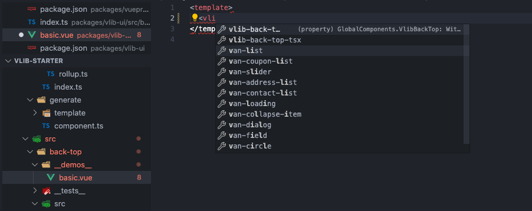
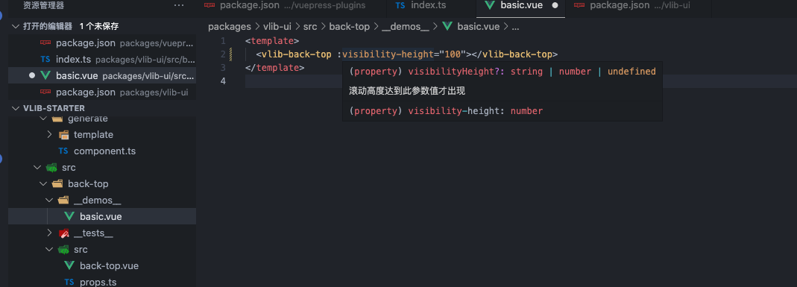
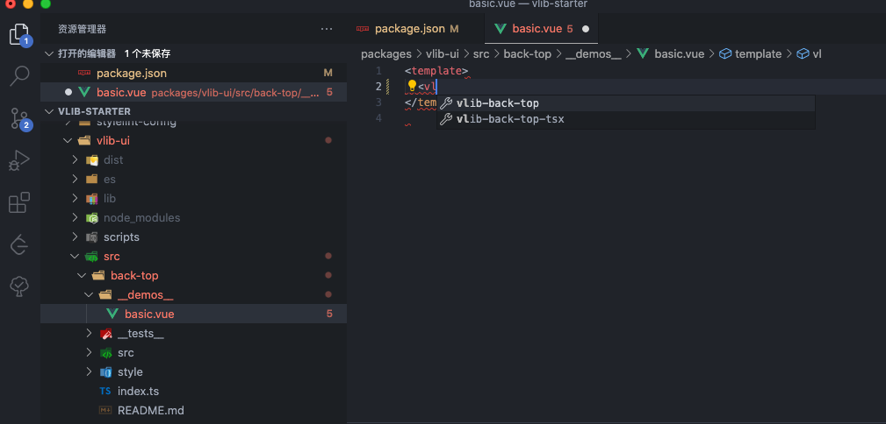
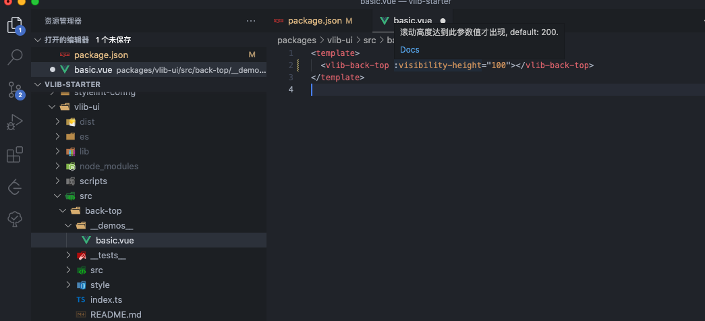
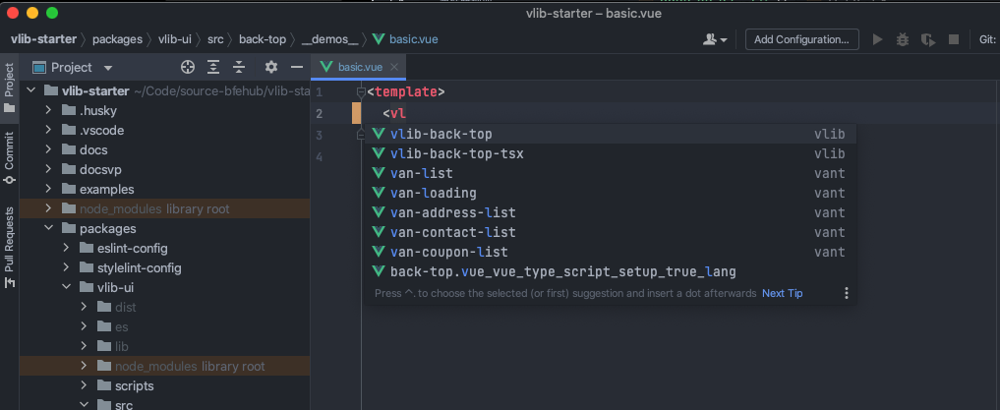
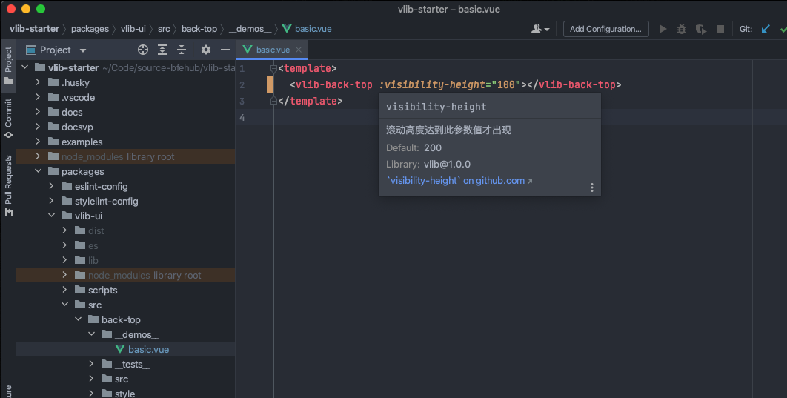
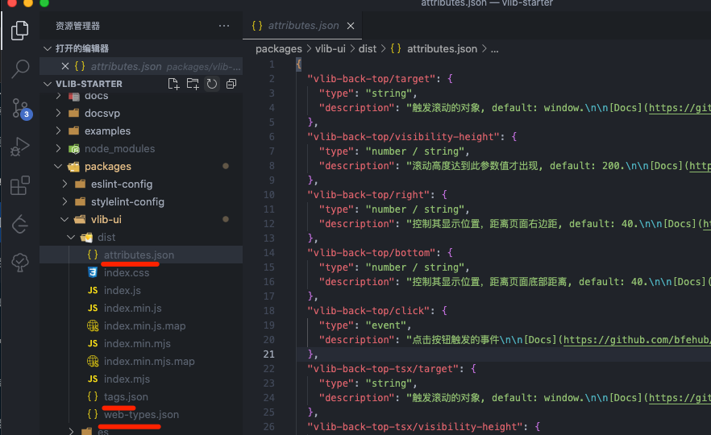

在我们使用开源组件库的时候，比如 Element Plus 在 VSCode 或 WebStorm 中输入 `<el-` 的时候会提示全部的组件，当在组件上输入 `:` 的时候会提示组件的属性，那么这是怎么做到的呢？这些一般都是需要代码编辑器或代码编辑器语言插件提供支持的，本篇就来探究如何实现这样的功能。

本篇新增的完整代码可查看单独的分支 [8-build-helper](https://github.com/bfehub/vlib-starter/tree/8-build-helper)。

> 如果你还不了解这个系列要做什么，那你可以先阅读 [【实践 Vue3 组件库-介绍一下这个系列】](./vlib-starter-1.md) 的介绍，以便你对整个系列有清晰的认识。

## 前置文章

你可能需要先阅读以下文章编写组件的实现。

- [实践 Vue3 组件库-基于开源组件库扩展业务组件(组件篇一)](./vlib-starter-4.md)

- [实践 Vue3 组件库-如何实现组件打包与组件声明文件(打包篇一)](./vlib-starter-7.md)

- [实践 Vue3 组件库-如何实现样式打包与按需引入(打包篇二)](./vlib-starter-8.md)

## 实现原理

先把组件库安装到根项目，这样全局都可以获得提示效果。

```sh
pnpm add @bfehub/vlib-ui -w
```

### vscode.volar

Volar 的实现原理是：它会读取 Vue 的全局类型接口做解析，你可以查看此实现 [support for expose component types](https://github.com/vuejs/core/pull/3399)，不仅能扩展组件还能扩展全局属性、指令。

所以我们只需扩展接口即可实现。你可以查看一个示例 [Define Global Components](https://github.com/johnsoncodehk/volar/tree/master/extensions/vscode-vue-language-features#usage)。新建一个 `global.d.ts` 文件编写扩展的组件类型，这个文件跟随组件库一起发布。

```ts
// packages/vlib-ui/global.d.ts
export {};

// Helper for Volar
declare module "@vue/runtime-core" {
  export interface GlobalComponents {
    VlibBackTop: typeof import("@bfehub/vlib-ui")["BackTop"];
    VlibBackTopTsx: typeof import("@bfehub/vlib-ui")["BackTopTsx"];
  }
}
```

如果使用的 `pnpm` 并且没有设置 `shamefully-hoist=true`，那么需要单独安装 `@vue/runtime-core` 这个包。

```sh
pnpm add @vue/runtime-core -w
```

再次使用组件库的组件，可以获得以下效果(可能需要重启编辑器)。





### vscode.vetur

Vetur 的实现原理是：它允许用户指定一个 JSON 文件，以声明方式描述组件的标签/属性。Vetur 能够加载这些 JSON 文件，为 Vue 组件提供自动完成、悬停信息和其他语言功能。

所以我们只需按照给出的格式补充 JSON 文件即可实现，你可查看 [component-data](https://vuejs.github.io/vetur/guide/component-data.html#component-data) 的文档，也可以参考已有组件库的写法。

需要一个 `tags.json` 编写组件的属性和组件描述。

```json
// packages/vlib-ui/dist/tags.json
{
  // 组件名称
  "vlib-back-top": {
    // 组件属性
    "attributes": ["target", "visibility-height", "right", "bottom"],
    // 组件描述
    "description": "返回页面顶部的操作按钮。"
  }
}
```

需要一个 `attributes.json` 编写组件属性和组件描述。

```json
// packages/vlib-ui/dist/attributes.json
{
  // 组件属性名称
  "vlib-back-top/target": {
    // 组件属性类型
    "type": "string",
    // 组件属性描述
    "description": "触发滚动的对象, default: window."
  },
  "vlib-back-top/visibility-height": {
    "type": "number / string",
    "description": "滚动高度达到此参数值才出现, default: 200."
  },
  "vlib-back-top/right": {
    "type": "number / string",
    "description": "控制其显示位置，距离页面右边距, default: 40."
  },
  "vlib-back-top/bottom": {
    "type": "number / string",
    "description": "控制其显示位置，距离页面底部距离, default: 40."
  }
}
```

之后在 `package.json` 文件中加入 `vetur` 字段指定配置的路径。

```json
// packages/vlib-ui/package.json
{
  "vetur": {
    "tags": "dist/tags.json",
    "attributes": "dist/attributes.json"
  }
}
```

禁用 Volar 启用 Vetur 之后再次使用组件库的组件，可以获得以下效果(可能需要重启编辑器)。





### webstorm.web-types

WebStorm 的实现原理是：JetBrains 系列的编辑器规范一种格式 [Web-Types](https://github.com/JetBrains/web-types)，它是一种用于记录 Web 组件库的 JSON 格式，相比 Vetur 定义字段功能更为完善，支持可选值、插槽等。

所以我们只需按照给出的格式补充 JSON 文件即可实现。

```json
// packages/vlib-ui/dist/web-types.json
{
  "$schema": "https://raw.githubusercontent.com/JetBrains/web-types/master/schema/web-types.json",
  "framework": "vue",
  "name": "vlib",
  "version": "1.0.0",
  "contributions": {
    "html": {
      // 类型使用 typescript
      "types-syntax": "typescript",
      // 提示信息支持 markdown
      "description-markup": "markdown",
      // 自定义的标签
      "tags": [
        {
          // 组件名称
          "name": "vlib-back-top",
          "source": {
            "symbol": "VlibBackTop"
          },
          // 组件描述
          "description": "返回页面顶部的操作按钮。",
          // 组件文档地址
          "doc-url": "https://github.com/bfehub/vlib-starter/components/Users/#backtop",
          // 组件属性
          "attributes": [
            {
              // 组件属性名称
              "name": "visibility-height",
              // 组件属性描述
              "description": "滚动高度达到此参数值才出现",
              // 组件属性文档
              "doc-url": "https://github.com/bfehub/vlib-starter/components/Users/#backtop-props",
              // 组件属性默认值
              "default": "200",
              // 组件属性类型
              "value": {
                "type": "number / string",
                "kind": "expression"
              }
            }
            // ...
          ],
          // 组件插槽
          "slots": [
            {
              "name": "default",
              "description": "自定义默认内容",
              "doc-url": "https://github.com/bfehub/vlib-starter/components/Users/#backtop-slots"
            }
          ]
        }
      ]
    }
  }
}
```

之后在 `package.json` 文件中加入 `web-types` 字段指定配置的路径。

```json
// packages/vlib-ui/package.json
{
  "web-types": "dist/web-types.json"
}
```

用 WebStorm 打开项目之后再次使用组件库的组件，可以获得以下效果。





## 自动生成

手写编写 Volar 的配置其实还好，对 TypeScript 也友好。但 Vetur 和 WebStorm 我们就需要编写大量的配置才能实现，有没有办法自动生成呢？

现有有一种方案根据文档生成。文档本身就是对外提供的最详细的配置说明，能根据文档最好不过了。这里有一个工具 [component-helper](https://github.com/tolking/components-helper) 它会解析 markdown 文档中的表格并自动生成 Vetur 和 WebStorm 的 JSON 配置文件。

作者很贴心的提供了各种用法的示例，我们更具示例更改即可(如何你写的文档不统一或者格式相差较大那么可能无法使用需要自己解析)。

和之前思路一致，新建一个 `generateHelper` 的任务去解析生成。

```ts
// packages/vlib-ui/scripts/build/task/generate-helper.ts
import type { ReComponentName, ReDocUrl, ReAttribute, ReWebTypesSource } from "components-helper";
import helper from "components-helper";
import { output, compRoot, compPackage } from "../utils/paths";
import { PKG_NAME, PKG_CAMELCASE_NAME } from "../utils/constants";

// eslint-disable-next-line @typescript-eslint/no-var-requires
const { version } = require(compPackage);

/**
 * 重写组件名称
 * @example BackTop -> vlib-back-top
 */
const reComponentName: ReComponentName = (title) => {
  return `${PKG_NAME}-${title
    .replace(/\B([A-Z])/g, "-$1")
    .replace(/[ ]+/g, "-")
    .toLowerCase()}`;
};

/**
 * 重写文档路径
 * @example src/back-top/README.md -> https://github.com/bfehub/vlib-starter/components/back-top/
 */
const reDocUrl: ReDocUrl = (_, header, path) => {
  const docs = "https://github.com/bfehub/vlib-starter/components/";
  const name = path?.split("/")[1] + "/";
  const _header = header ? header.replace(/[ ]+/g, "-").toLowerCase() : undefined;
  return docs + name + (_header ? "#" + _header : "");
};

/**
 * 重写组件属性
 * @example v-model -> model-value
 */
const reAttribute: ReAttribute = (value) => {
  switch (value) {
    case "":
    case "-":
    case "—":
      return undefined;
    case "v-model":
      return "model-value";
    default:
      return value;
  }
};

/**
 * 重写 web-types 来源
 * @example BackTop -> VlibBackTop
 */
const reWebTypesSource: ReWebTypesSource = (title: string) => {
  const symbol = `${PKG_CAMELCASE_NAME}${title
    .replace(/-/, " ")
    .replace(/^\w|\s+\w/g, (item) => item.trim().toUpperCase())}`;

  return { symbol };
};

export const generateHelper = async () => {
  await helper({
    // 基本配置
    name: PKG_NAME,
    version,
    entry: `${compRoot}/**/*.md`,
    outDir: output,
    space: 2,

    // 解析配置
    reComponentName,
    reDocUrl,
    reAttribute,
    reWebTypesSource,

    // 表头配置
    propsName: "属性",
    propsDescription: "说明",
    propsType: "类型",
    propsOptions: "可选值",
    propsDefault: "默认值",

    eventsName: "事件名",
    eventsDescription: "说明",

    slotsName: "插槽名",
    slotsDescription: "说明",
  });
};
```

加入到之前的主任务中。

```ts
import { series, parallel } from "gulp";
import { /* ... */ generateHelper } from "./task";

export default series(clean, parallel(/* ... */ generateHelper));
```

执行 `pnpm run build` 打包可以看到已经生成了，会比手动编写的更为详细。



## 你可以...

- 你可以根据本章内容自己实现一遍完善我们的组件库。

- 如果对你有帮助可以点个 **赞** 和 **关注** 以示鼓励。
